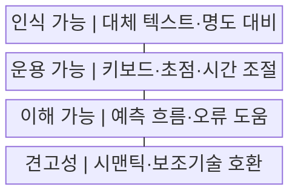
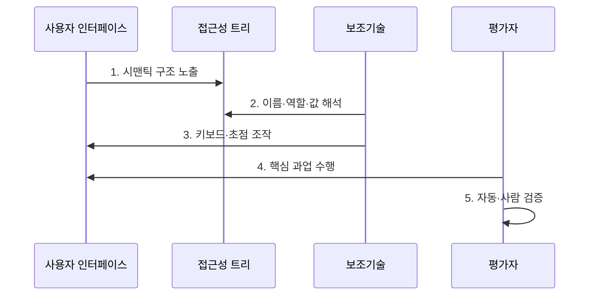

---
sidebar:
  order: 194
  label: "194. 디지털 접근성: WCAG 2.1 (Digital Accessibility WCAG)"
  badge:
    text: "기출 · 50%"
    variant: note
title: "디지털 접근성: WCAG 2.1 (Digital Accessibility WCAG)"
date: "2026-07-29T17:25:00+09:00"
tags:
  - "notes-software"
weight: 194
extra:
  question_no: "194"
  source_status: "기출"
  source_history: "137회"
  priority: 50
  priority_note: "인식·운용·이해·견고 기준이 최근 출제됨"
---

## 미리 알고가기

- **디지털 접근성**: 장애·연령·기기와 관계없이 디지털 서비스를 동등하게 이용하게 하는 성질이다.
- **웹 콘텐츠 접근성 지침(Web Content Accessibility Guidelines, WCAG)**: WCAG는 ‘더블유시에이지’로 읽고 영문 머리글자를 딴 약어이며, 웹 콘텐츠를 보조기술과 함께 인식·조작·이해하는 기준을 제공한다.
- **인식 가능·운용 가능·이해 가능·견고성(Perceivable, Operable, Understandable, Robust, POUR)**: POUR는 ‘포어’로 읽고 네 영문 원칙의 머리글자를 모은 기억 표기이며, WCAG 성공 기준의 상위 분류를 나타냄
- **보조기술·스크린 리더**: 보조기술은 접근을 돕고 스크린 리더는 화면 내용을 음성으로 읽음
- **대체 텍스트·명도 대비**: 대체 텍스트는 이미지 의미를 설명하고 대비는 글자와 배경 차이이다.
- **키보드 탐색·초점**: 키보드만으로 조작하며 초점은 현재 입력 대상의 시각적 표시이다.
- **시맨틱 마크업**: 제목·버튼·입력의 의미와 관계를 표준 요소·속성으로 표현한 코드이다.
- **적합성 검사**: 자동 검사와 사람의 키보드·보조기술 검증을 함께 수행하는 평가이다.
- **Level A·AA·AAA**: ‘레벨 에이·더블에이·트리플에이’로 읽고 A를 누적해 적합 수준을 높인 표기이며, 최소·주요·최고 수준을 구분한다.

## Ⅰ. 개요

- 정의/개념: 장애·연령·기기와 무관한 **동등한 과업 수행**
- 배경/필요성: 감각·운동·인지 장벽의 **서비스 이용 배제 해소**

### 쉽게 이해하기 (학습용)
- 화면을 보거나 마우스를 쓰기 어려워도 같은 과업을 끝낼 수 있게 설계함

## Ⅱ. 특징

- **인식·운용·이해·견고성**의 POUR 원칙
- **대체 텍스트·대비·키보드·초점** 지원
- **자동 검사·보조기술·사용자 과업** 검증

### 쉽게 이해하기 (학습용)
- 화면을 듣거나 키보드만 써도 같은 입력·이동 과정을 완료하게 한다.

## Ⅲ. 구조 및 구성요소

| 구성요소 | 책임 |
|:---|:---|
| 인식 가능 | 대체 텍스트·**명도 대비 제공** |
| 운용 가능 | 키보드·초점·**시간 조절 지원** |
| 이해 가능 | 예측 흐름·**입력 오류 도움** |
| 견고성 | 시맨틱·**보조기술 호환** |

### 쉽게 이해하기 (학습용)
- 보조기술 호환을 위해 화면 구조를 설계함

## Ⅳ. 흐름도

**동작 원리**

1. **시맨틱 구조 노출**: 이름·역할·상태 제공
2. **이름·역할·값 해석**: 보조기술 의미 전달
3. **키보드·초점 조작**: 포인터 없는 탐색·실행
4. **핵심 과업 수행**: 사용자 흐름 완료 확인
5. **자동·사람 검증**: 도구 결과·실제 과업 대조

### 쉽게 이해하기 (학습용)
- 표준 코딩 후 보조 도구로 검증함

## Ⅴ. 종류 및 비교

| WCAG 적합 수준 | Level A | Level AA | Level AAA |
|:---|:---|:---|:---|
| 적용 기준 | 최소 **기능 접근 보장** | 일반 서비스 **준수 목표** | 특정 **고접근성 목표** |
| 핵심 특징 | 최소 장벽 **제거** | 주요 장벽 **추가 제거** | 최고 기준 **충족** |
| 한계 | 주요 장벽 **잔존** | 일부 요구 **누락 가능** | 전 콘텐츠 **적용 비용** |

### 쉽게 이해하기 (학습용)
- AA는 일반 서비스의 보편적 준수 표준임

## Ⅵ. 실무 고려사항 및 대책

| 고려사항 | 대책 | 효과 |
|:---|:---|:---|
| 이미지의 **의미 누락** | 목적별 **대체 텍스트 제공** | 비시각 정보 **접근 보장** |
| 키보드의 **초점 손실** | 논리 순서·**가시 초점 적용** | 포인터 없는 **과업 완료** |
| 입력 오류의 **원인 불명** | 오류 위치·**수정 방법 안내** | 과업 이탈 **감소** |
| 자동 검사만의 **오판** | 보조기술·**사용자 검증 병행** | 실제 장벽 **탐지 향상** |

### 쉽게 이해하기 (학습용)
- 공공 민원 신청은 오류 개수보다 키보드와 스크린 리더만으로 제출과 오류 수정까지 끝낼 수 있는지 확인해야 한다.

## Ⅶ. 결론

- **과업 중요도·사용자 장벽·보조기술 성공률**로 준수 수준 결정

### 쉽게 이해하기 (학습용)
- 오류 수가 아니라 사용자의 과업 성공까지 확인함
