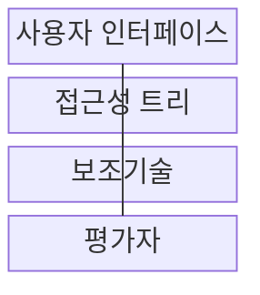
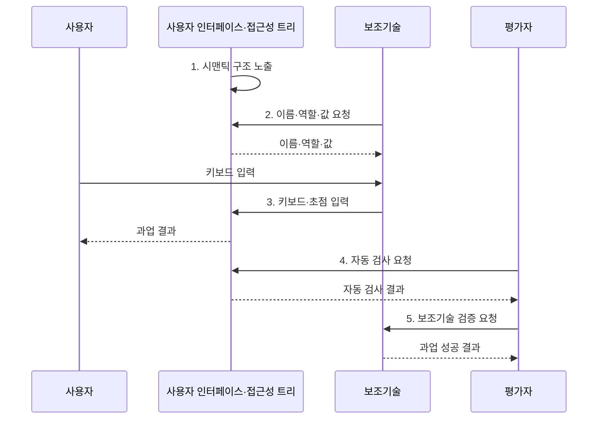

---
sidebar:
  order: 194
  label: "194. 디지털 접근성: WCAG 2.1 (Digital Accessibility WCAG)"
  badge:
    text: "기출 · 50%"
    variant: note
title: "디지털 접근성: WCAG 2.1 (Digital Accessibility WCAG)"
date: "2026-08-02T12:00:00+09:00"
tags:
  - "notes-software"
weight: 194
extra:
  question_no: "194"
  source_status: "기출"
  source_history: "137회"
  priority: 50
  priority_note: "인식·운용·이해·견고 기준이 최근 출제됨"
---

## Ⅰ. 개요

핵심 용어

- **디지털 접근성(Digital Accessibility)**: 장애·연령·사용 기기와 관계없이 사용자가 같은 정보와 기능에 접근해 과업을 완료하게 하는 사용성 품질 속성이다.

- 정의/개념: **디지털 접근성**은 장애•연령•사용 기기와 관계없이 사용자가 같은 정보와 기능에 접근해 과업을 완료하도록 하는 **사용성 품질 속성**
- 배경/필요성: 시각•포인터 중심 인터페이스는 감각•운동 제약 사용자의 **정보 접근과 과업 완료를 제한**

#### 한줄 요약
- 화면을 보거나 마우스를 쓰기 어려워도 같은 과업을 끝낼 수 있게 설계함

## Ⅱ. 특징

핵심 용어

- **WCAG·POUR 원칙**: WCAG의 POUR 원칙은 콘텐츠 접근성을 인식 가능, 운용 가능, 이해 가능, 견고성 관점으로 분류한다.
- **웹 콘텐츠 접근성 지침(Web Content Accessibility Guidelines, WCAG)**: 웹 콘텐츠가 장애 사용자에게 접근 가능하도록 적합 기준과 시험 가능한 성공 기준을 제공하는 국제 지침이다.
- **인식·운용·이해·견고(Perceivable, Operable, Understandable, Robust, POUR)**: WCAG 접근성 요구를 네 관점으로 분류한 핵심 원칙이다.
- **스크린 리더·접근성 트리**: 화면 요소의 의미 구조를 음성·점자 등 대체 출력으로 전달하는 보조기술과 기반 정보이다.

- **WCAG·POUR 원칙** 기반 접근성 분류
- **대체 텍스트·키보드**로 비시각·비포인터 이용 지원
- **스크린 리더·접근성 트리** 기반 의미 전달
- **자동 검사·사용자 과업** 결합 검증

#### 한줄 요약
- 화면을 듣거나 키보드만 써도 같은 입력·이동 과정을 완료하게 한다.

## Ⅲ. 구조 및 구성요소

핵심 용어

- **접근성 트리**: 접근성 트리는 화면 요소의 이름, 역할, 상태, 관계를 보조기술이 해석할 수 있게 제공한다.
- **사용자 인터페이스(User Interface, UI)**: 시맨틱 구조와 키보드 조작 및 시각적 상태를 제공하는 구성요소이다.
- **보조기술(Assistive Technology)**: 접근성 트리를 해석해 음성·점자·대체 입력으로 화면과 사용자를 연결하는 구성요소이다.
- **평가자(Evaluator)**: 자동 규칙 검사와 실제 보조기술 사용자 과업을 결합해 장벽을 판정하는 주체이다.

| 구성요소 | 책임 |
|:---|:---|
| 사용자 인터페이스 | 시맨틱 구조·**키보드 조작 제공** |
| 접근성 트리 | 요소의 이름·역할·**상태 노출** |
| 보조기술 | 트리 해석·**대체 입출력 제공** |
| 평가자 | 자동 규칙·**사용자 과업 검증** |

#### 한줄 요약
- 화면의 버튼과 입력창이 접근성 트리에 이름·역할로 놓이면 스크린 리더가 읽고 키보드 입력을 다시 화면 동작으로 전달한다.

## Ⅳ. 흐름도

핵심 용어

- **5. 보조기술 검증 요청**: 자동 검사 결과를 스크린 리더와 키보드의 실제 과업 수행에 대조해 접근성 장벽인지 검증한다.
- **1. 시맨틱 구조 노출**: 화면 요소의 이름·역할·상태·관계를 접근성 트리에 제공하는 단계이다.
- **2. 이름·역할·값 요청**: 보조기술이 현재 화면 요소의 의미와 상태를 조회하는 단계이다.
- **3. 키보드·초점 입력**: 포인터 없이 논리적 순서로 이동하고 요소를 실행하는 단계이다.
- **4. 자동 검사 요청**: 코드에서 기계적으로 판정할 수 있는 접근성 위반 후보를 수집하는 단계이다.

**동작 원리**

1. **시맨틱 구조 노출**: 이름·역할·상태 제공
2. **이름·역할·값 요청**: 보조기술이 화면 요소의 의미 해석
3. **키보드·초점 입력**: 포인터 없이 탐색·실행
4. **자동 검사 요청**: 코드 규칙 위반 후보 수집
5. **보조기술 검증 요청**: 도구 결과와 실제 과업 성공 대조

#### 한줄 요약
- 평가자가 자동 검사로 코드 위반 후보를 찾고 스크린 리더와 키보드로 같은 과업을 끝내 실제 장벽인지 확인한다.

## Ⅴ. 종류 및 비교

핵심 용어

- **Level AA**: Level AA는 일반 디지털 서비스가 주요 접근성 장벽을 제거하기 위해 사용하는 보편적인 준수 목표다.
- **웹 콘텐츠 접근성 지침(Web Content Accessibility Guidelines, WCAG) 수준 A**: 기본 기능 접근을 막는 최소 장벽을 제거하는 적합 수준이다.
- **WCAG 수준 AA(Level AA)**: 일반 디지털 서비스의 주요 접근성 장벽을 추가로 제거하는 보편적 준수 목표이다.
- **WCAG 수준 AAA(Level AAA)**: 특정 고접근성 요구를 위해 가장 엄격한 성공 기준까지 충족하는 수준이다.

| WCAG 적합 수준 | Level A | Level AA | Level AAA |
|:---|:---|:---|:---|
| 적용 기준 | 최소 **기능 접근 보장** | 일반 서비스 **준수 목표** | 특정 **고접근성 목표** |
| 핵심 특징 | 최소 장벽 **제거** | 주요 장벽 **추가 제거** | 최고 기준 **충족** |
| 한계 | 주요 장벽 **잔존** | 일부 요구 **누락 가능** | 전 콘텐츠 **적용 비용** |

#### 한줄 요약
- A는 최소 장벽만 제거하고 AA는 일반 서비스의 주요 장벽까지 다루며 AAA는 특정 고접근성 요구에 적용한다.

## Ⅵ. 실무 고려사항 및 대책

핵심 용어

- **초점 손실**: 초점 손실은 키보드 사용자가 현재 조작 위치를 알 수 없거나 논리적 순서대로 이동하지 못하는 문제다.
- **명도 대비율(Contrast Ratio)**: 전경과 배경의 상대 밝기 차이를 수치화해 텍스트·요소의 가독성을 판정하는 기준이다.
- **대체 텍스트(Alternative Text)**: 비텍스트 콘텐츠의 목적과 의미를 보조기술 사용자에게 전달하는 텍스트 설명이다.

| 문제 | 대책 | 효과 |
|:---|:---|:---|
| 이미지의 **의미 누락** | 목적별 **대체 텍스트 제공** | 비시각 정보 **접근 보장** |
| 텍스트의 **명도 대비 부족** | WCAG **대비율 기준 적용** | 저시력 사용자의 **가독성 확보** |
| 키보드의 **초점 손실** | 논리 순서·**가시 초점 적용** | 포인터 없는 **과업 완료** |
| 입력 오류의 **원인 불명** | 오류 위치·**수정 방법 안내** | 과업 이탈 **감소** |
| 자동 검사만의 **오판** | 보조기술·**사용자 검증 병행** | 실제 장벽 **탐지 향상** |

#### 한줄 요약
- 공공 민원 신청은 오류 개수보다 키보드와 스크린 리더만으로 제출과 오류 수정까지 끝낼 수 있는지 확인해야 한다.

## Ⅶ. 결론

핵심 용어

- **Level AA**: 일반 서비스는 Level AA를 기준선으로 삼고 핵심 과업은 보조기술 사용자가 실제로 완료하는지 검증해야 한다.

- 일반 서비스는 **Level AA**를 기준선으로 삼고 핵심 과업은 보조기술 사용자 성공까지 검증

#### 한줄 요약
- 자동 검사 오류가 적어도 사용자가 키보드와 스크린 리더로 제출을 마치지 못하면 접근성에 실패한 것이다.
