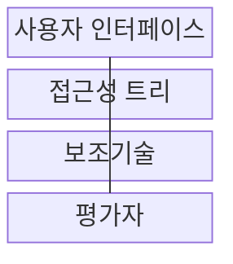
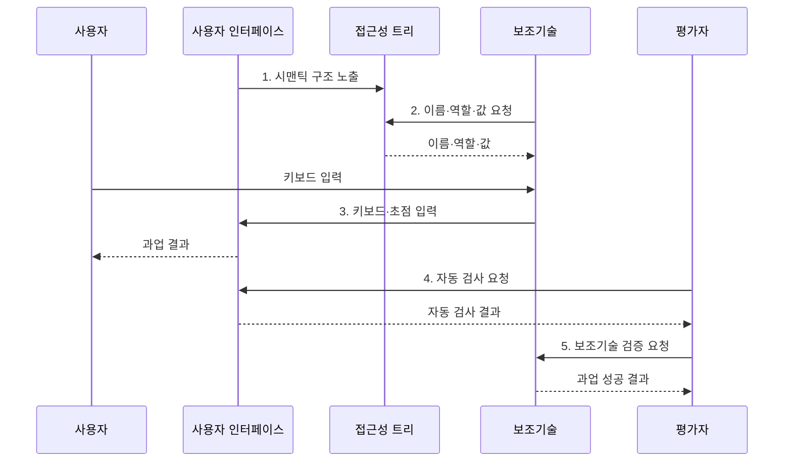

---
sidebar:
  order: 194
  label: "194. 디지털 접근성: WCAG 2.1 (Digital Accessibility WCAG)"
  badge:
    text: "기출 · 50%"
    variant: note
title: "디지털 접근성: WCAG 2.1 (Digital Accessibility WCAG)"
date: "2026-07-31T11:05:53+09:00"
tags:
  - "notes-software"
weight: 194
extra:
  question_no: "194"
  source_status: "기출"
  source_history: "137회"
  priority: 50
  priority_note: "인식·운용·이해·견고 기준이 최근 출제됨"
---

## 미리 알고가기

- **디지털 접근성**: 장애·연령·기기와 관계없이 디지털 서비스를 동등하게 이용하게 하는 성질이다.
- **웹 콘텐츠 접근성 지침(Web Content Accessibility Guidelines, WCAG)**: 웹 콘텐츠를 보조기술과 함께 인식·조작·이해하는 기준을 제공한다.
- **인식 가능·운용 가능·이해 가능·견고성(Perceivable, Operable, Understandable, Robust, POUR)**: WCAG 성공 기준을 네 관점으로 분류하는 원칙이다.
- **보조기술·스크린 리더**: 보조기술은 접근을 돕고 스크린 리더는 화면 내용을 음성으로 읽음
- **대체 텍스트·명도 대비**: 대체 텍스트는 이미지 의미를 설명하고 대비는 글자와 배경 차이이다.
- **키보드 탐색·초점**: 키보드만으로 조작하며 초점은 현재 입력 대상의 시각적 표시이다.
- **시맨틱 마크업**: 제목·버튼·입력의 의미와 관계를 표준 요소·속성으로 표현한 코드이다.
- **적합성 검사**: 자동 검사와 사람의 키보드·보조기술 검증을 함께 수행하는 평가이다.
- **Level A·AA·AAA**: WCAG 성공 기준의 최소·중간·최고 적합 수준을 구분한다.
- **접근성 트리(Accessibility Tree)**: 화면 요소의 이름·역할·상태·관계를 보조기술이 읽도록 제공하는 구조이다.

> **키워드:** 디지털 접근성: WCAG 2.1 (Digital Accessibility WCAG)

## Ⅰ. 개요

- 정의/개념: 장애·연령·기기와 무관하게 같은 과업을 수행하도록 설계하는 **품질 속성**
- 배경/필요성: 시각·포인터 중심 인터페이스로는 감각·운동 제약 사용자의 **과업 완료 불가**

### 쉽게 이해하기 (학습용)
- 화면을 보거나 마우스를 쓰기 어려워도 같은 과업을 끝낼 수 있게 설계함

## Ⅱ. 특징

- **WCAG·POUR 원칙** 기반 접근성 분류
- **대체 텍스트·키보드**로 비시각·비포인터 이용 지원
- **스크린 리더·접근성 트리** 기반 의미 전달
- **자동 검사·사용자 과업** 결합 검증

### 쉽게 이해하기 (학습용)
- 화면을 듣거나 키보드만 써도 같은 입력·이동 과정을 완료하게 한다.

## Ⅲ. 구조 및 구성요소

| 구성요소 | 책임 |
|:---|:---|
| 사용자 인터페이스 | 시맨틱 구조·**키보드 조작 제공** |
| 접근성 트리 | 요소의 이름·역할·**상태 노출** |
| 보조기술 | 트리 해석·**대체 입출력 제공** |
| 평가자 | 자동 규칙·**사용자 과업 검증** |

### 쉽게 이해하기 (학습용)
- 화면의 버튼과 입력창이 접근성 트리에 이름·역할로 놓이면 스크린 리더가 읽고 키보드 입력을 다시 화면 동작으로 전달한다.

## Ⅳ. 흐름도

**동작 원리**

1. **시맨틱 구조 노출**: 이름·역할·상태 제공
2. **이름·역할·값 요청**: 보조기술이 화면 요소의 의미 해석
3. **키보드·초점 입력**: 포인터 없이 탐색·실행
4. **자동 검사 요청**: 코드 규칙 위반 후보 수집
5. **보조기술 검증 요청**: 도구 결과와 실제 과업 성공 대조

### 쉽게 이해하기 (학습용)
- 평가자가 자동 검사로 코드 위반 후보를 찾고 스크린 리더와 키보드로 같은 과업을 끝내 실제 장벽인지 확인한다.

## Ⅴ. 종류 및 비교

| WCAG 적합 수준 | Level A | Level AA | Level AAA |
|:---|:---|:---|:---|
| 적용 기준 | 최소 **기능 접근 보장** | 일반 서비스 **준수 목표** | 특정 **고접근성 목표** |
| 핵심 특징 | 최소 장벽 **제거** | 주요 장벽 **추가 제거** | 최고 기준 **충족** |
| 한계 | 주요 장벽 **잔존** | 일부 요구 **누락 가능** | 전 콘텐츠 **적용 비용** |

### 쉽게 이해하기 (학습용)
- A는 최소 장벽만 제거하고 AA는 일반 서비스의 주요 장벽까지 다루며 AAA는 특정 고접근성 요구에 적용한다.

## Ⅵ. 실무 고려사항 및 대책

| 고려사항 | 대책 | 효과 |
|:---|:---|:---|
| 이미지의 **의미 누락** | 목적별 **대체 텍스트 제공** | 비시각 정보 **접근 보장** |
| 텍스트의 **명도 대비 부족** | WCAG **대비율 기준 적용** | 저시력 사용자의 **가독성 확보** |
| 키보드의 **초점 손실** | 논리 순서·**가시 초점 적용** | 포인터 없는 **과업 완료** |
| 입력 오류의 **원인 불명** | 오류 위치·**수정 방법 안내** | 과업 이탈 **감소** |
| 자동 검사만의 **오판** | 보조기술·**사용자 검증 병행** | 실제 장벽 **탐지 향상** |

### 쉽게 이해하기 (학습용)
- 공공 민원 신청은 오류 개수보다 키보드와 스크린 리더만으로 제출과 오류 수정까지 끝낼 수 있는지 확인해야 한다.

## Ⅶ. 결론

- 일반 서비스는 **Level AA**를 기준선으로 삼고 핵심 과업은 보조기술 사용자 성공까지 검증

### 쉽게 이해하기 (학습용)
- 자동 검사 오류가 적어도 사용자가 키보드와 스크린 리더로 제출을 마치지 못하면 접근성에 실패한 것이다.
