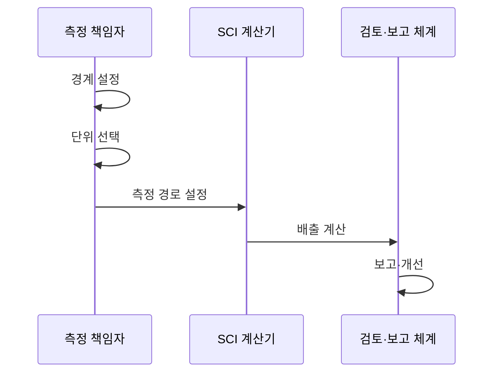

---
sidebar:
  order: 195
  label: "195. 소프트웨어 그린 엔지니어링 SCI 지수 (Green Software SCI)"
  badge:
    text: "기출 · 70%"
    variant: note
title: "소프트웨어 그린 엔지니어링 SCI 지수 (Green Software SCI)"
date: "2026-07-27T23:59:59+09:00"
tags:
  - "notes-software"
weight: 195
extra:
  question_no: "195"
  source_status: "기출"
  source_history: "137회"
  priority: 70
  priority_note: "탄소 강도 산정과 감축 판단이 최근 출제됨"
---

## 미리 알고가기

- **그린 소프트웨어**: 에너지·하드웨어 효율과 저탄소 전력을 활용해 배출량을 줄이는 설계임
- **소프트웨어 탄소 집약도(Software Carbon Intensity, SCI)**: SCI는 ‘에스시아이’로 읽고 영문 머리글자를 딴 약어이며, 기능 단위당 운영·내재 탄소 배출량으로 버전·구조의 탄소 효율을 비교함
- **운영 배출량 오($O$)**: 운영을 뜻하는 영문 Operational Emissions의 머리글자 `O`를 사용하며 소비 전력 $E$와 전력 탄소 집약도 $I$를 곱해 실행 중 배출량을 나타냄
- **에너지 이($E$)·탄소 집약도 아이($I$)**: Energy와 Carbon Intensity에서 가져온 라틴 문자 표기이며 각각 소비 전력량과 지역 전력 단위당 탄소 배출량을 가리켜 운영 배출량 계산에 사용함
- **내재 배출량 엠($M$)**: SCI 규격에서 내재 배출량에 관례적으로 쓰는 라틴 문자 표기이며 하드웨어 제조·운송·폐기 배출량 중 소프트웨어 사용분을 할당한 값임
- **기능 단위 알($R$)**: SCI 규격에서 기능 단위에 관례적으로 쓰는 라틴 문자 표기이며 API 호출·사용자·거래처럼 소프트웨어가 제공한 유용한 작업량을 뜻함
- **SCI 산식 $(O+M)/R$**: ‘오 더하기 엠을 알로 나눈 값’으로 읽고 괄호는 운영·내재 배출량을 먼저 합산한다는 표기이며, 합계를 기능 단위로 나눠 탄소 효율을 산출함
- **응용 프로그램 인터페이스(Application Programming Interface, API)**: API는 ‘에이피아이’로 읽고 영문 머리글자를 딴 약어이며, 본문에서는 SCI를 나눌 기능 단위인 호출 작업량을 제공함
- **탄소 인지**: 작업을 저탄소 시간·지역으로 이동해 같은 기능의 배출량을 줄이는 방식임
- **텔레메트리**: 전력·사용량·성능을 자동 수집해 계산 근거로 쓰는 관측 데이터임
- **탄소 상쇄**: 외부 감축 활동으로 배출량을 보전하며 SCI의 실제 감축 계산에는 포함하지 않음
- **기준선·성능 제약**: 기준선은 비교 전 상태이고 성능 제약은 지연·처리량의 허용 한계임

## Ⅰ. 개요

- 정의/개념: 기능 단위당 **운영·내재 탄소 배출량** 지표
- 기존 한계: 총배출량 비교는 **작업량 차이로 효율 왜곡**

### 쉽게 이해하기 (학습용)
- 기능 단위당 탄소 배출 효율 지표임

## Ⅱ. 특징

- 운영 배출과 내재 배출을 결합 계산한다.
- 경계와 단위를 통일해야 비교가 유효하다.
- 텔레메트리 데이터로 배출량을 정량화한다.
- 상쇄 수단을 배제하고 실제 감축만 측정한다.

### 쉽게 이해하기 (학습용)
- 운영과 자원 배출을 기능 단위로 나눔

## Ⅲ. 아키텍처 및 구성요소

$\mathrm{SCI} = (O + M) / R$

| 설계 요소 | 설명 |
|:---|:---|
| 경계 설정 | 분석할 서비스와 자원 범위를 정함 |
| 기능 단위 R | 유용한 작업량의 측정 단위를 정함 |
| 운영 배출 O | 전력과 탄소 집약도로 계산함 |
| 내재 배출 M | 제조 배출량의 사용분을 할당함 |
| 보고·개선 체계 | 산출 근거와 변경 효과를 공개함 |

> 요약: 경계와 단위 고정해 SCI 계산함

### 쉽게 이해하기 (학습용)
- 측정 경계와 산출 기준을 투명하게 공개함

## Ⅳ. 원리 및 절차 흐름도

| 절차 | 설명 |
|:---|:---|
| 경계 설정 | 분석할 서비스와 자원 확정 |
| 단위 선택 | 기능 단위와 측정량 결정 |
| 측정 경로 설정 | 데이터 수집 경로와 방식 결정 |
| 배출 계산 | O·M 합계를 R로 나눠 SCI 산출 |
| 보고·개선 | 지표 근거 공개와 버전 비교 |

> 요약: 동일 경계에서 효율 비교함

### 쉽게 이해하기 (학습용)
- 기준선 변경 없이 지표 변화를 측정함

## Ⅴ. 종류 및 비교

| 탄소 측정 지표 | SCI | 총 배출량 | 에너지 사용 |
|:---|:---|:---|:---|
| 적용 기준 | 버전·구조의 **효율 비교** | 조직·서비스 **총량 관리** | 전력 비용·**효율 개선** |
| 핵심 특징 | 기능당 **탄소 집약도** | 전체 **탄소 총량** | 소비 **전력량** |
| 한계 | 경계·기능 단위 **왜곡** | 사용량 증가와 **혼동** | 전력원 탄소 **차이 누락** |

> 요약: SCI는 단위당 효율을 비교함

### 쉽게 이해하기 (학습용)
- 이용자가 늘어도 지표로 효율 비교함

## Ⅵ. 실무 사례

1. 배치 작업은 저탄소 시간대로 이동함

### 쉽게 이해하기 (학습용)
- 배치는 마감 시간을 지키며 배출량을 줄임

## Ⅶ. 결론

- SCI가 줄고 성능 기준을 지킨 변경만 배포함

### 쉽게 이해하기 (학습용)
- 탄소만 줄이고 응답이 느려진 변경은 채택하지 않음
