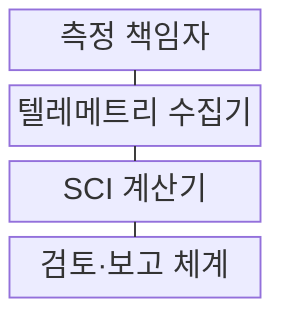
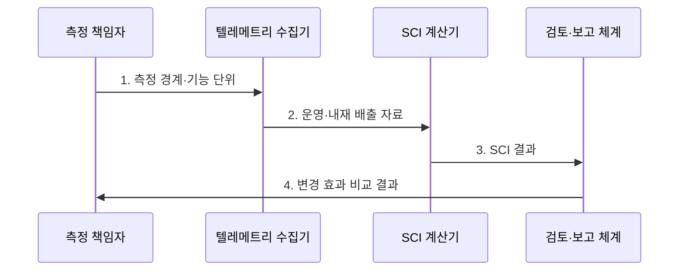

---
sidebar:
  order: 195
  label: "195. 소프트웨어 그린 엔지니어링 SCI 지수 (Green Software SCI)"
  badge:
    text: "기출 · 70%"
    variant: note
title: "소프트웨어 그린 엔지니어링 SCI 지수 (Green Software SCI)"
date: "2026-08-02T12:00:00+09:00"
tags:
  - "notes-software"
weight: 195
extra:
  question_no: "195"
  source_status: "기출"
  source_history: "137회"
  priority: 70
  priority_note: "탄소 강도 산정과 감축 판단이 최근 출제됨"
---

## Ⅰ. 개요

핵심 용어

- **소프트웨어 탄소 집약도(Software Carbon Intensity, SCI)**: 정한 소프트웨어 경계의 운영·내재 탄소 배출량 합계를 기능 단위로 나눈 탄소 효율 지표이다.

- 정의/개념: **소프트웨어 탄소집약도(SCI)** 는 정한 소프트웨어 경계의 운영•내재 탄소 배출량을 기능 단위로 나눠 나타내는 **탄소 효율 지표**
- 배경/필요성: 총배출량만으로는 작업량이 다른 버전의 **탄소 효율 비교** 불가

#### 한줄 요약
- 같은 배송 건수마다 트럭 연료와 차량 제조분을 나누듯, 같은 기능 작업량마다 운영·내재 배출량을 계산한다.

## Ⅱ. 특징

핵심 용어

- **에너지 E·탄소 집약도 I**: 운영 배출량은 소비 에너지 E와 시간·지역별 전력 탄소 집약도 I를 곱해 산정한다.
- **운영 배출량(Operational Emissions, O)·내재 배출량(Embodied Emissions, M)**: 서비스 실행 전력에서 발생한 배출과 하드웨어 제조·수명주기 배출의 할당분이다.
- **에너지(Energy, E)·탄소 집약도(Carbon Intensity, I)**: 소비 전력량과 시간·지역별 전력 단위당 탄소 배출 계수이다.
- **기능 단위(Functional Unit, R)**: 응용 프로그래밍 인터페이스 호출·거래처럼 소프트웨어가 제공한 유용 작업량을 나타내는 정규화 기준이다.

- **운영 배출 O·내재 배출 M** 결합
- **에너지 E·탄소 집약도 I** 기반 운영 배출량 산정
- **기능 단위 R·측정 경계** 기반 정규화
- **API 호출·거래량** 기반 기능 단위 설정
- **탄소 인지·텔레메트리** 기반 시간·지역별 감축 측정
- **상쇄 제외·실제 감축** 중심 버전 비교

#### 한줄 요약
- 같은 API 호출 수를 기준으로 실행 전력과 서버 제조분을 합쳐야 버전별 실제 탄소 효율을 비교할 수 있다.

## Ⅲ. 구조 및 구성요소

핵심 용어

- **SCI 계산기**: SCI 계산기는 운영 배출량과 할당한 내재 배출량의 합계를 기능 단위로 나눠 SCI를 산출한다.
- **소프트웨어 탄소 집약도 계산기(Software Carbon Intensity Calculator, SCI Calculator)**: 운영·내재 배출량 합계를 기능 단위로 나눠 탄소 효율을 산출하는 구성요소이다.
- **텔레메트리 수집기(Telemetry Collector)**: 전력·작업량·시간·지역별 탄소 계수와 하드웨어 정보를 수집하는 구성요소이다.

$\mathrm{SCI} = (O + M) / R$

| 구성요소 | 책임 |
|:---|:---|
| 측정 책임자 | 서비스 경계·**기능 단위 정의** |
| 텔레메트리 수집기 | 전력·작업량·**탄소 계수 수집** |
| SCI 계산기 | 운영·내재 배출량의 **SCI 산출** |
| 검토·보고 체계 | 기준선 비교·**변경 효과 공개** |

> 요약: 동일 경계·기능 단위로 **SCI** 산출

#### 한줄 요약
- 측정 책임자가 저울 범위와 한 묶음의 크기를 정하면 수집기가 재료를 모으고 계산기와 검토 체계가 같은 기준으로 변경 효과를 비교한다.

## Ⅳ. 흐름도

핵심 용어

- **3. SCI 결과**: 같은 측정 경계에서 O와 M의 합계를 R로 정규화한 SCI 결과를 검토·보고 체계에 전달한다.
- **1. 측정 경계·기능 단위**: 비교할 서비스·자원 범위와 동일한 유용 작업량 기준을 확정하는 단계이다.
- **2. 운영·내재 배출 자료**: 전력·탄소 집약도와 하드웨어 제조 배출 할당분을 수집하는 단계이다.
- **3. 소프트웨어 탄소 집약도(Software Carbon Intensity, SCI) 결과**: 운영 배출량과 내재 배출량의 합계를 기능 단위로 나눈 값을 전달하는 단계이다.
- **4. 변경 효과 비교 결과**: 동일 경계·단위에서 기준선과 변경안의 탄소 효율·품질을 대조한 결과이다.

**동작 원리**

1. **측정 경계·기능 단위**: 서비스·자원 범위와 유용 작업량 확정
2. **운영·내재 배출 자료**: 전력·탄소 집약도·제조분 수집
3. **SCI 결과**: O·M 합계를 R로 정규화
4. **변경 효과 비교 결과**: 동일 경계·단위의 기준선과 변경안 대조

> 요약: 동일 경계에서 **기준선·변경안 SCI** 비교

#### 한줄 요약
- 같은 크기의 바구니에 기준 버전과 변경 버전의 배출 자료를 담아 SCI를 계산해야 차이가 코드 변경에서 생겼는지 판단할 수 있다.

## Ⅴ. 종류 및 비교

핵심 용어

- **SCI**: SCI는 작업량이 다른 소프트웨어 버전과 구조를 기능당 탄소 배출량으로 비교하는 지표다.
- **소프트웨어 탄소 집약도(Software Carbon Intensity, SCI)**: 버전·구조별 기능당 탄소 배출량을 비교하는 효율 지표이다.
- **총 배출량(Total Emissions)**: 조직이나 서비스가 정한 기간에 발생시킨 전체 탄소 배출량이다.
- **에너지 사용량(Energy Consumption)**: 소프트웨어 실행에 소비한 전력량으로 전력원별 탄소 차이는 직접 포함하지 않는 지표이다.

| 탄소 측정 지표 | SCI | 총 배출량 | 에너지 사용 |
|:---|:---|:---|:---|
| 적용 기준 | 버전·구조의 **효율 비교** | 조직·서비스 **총량 관리** | 전력 비용·**효율 개선** |
| 핵심 특징 | 기능당 **탄소 집약도** | 전체 **탄소 총량** | 소비 **전력량** |
| 한계 | 경계·기능 단위 **왜곡** | 사용량 증가와 **혼동** | 전력원 탄소 **차이 누락** |

> 요약: **SCI** 로 작업량당 탄소 효율 비교

#### 한줄 요약
- 총배출량은 이용자가 늘면 커지지만 SCI는 같은 거래 한 건에 든 탄소를 비교하고 에너지 사용량은 전력원 차이를 놓친다.

## Ⅵ. 실무 고려사항 및 대책

핵심 용어

- **성능 저하**: 성능 저하를 탄소 감축으로 오인하지 않으려면 SCI와 함께 지연·처리량 SLO와 업무 마감을 검증해야 한다.
- **서비스 수준 목표(Service Level Objective, SLO)**: 지연·처리량·성공률 등 변경 후에도 충족해야 할 서비스 품질 목표이다.
- **시간·지역별 탄소 계수**: 전력이 생산된 시각과 지역의 에너지원 구성에 따른 단위 전력당 배출량이다.

| 문제 | 대책 | 효과 |
|:---|:---|:---|
| 서로 다른 **측정 경계** | 서비스·자원 **범위 고정** | 버전 비교 **일관성** |
| 기능 단위의 **가치 왜곡** | 업무량·품질을 **함께 정의** | 효율 개선 **정확성** |
| 지역별 **탄소 집약도 차이** | 시간·지역별 **계수 적용** | 운영 배출 **정밀도** |
| 성능 저하의 **위장 감축** | SLO·마감 **동시 검증** | 품질 유지 **보장** |

#### 한줄 요약
- 야간 저탄소 시간대로 작업을 옮겨도 마감과 SLO를 함께 확인해야 느려진 서비스를 감축 성과로 오인하지 않는다.

## Ⅶ. 결론

핵심 용어

- **SCI가 낮은 변경안**: 동일 기능과 SLO를 충족하는 후보 중 SCI가 낮은 변경안만 채택해야 한다.
- **소프트웨어 탄소 집약도(Software Carbon Intensity, SCI)가 낮은 변경안**: 동일 기능과 서비스 수준 목표를 충족하면서 기능당 탄소 배출량을 실제로 줄인 후보이다.

- 동일 기능·SLO를 만족할 때만 **SCI가 낮은 변경안** 채택

#### 한줄 요약
- 탄소만 줄이고 응답이 느려진 변경은 채택하지 않음
