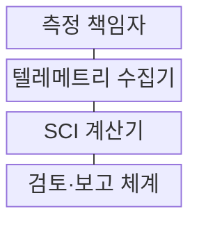
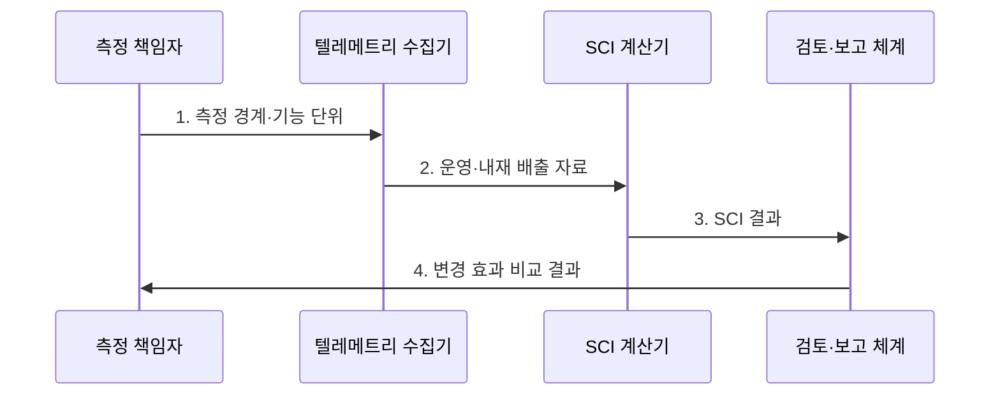

---
sidebar:
  order: 195
  label: "195. 소프트웨어 그린 엔지니어링 SCI 지수 (Green Software SCI)"
  badge:
    text: "기출 · 70%"
    variant: note
title: "소프트웨어 그린 엔지니어링 SCI 지수 (Green Software SCI)"
date: "2026-07-31T00:37:05+09:00"
tags:
  - "notes-software"
weight: 195
extra:
  question_no: "195"
  source_status: "기출"
  source_history: "137회"
  priority: 70
  priority_note: "탄소 강도 산정과 감축 판단이 최근 출제됨"
---

## 미리 알고가기

- **그린 소프트웨어**: 에너지·하드웨어 효율과 저탄소 전력을 활용해 배출량을 줄이는 설계이다.
- **소프트웨어 탄소 집약도(Software Carbon Intensity, SCI)**: 기능 단위당 운영·내재 탄소 배출량으로 버전·구조의 탄소 효율을 비교한다.
- **운영 배출량 오($O$)**: 운영을 뜻하는 영문 Operational Emissions의 머리글자 `O`를 사용하며 소비 전력 $E$와 전력 탄소 집약도 $I$를 곱해 실행 중 배출량을 나타냄
- **에너지 이($E$)·탄소 집약도 아이($I$)**: Energy와 Carbon Intensity에서 가져온 라틴 문자 표기이며 각각 소비 전력량과 지역 전력 단위당 탄소 배출량을 가리켜 운영 배출량 계산에 사용한다.
- **내재 배출량 엠($M$)**: SCI 규격에서 내재 배출량에 관례적으로 쓰는 라틴 문자 표기이며 하드웨어 제조·운송·폐기 배출량 중 소프트웨어 사용분을 할당한 값이다.
- **기능 단위 알($R$)**: SCI 규격에서 기능 단위에 관례적으로 쓰는 라틴 문자 표기이며 API 호출·사용자·거래처럼 소프트웨어가 제공한 유용한 작업량을 뜻한다.
- **SCI 산식 $(O+M)/R$**: ‘오 더하기 엠을 알로 나눈 값’으로 읽고 괄호는 운영·내재 배출량을 먼저 합산한다는 표기이며, 합계를 기능 단위로 나눠 탄소 효율을 산출한다.
- **응용 프로그램 인터페이스(Application Programming Interface, API)**: 본문에서는 SCI를 나눌 기능 단위인 호출 작업량을 제공한다.
- **탄소 인지**: 작업을 저탄소 시간·지역으로 이동해 같은 기능의 배출량을 줄이는 방식이다.
- **텔레메트리**: 전력·사용량·성능을 자동 수집해 계산 근거로 쓰는 관측 데이터이다.
- **탄소 상쇄**: 외부 감축 활동으로 배출량을 보전하며 SCI의 실제 감축 계산에는 포함하지 않음
- **기준선·성능 제약**: 기준선은 비교 전 상태이고 성능 제약은 지연·처리량의 허용 한계이다.
- **서비스 수준 목표(Service Level Objective, SLO)**: 지연·가용성처럼 서비스가 지켜야 할 정량 품질 목표이다.

## Ⅰ. 개요

- 정의/개념: 서비스 경계의 운영·내재 배출량을 기능 단위로 나누는 **탄소 효율 지표**
- 배경/필요성: 총배출량만으로는 작업량이 다른 버전의 **탄소 효율 비교** 불가

### 쉽게 이해하기 (학습용)
- 같은 배송 건수마다 트럭 연료와 차량 제조분을 나누듯, 같은 기능 작업량마다 운영·내재 배출량을 계산한다.

## Ⅱ. 특징

- **운영 배출 O·내재 배출 M** 결합
- **기능 단위 R·측정 경계** 기반 정규화
- **상쇄 제외·실제 감축** 중심 버전 비교

### 쉽게 이해하기 (학습용)
- 같은 API 호출 수를 기준으로 실행 전력과 서버 제조분을 합쳐야 버전별 실제 탄소 효율을 비교할 수 있다.

## Ⅲ. 구조 및 구성요소

$\mathrm{SCI} = (O + M) / R$

| 구성요소 | 책임 |
|:---|:---|
| 측정 책임자 | 서비스 경계·**기능 단위 정의** |
| 텔레메트리 수집기 | 전력·작업량·**탄소 계수 수집** |
| SCI 계산기 | 운영·내재 배출량의 **SCI 산출** |
| 검토·보고 체계 | 기준선 비교·**변경 효과 공개** |

> 요약: 동일 경계·기능 단위로 **SCI** 산출

### 쉽게 이해하기 (학습용)
- 측정 책임자가 저울 범위와 한 묶음의 크기를 정하면 수집기가 재료를 모으고 계산기와 검토 체계가 같은 기준으로 변경 효과를 비교한다.

## Ⅳ. 흐름도

**동작 원리**

1. **측정 경계·기능 단위**: 서비스·자원 범위와 유용 작업량 확정
2. **운영·내재 배출 자료**: 전력·탄소 집약도·제조분 수집
3. **SCI 결과**: O·M 합계를 R로 정규화
4. **변경 효과 비교 결과**: 동일 경계·단위의 기준선과 변경안 대조

> 요약: 동일 경계에서 **기준선·변경안 SCI** 비교

### 쉽게 이해하기 (학습용)
- 같은 크기의 바구니에 기준 버전과 변경 버전의 배출 자료를 담아 SCI를 계산해야 차이가 코드 변경에서 생겼는지 판단할 수 있다.

## Ⅴ. 종류 및 비교

| 탄소 측정 지표 | SCI | 총 배출량 | 에너지 사용 |
|:---|:---|:---|:---|
| 적용 기준 | 버전·구조의 **효율 비교** | 조직·서비스 **총량 관리** | 전력 비용·**효율 개선** |
| 핵심 특징 | 기능당 **탄소 집약도** | 전체 **탄소 총량** | 소비 **전력량** |
| 한계 | 경계·기능 단위 **왜곡** | 사용량 증가와 **혼동** | 전력원 탄소 **차이 누락** |

> 요약: **SCI**로 작업량당 탄소 효율 비교

### 쉽게 이해하기 (학습용)
- 총배출량은 이용자가 늘면 커지지만 SCI는 같은 거래 한 건에 든 탄소를 비교하고 에너지 사용량은 전력원 차이를 놓친다.

## Ⅵ. 실무 고려사항 및 대책

| 고려사항 | 대책 | 효과 |
|:---|:---|:---|
| 서로 다른 **측정 경계** | 서비스·자원 **범위 고정** | 버전 비교 **일관성** |
| 기능 단위의 **가치 왜곡** | 업무량·품질을 **함께 정의** | 효율 개선 **정확성** |
| 지역별 **탄소 집약도 차이** | 시간·지역별 **계수 적용** | 운영 배출 **정밀도** |
| 성능 저하의 **위장 감축** | SLO·마감 **동시 검증** | 품질 유지 **보장** |

### 쉽게 이해하기 (학습용)
- 야간 저탄소 시간대로 작업을 옮겨도 마감과 SLO를 함께 확인해야 느려진 서비스를 감축 성과로 오인하지 않는다.

## Ⅶ. 결론

- 동일 기능·SLO를 만족할 때만 **SCI가 낮은 변경안** 채택

### 쉽게 이해하기 (학습용)
- 탄소만 줄이고 응답이 느려진 변경은 채택하지 않음
