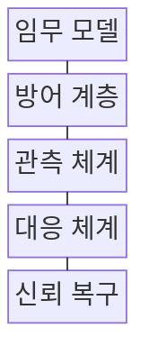
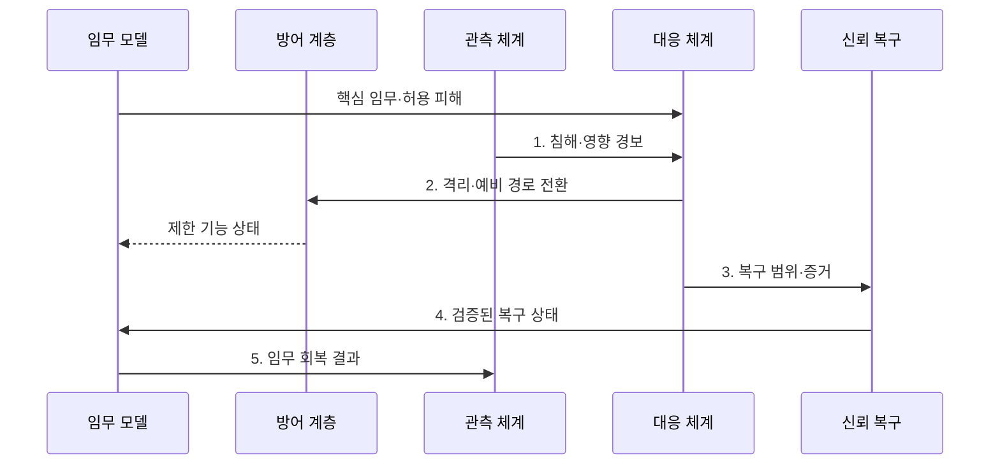

---
sidebar:
  order: 196
  label: "196. 사이버 레질리언스: 예방·감지·대응·복구 (Cyber Resilience)"
  badge:
    text: "기출 · 70%"
    variant: note
title: "사이버 레질리언스: 예방·감지·대응·복구 (Cyber Resilience)"
date: "2026-07-31T11:09:46+09:00"
tags:
  - "notes-software"
weight: 196
extra:
  question_no: "196"
  source_status: "기출"
  source_history: "137회"
  priority: 70
  priority_note: "예방·대응·복구 연계가 최근 직접 출제됨"
---

## 미리 알고가기

- **사이버 레질리언스**: 공격을 예상하고 견디며 핵심 업무를 복구·적응하는 능력이다.
- **예방·복원력**: 예방은 사고 가능성을 낮추고 복원력은 사고 중 임무 수행을 유지한다.
- **임무 중심**: 핵심 업무와 허용 피해 범위를 먼저 정해 보호·복구 순서를 결정한다.
- **가정된 침해**: 일부 계정·자산이 이미 장악됐다고 보고 격리와 우회 경로를 설계한다.
- **복구시간목표(Recovery Time Objective, RTO)·복구시점목표(Recovery Point Objective, RPO)**: 각각 최대 복구 시간과 허용 데이터 손실 시점을 정한다.
- **제로 트러스트**: 모든 접근마다 신원·기기·권한을 검증하고 최소 권한만 허용한다.
- **텔레메트리**: 로그·지표·흐름을 자동 수집해 이상 징후와 상태를 판단하는 데이터이다.
- **불변 백업**: 정해진 보존 기간에는 공격자도 수정·삭제할 수 없는 백업이다.
- **공통 실패 지점**: 이중화 구성도 함께 멈추게 만드는 공유 의존 요소이다.

> **키워드:** 사이버 레질리언스: 예방·감지·대응·복구 (Cyber Resilience)

## Ⅰ. 개요

- 정의/개념: 공격을 예상하고 견디며 **핵심 업무를 유지·복구·적응**하는 관리 능력
- 배경/필요성: 예방 통제만으로는 우회 침해 후 **핵심 임무 지속** 보장 불가

### 쉽게 이해하기 (학습용)
- 성의 일부가 뚫려도 방화문으로 감염 구역을 닫고 예비 지휘소에서 핵심 명령을 계속 수행하는 능력이다.

## Ⅱ. 특징

- **핵심 임무·허용 피해** 기반 복원력
- **침해 가정·제로 트러스트** 기반 최소 권한 통제
- **텔레메트리·업무 영향** 기반 탐지 우선순위
- 감염 구간을 격리하고 **예비 경로**로 제한 기능 지속
- **불변 백업·독립 복구 경계** 기반 신뢰 복구
- **정화 복구·훈련 환류**로 방어 적응

### 쉽게 이해하기 (학습용)
- 감염 객차를 분리해 남은 열차를 운행하고 깨끗한 차량으로 교체한 경험을 다음 차단 규칙과 훈련에 반영한다.

## Ⅲ. 구조 및 구성요소

| 구성요소 | 책임 |
|:---|:---|
| 임무 모델 | 핵심 업무·**허용 피해 정의** |
| 방어 계층 | 최소 권한·**격리 적용** |
| 관측 체계 | 침해·**업무 영향 분석** |
| 대응 체계 | 감염 구간 격리·**예비 경로 운영** |
| 신뢰 복구 | 정화 자원·**무결성 검증** |

> 요약: 감염 구간 격리·예비 경로 전환·신뢰 복구에 의한 **핵심 임무 유지**

### 쉽게 이해하기 (학습용)
- 관측 결과로 감염 자원을 격리하고 검증된 자원으로 복구한다.

## Ⅳ. 흐름도

**동작 원리**

1. **침해·영향 경보**: 이상과 핵심 업무 저하 판정
2. **격리·예비 경로 전환**: 감염 연결·권한을 차단하고 예비 경로 허용
3. **복구 범위·증거**: 정상 이미지·자료와 정화 대상 지정
4. **검증된 복구 상태**: 무결성을 확인한 자원만 임무에 복귀
5. **임무 회복 결과**: 원인·증거를 탐지 정책에 반영

> 요약: **임무 회복 결과**로 탐지 정책·대응 절차 갱신

### 쉽게 이해하기 (학습용)
- 침해를 발견하면 감염 구간을 떼고 예비 경로로 핵심 업무를 이어 감

## Ⅴ. 종류 및 비교

| 보안 대응 방식 | 사이버 레질리언스 | 예방 중심 | 재해 복구 |
|:---|:---|:---|:---|
| 적용 기준 | 공격·오염 **가정 설계** | 취약점·**접근 통제 강화** | 재해·**물리 장애 대비** |
| 핵심 특징 | 침해 중 **임무 유지·적응** | 공격 경로 **사전 차단** | 장애 후 **인프라 복구** |
| 한계 | 우회·신뢰 판정 **복잡도** | 우회 침해·**탐지 누락** | 오염 백업·**복구 지연** |

> 요약: **사이버 레질리언스**는 침해 중 임무 유지·적응 중심

### 쉽게 이해하기 (학습용)
- 예방 중심은 성문을 막고 재해 복구는 무너진 성을 다시 세우지만, 사이버 레질리언스는 침입 중에도 격리된 지휘소에서 핵심 임무를 이어 간다.

## Ⅵ. 실무 고려사항 및 대책

| 고려사항 | 대책 | 효과 |
|:---|:---|:---|
| 모든 업무의 **동일 복구** | 임무별 **중요도·허용 피해 정의** | 복구 자원 **우선순위** |
| 예비 환경의 **동시 오염** | 신뢰 경계·**백업 격리** | 깨끗한 복구 **기반 확보** |
| 이중화 자원의 **공통 실패 지점** | 계정·망·저장소의 **독립 경계 구성** | 동시 장애·오염 **차단** |
| 예비 경로의 **용량 부족** | 기능 저하·**최소 용량 시험** | 핵심 임무 **지속성** |
| 복구 자료의 **무결성 미확인** | 정화 이미지·**대사 검증** | 재침해·오류 **방지** |

### 쉽게 이해하기 (학습용)
- 결제 주 경로와 예비 경로가 같은 계정·저장소를 공유하면 함께 오염되므로 복구 경계와 최소 처리 용량을 분리해 시험한다.

## Ⅶ. 결론

- **RTO·RPO** 안에서 감염 구간 격리, 예비 경로 제한 운영 후 신뢰 복구·정상 전환

### 쉽게 이해하기 (학습용)
- 주 결제망이 오염되면 감염 구역을 닫고 예비 경로로 최소 결제를 이어 가되 깨끗한 복구본을 확인하기 전에는 정상망으로 돌리지 않는다.
