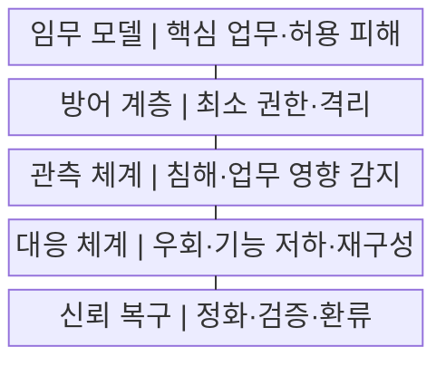
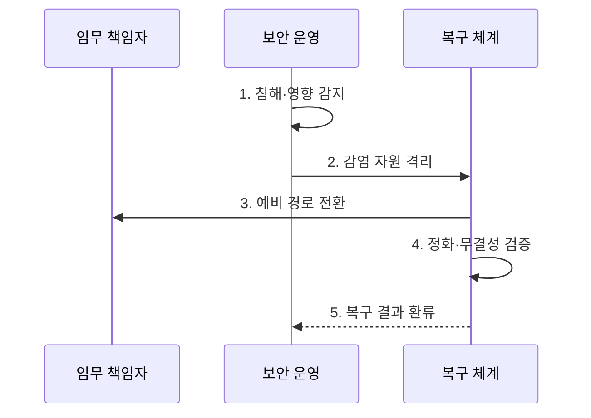

---
sidebar:
  order: 196
  label: "196. 사이버 레질리언스: 예방·감지·대응·복구 (Cyber Resilience)"
  badge:
    text: "기출 · 70%"
    variant: note
title: "사이버 레질리언스: 예방·감지·대응·복구 (Cyber Resilience)"
date: "2026-07-29T17:35:00+09:00"
tags:
  - "notes-software"
weight: 196
extra:
  question_no: "196"
  source_status: "기출"
  source_history: "137회"
  priority: 70
  priority_note: "예방·대응·복구 연계가 최근 직접 출제됨"
---

## 미리 알고가기

- **사이버 레질리언스**: 공격을 예상하고 견디며 핵심 업무를 복구·적응하는 능력이다.
- **예방·복원력**: 예방은 사고 가능성을 낮추고 복원력은 사고 중 임무 수행을 유지한다.
- **임무 중심**: 핵심 업무와 허용 피해 범위를 먼저 정해 보호·복구 순서를 결정한다.
- **가정된 침해**: 일부 계정·자산이 이미 장악됐다고 보고 격리와 우회 경로를 설계한다.
- **복구시간목표(Recovery Time Objective, RTO)·복구시점목표(Recovery Point Objective, RPO)**: RTO·RPO는 ‘알티오·알피오’로 읽고 영문 머리글자를 딴 약어이며, 각각 최대 복구 시간과 허용 데이터 손실 시점을 정한다.
- **제로 트러스트**: 모든 접근마다 신원·기기·권한을 검증하고 최소 권한만 허용한다.
- **텔레메트리**: 로그·지표·흐름을 자동 수집해 이상 징후와 상태를 판단하는 데이터이다.
- **불변 백업**: 정해진 보존 기간에는 공격자도 수정·삭제할 수 없는 백업이다.
- **공통 실패 지점**: 이중화 구성도 함께 멈추게 만드는 공유 의존 요소이다.

## Ⅰ. 개요

- 정의/개념: 침해를 견디며 **핵심 업무를 유지·복구·적응**
- 배경/필요성: 예방 통제 우회 시 **핵심 임무 중단 방지**

### 쉽게 이해하기 (학습용)
- 침해 상황에서도 핵심 업무를 지속함

## Ⅱ. 특징

- **핵심 임무·허용 피해** 기반 복원력
- **격리·우회·기능 저하** 기반 업무 지속
- **정화 복구·훈련 환류** 기반 적응

### 쉽게 이해하기 (학습용)
- 피해 범위를 통제하고 신뢰 상태로 복구함

## Ⅲ. 구조 및 구성요소

| 구성요소 | 책임 |
|:---|:---|
| 임무 모델 | 핵심 업무·**허용 피해 정의** |
| 방어 계층 | 최소 권한·**격리 적용** |
| 관측 체계 | 침해·**업무 영향 분석** |
| 대응 체계 | 감염 격리·**우회 운영** |
| 신뢰 복구 | 정화 자원·**무결성 검증** |

> 요약: 핵심 임무를 격리·우회·신뢰 복구로 지킴

### 쉽게 이해하기 (학습용)
- 관측 결과로 감염 자원을 격리하고 검증된 자원으로 복구한다.

## Ⅳ. 흐름도

**동작 원리**

1. **침해·영향 감지**: 이상과 핵심 업무 저하 판정
2. **감염 자원 격리**: 연결·권한 차단
3. **예비 경로 전환**: 허용 수준의 임무 지속
4. **정화·무결성 검증**: 정상 이미지·자료 복원
5. **복구 결과 환류**: 원인·증거를 정책에 반영

> 요약: 복구 결과로 방어 정책·대응 절차 갱신

### 쉽게 이해하기 (학습용)
- 침해를 발견하면 감염 구간을 떼고 예비 경로로 핵심 업무를 이어 감

## Ⅴ. 종류 및 비교

| 보안 대응 방식 | 사이버 레질리언스 | 예방 중심 | 재해 복구 |
|:---|:---|:---|:---|
| 적용 기준 | 공격·오염 **가정 설계** | 취약점·**접근 통제 강화** | 재해·**물리 장애 대비** |
| 핵심 특징 | 침해 중 **임무 유지·적응** | 공격 경로 **사전 차단** | 장애 후 **인프라 복구** |
| 한계 | 우회·신뢰 판정 **복잡도** | 우회 침해·**탐지 누락** | 오염 백업·**복구 지연** |

> 요약: 레질리언스는 침해 중 임무 유지·적응을 중시

### 쉽게 이해하기 (학습용)
- 오염 상황에서도 중요 망을 격리함

## Ⅵ. 실무 고려사항 및 대책

| 고려사항 | 대책 | 효과 |
|:---|:---|:---|
| 모든 업무의 **동일 복구** | 임무별 **중요도·허용 피해 정의** | 복구 자원 **우선순위** |
| 예비 환경의 **동시 오염** | 신뢰 경계·**백업 격리** | 깨끗한 복구 **기반 확보** |
| 우회 경로의 **용량 부족** | 기능 저하·**최소 용량 시험** | 핵심 임무 **지속성** |
| 복구 자료의 **무결성 미확인** | 정화 이미지·**대사 검증** | 재침해·오류 **방지** |

### 쉽게 이해하기 (학습용)
- 결제망은 한 침해가 두 경로를 함께 막지 않게 함

## Ⅶ. 결론

- **임무 중요도·오염 격리·복구 신뢰**로 복원력 수준 결정

### 쉽게 이해하기 (학습용)
- 예방 통제가 뚫려도 핵심 업무는 격리된 경로로 이어 감
