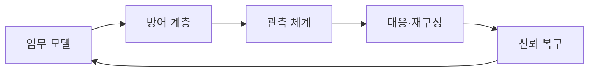
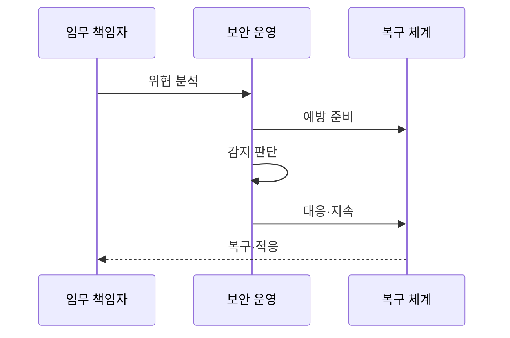

---
sidebar:
  order: 196
  label: "196. 사이버 레질리언스 — 예방·감지·대응·복구 (Cyber Resilience)"
  badge:
    text: "기출 · 70%"
    variant: note
title: "사이버 레질리언스 — 예방·감지·대응·복구 (Cyber Resilience)"
date: "2026-07-27T23:59:59+09:00"
tags:
  - "notes-software"
weight: 196
extra:
  question_no: "196"
  source_status: "기출"
  source_history: "137회"
  priority: 70
  priority_note: "예방·대응·복구 연계가 최근 직접 출제됨"
---

## 미리 알고가기

- **사이버 레질리언스**: 공격을 예상하고 견디며 핵심 업무를 복구·적응하는 능력임
- **예방·복원력**: 예방은 사고 가능성을 낮추고 복원력은 사고 중 임무 수행을 유지함
- **임무 중심**: 핵심 업무와 허용 피해 범위를 먼저 정해 보호·복구 순서를 결정함
- **가정된 침해**: 일부 계정·자산이 이미 장악됐다고 보고 격리와 우회 경로를 설계함
- **복구시간목표(Recovery Time Objective, RTO)·복구시점목표(Recovery Point Objective, RPO)**: RTO·RPO는 ‘알티오·알피오’로 읽고 영문 머리글자를 딴 약어이며, 각각 최대 복구 시간과 허용 데이터 손실 시점을 정함
- **제로 트러스트**: 모든 접근마다 신원·기기·권한을 검증하고 최소 권한만 허용함
- **텔레메트리**: 로그·지표·흐름을 자동 수집해 이상 징후와 상태를 판단하는 데이터임
- **불변 백업**: 정해진 보존 기간에는 공격자도 수정·삭제할 수 없는 백업임
- **공통 실패 지점**: 이중화 구성도 함께 멈추게 만드는 공유 의존 요소임

## Ⅰ. 개요

- 정의/개념: 침해를 견디며 **핵심 업무를 유지·복구·적응**
- 기존 한계: 예방 통제 우회 시 **핵심 임무 중단**

### 쉽게 이해하기 (학습용)
- 침해 상황에서도 핵심 업무를 지속함

## Ⅱ. 특징

- 비즈니스 우선순위 기반 복원력을 설계한다.
- 격리와 최소 권한으로 피해 확산을 제한한다.
- 텔레메트리 분석으로 이상 징후를 감지한다.
- 정화된 복구를 수행하고 피드백을 반영한다.

### 쉽게 이해하기 (학습용)
- 피해 범위를 통제하고 신뢰 상태로 복구함

## Ⅲ. 아키텍처 및 구성요소

| 설계 요소 | 설명 |
|:---|:---|
| 임무 모델 | 핵심 업무와 허용 피해를 정의함 |
| 방어 계층 | 제로 트러스트와 격리를 적용함 |
| 관측 체계 | 이상 징후와 업무 상태를 분석함 |
| 대응·재구성 | 감염 자원을 격리하고 우회 운영함 |
| 신뢰 복구 | 무결성을 검증한 자원으로 복구함 |

> 요약: 핵심 임무를 격리·우회·신뢰 복구로 지킴

### 쉽게 이해하기 (학습용)
- 관측 결과로 감염 자원을 격리하고 검증된 자원으로 복구한다.

## Ⅳ. 원리 및 절차 흐름도

| 절차 | 설명 |
|:---|:---|
| 위협 분석 | 핵심 업무 경로와 위험 도출 |
| 예방 준비 | 최소 권한·격리·우회 설계 |
| 감지 판단 | 이상 징후와 업무 상태 판정 |
| 대응·지속 | 감염 자원 격리와 우회 운영 |
| 복구·적응 | 신뢰 복구 후 정책·절차 개선 |

> 요약: 복구 결과로 방어 정책·대응 절차 갱신

### 쉽게 이해하기 (학습용)
- 침해를 발견하면 감염 구간을 떼고 예비 경로로 핵심 업무를 이어 감

## Ⅴ. 종류 및 비교

| 보안 대응 방식 | 사이버 레질리언스 | 예방 중심 | 재해 복구 |
|:---|:---|:---|:---|
| 적용 기준 | 공격·오염 **가정 설계** | 취약점·**접근 통제 강화** | 재해·**물리 장애 대비** |
| 핵심 특징 | 침해 중 **임무 유지·적응** | 공격 경로 **사전 차단** | 장애 후 **인프라 복구** |
| 한계 | 우회·신뢰 판정 **복잡도** | 우회 침해·**탐지 누락** | 오염 백업·**복구 지연** |

> 요약: 레질리언스는 침해 중 임무 유지·적응을 중시

### 쉽게 이해하기 (학습용)
- 오염 상황에서도 중요 망을 격리함

## Ⅵ. 실무 사례

1. 결제망은 이중화의 공통 실패 지점을 격리함

### 쉽게 이해하기 (학습용)
- 결제망은 한 침해가 두 경로를 함께 막지 않게 함

## Ⅶ. 결론

- 침해 훈련에서 RTO를 지킨 우회·복구만 승인함

### 쉽게 이해하기 (학습용)
- 예방 통제가 뚫려도 핵심 업무는 격리된 경로로 이어 감
