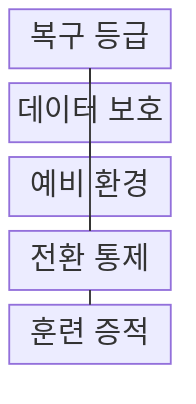
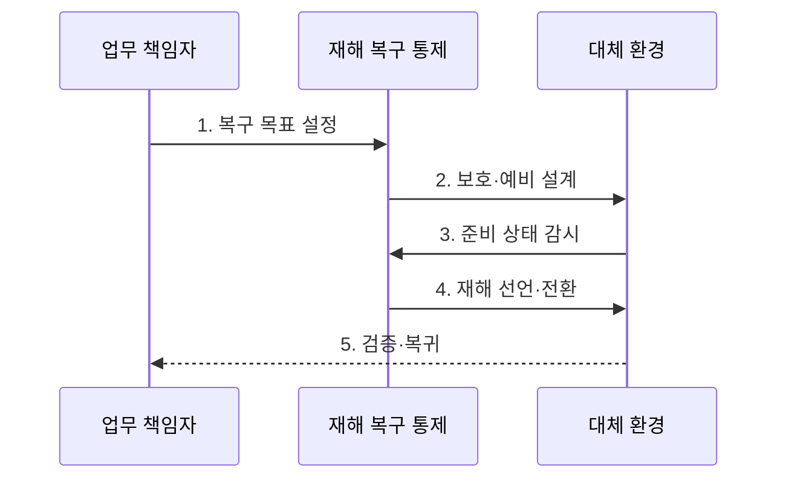

---
sidebar:
  order: 197
  label: "197. 재해 복구 RTO·RPO (Disaster Recovery RTO RPO)"
  badge:
    text: "미출 · 70%"
    variant: note
title: "재해 복구 RTO·RPO (Disaster Recovery RTO RPO)"
date: "2026-07-30T18:00:00+09:00"
tags:
  - "notes-software"
weight: 197
extra:
  question_no: "197"
  source_status: "미출"
  source_history: ""
  priority: 70
  priority_note: "복구 시간·데이터 손실 목표가 설계 핵심임"
---

## 미리 알고가기

- **재해 복구(Disaster Recovery, DR)**: DR은 ‘디알’로 읽고 영문 머리글자를 딴 약어이며, 재해로 중단된 서비스를 대체 환경에서 복원해 핵심 업무를 재개한다.
- **복구시간목표(Recovery Time Objective, RTO)**: RTO는 ‘알티오’로 읽고 영문 머리글자를 딴 약어이며, 서비스 복구를 완료할 목표 시간으로 예비 환경 준비 수준을 정한다.
- **복구시점목표(Recovery Point Objective, RPO)**: RPO는 ‘알피오’로 읽고 영문 머리글자를 딴 약어이며, 허용할 최대 데이터 손실 시간으로 복제·백업 주기를 정한다.
- **최대허용중단시간(Maximum Tolerable Downtime, MTD)**: MTD는 ‘엠티디’로 읽고 영문 머리글자를 딴 약어이며, 업무가 견딜 최대 중단 시간으로 RTO의 상한을 정한다.
- **장애조치(Failover)·원복(Failback)**: 장애조치는 대체 환경으로 서비스를 전환하는 동작이고 원복은 복구된 원 환경으로 되돌리는 동작이다.
- **업무영향분석(Business Impact Analysis, BIA)**: BIA는 ‘비아이에이’로 읽고 영문 머리글자를 딴 약어이며, 중단 영향을 분석해 복구 우선순위와 RTO·RPO를 정한다.
- **복제·스냅샷**: 복제는 변경을 다른 저장소에 전송하고 스냅샷은 특정 시점 상태를 보존한다.
- **런북**: 전환·복구·검증·복귀 단계와 담당자를 명시한 운영 절차서이다.
- **복구 검증**: 데이터 정합성·의존 서비스·업무 거래가 정상인지 확인하는 활동이다.
- **백업 복구(Backup Recovery)·웜 스탠바이(Warm Standby)**: 백업 복구는 저장된 사본으로 환경을 다시 만들고 웜 스탠바이는 축소된 대체 환경을 상시 준비하는 방식이다.
- **액티브-액티브(Active-Active)**: 둘 이상의 환경이 평상시에도 동시에 요청을 처리해 전환 시간을 줄이는 구조이다.

## Ⅰ. 개요

- 정의/개념: 복구 지표에 맞춰 서비스를 대체 복원함
- 배경/필요성: 업무별 **허용 중단·손실 차이의 복구 등급화**

### 쉽게 이해하기 (학습용)
- 서비스 중단 시 허용 유실 한도를 정의함

## Ⅱ. 특징

> 장애 시점 0을 기준으로 왼쪽 RPO 선은 허용 가능한 마지막 복구점, 오른쪽 RTO 선은 서비스 재개 시한을 나타낸 개념 예시이며 실제 목표 시간은 업무 영향 분석으로 정한다.

- **BIA·MTD·RTO·RPO** 기반 복구 목표
- **복제·백업·예비 환경** 기반 복구 등급
- **전환·복귀·대사 훈련** 기반 목표 입증

### 쉽게 이해하기 (학습용)
- 복구 등급에 따라 백업 사양을 분할 관리함

## Ⅲ. 구조 및 구성요소

| 구성요소 | 책임 |
|:---|:---|
| 복구 등급 | BIA·RTO·**RPO·순위 승인** |
| 데이터 보호 | 복제·백업·**스냅샷 구성** |
| 예비 환경 | 목표 시간별 **대체 자원 준비** |
| 전환 통제 | 선언·전환·**복귀 통제** |
| 훈련 증적 | 실행 시간·**정합성 기록** |

> 요약: 복구 목표를 데이터·자원·전환 설계로 연결함

### 쉽게 이해하기 (학습용)
- 백업 경로와 대체 환경을 통합 준비함

## Ⅳ. 흐름도

**동작 원리**

1. **복구 목표 설정**: BIA로 RTO·RPO 승인
2. **보호·예비 설계**: 복제·백업·런북 구성
3. **준비 상태 감시**: 지연·용량·복원성 확인
4. **재해 선언·전환**: 대체 환경으로 순차 복구
5. **검증·복귀**: 거래·무결성 대사 후 복귀

> 요약: 복제·예비 자원 감시 후 선언·전환·복귀

### 쉽게 이해하기 (학습용)
- 재해 선언 뒤 대체 환경을 켜고 거래를 확인한 후 원래 환경으로 돌아감

## Ⅴ. 종류 및 비교

| 재해 복구 방식 | Backup 복구 | Warm Standby | Active-Active |
|:---|:---|:---|:---|
| 적용 기준 | 긴 RTO·**비용 제한** | 중간 **RTO·RPO** | 매우 짧은 **RTO·RPO** |
| 핵심 특징 | 백업 기반 **환경 재구성** | 축소 환경 **상시 준비** | 두 환경 **동시 서비스** |
| 한계 | 복원 지연·**백업 오류** | 용량 부족·**전환 실패** | 쓰기 충돌·**높은 비용** |

> 요약: RTO·RPO·비용으로 예비 환경 수준 선택

### 쉽게 이해하기 (학습용)
- 복구 시간과 예산을 절충해 선택함

## Ⅵ. 실무 고려사항 및 대책

| 고려사항 | 대책 | 효과 |
|:---|:---|:---|
| 전 업무의 **동일 등급** | BIA 기반 **RTO·RPO 차등화** | 투자 우선순위 **확보** |
| 복제의 **오류 동시 전파** | 불변 백업·**복원 시점 분리** | 깨끗한 자료 **확보** |
| 예비 환경의 **용량 부족** | Peak·N-1 **부하 시험** | 전환 후 **서비스 유지** |
| 훈련 없는 **문서 런북** | 정기 전환·**대사 훈련** | 목표 달성 **증명** |

### 쉽게 이해하기 (학습용)
- 금융 거래는 연관 데이터가 같은 시점으로 복구돼야 함

## Ⅶ. 결론

- **업무 영향·허용 손실·훈련 결과**로 복구 등급 결정

### 쉽게 이해하기 (학습용)
- 백업 보유가 아니라 실제 거래 복구 성공을 확인함
