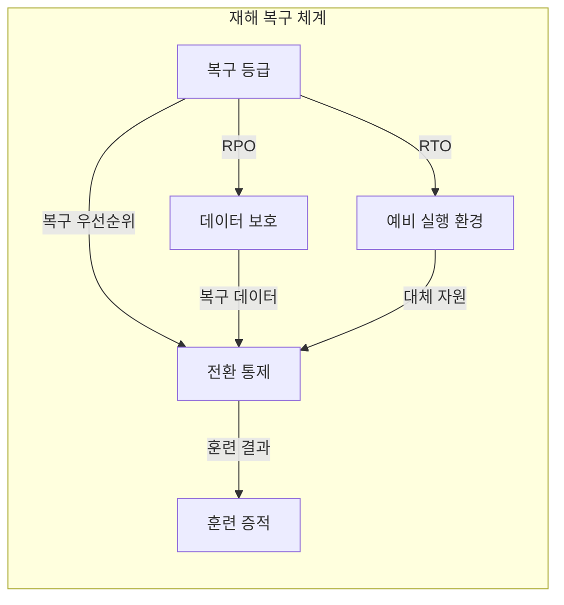
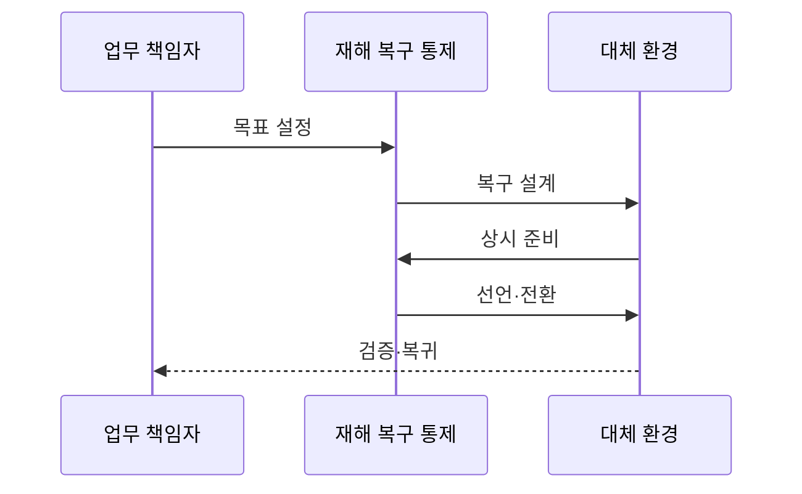

---
sidebar:
  order: 197
  label: "197. 재해 복구 RTO·RPO (Disaster Recovery RTO RPO)"
  badge:
    text: "미출제 · 70%"
    variant: note
title: "재해 복구 RTO·RPO (Disaster Recovery RTO RPO)"
date: "2026-07-25T00:30:00+09:00"
tags:
  - "notes-software"
weight: 197
extra:
  question_no: "197"
  source_status: "미출제"
  source_history: ""
  priority: 70
  priority_note: "복구 시간·데이터 손실 목표가 설계 핵심임"
---

## 미리 알고가기

- **재해 복구(Disaster Recovery, DR)**: DR은 ‘디알’로 읽고 영문 머리글자를 딴 약어이며, 재해로 중단된 서비스를 대체 환경에서 복원해 핵심 업무를 재개함
- **복구시간목표(Recovery Time Objective, RTO)**: RTO는 ‘알티오’로 읽고 영문 머리글자를 딴 약어이며, 서비스 복구를 완료할 목표 시간으로 예비 환경 준비 수준을 정함
- **복구시점목표(Recovery Point Objective, RPO)**: RPO는 ‘알피오’로 읽고 영문 머리글자를 딴 약어이며, 허용할 최대 데이터 손실 시간으로 복제·백업 주기를 정함
- **최대허용중단시간(Maximum Tolerable Downtime, MTD)**: MTD는 ‘엠티디’로 읽고 영문 머리글자를 딴 약어이며, 업무가 견딜 최대 중단 시간으로 RTO의 상한을 정함
- **장애조치(Failover)·원복(Failback)**: 장애조치는 대체 환경으로 서비스를 전환하는 동작이고 원복은 복구된 원 환경으로 되돌리는 동작임
- **업무영향분석(Business Impact Analysis, BIA)**: BIA는 ‘비아이에이’로 읽고 영문 머리글자를 딴 약어이며, 중단 영향을 분석해 복구 우선순위와 RTO·RPO를 정함
- **복제·스냅샷**: 복제는 변경을 다른 저장소에 전송하고 스냅샷은 특정 시점 상태를 보존함
- **런북**: 전환·복구·검증·복귀 단계와 담당자를 명시한 운영 절차서임
- **복구 검증**: 데이터 정합성·의존 서비스·업무 거래가 정상인지 확인하는 활동임
- **백업 복구(Backup Recovery)·웜 스탠바이(Warm Standby)**: 백업 복구는 저장된 사본으로 환경을 다시 만들고 웜 스탠바이는 축소된 대체 환경을 상시 준비하는 방식임
- **액티브-액티브(Active-Active)**: 둘 이상의 환경이 평상시에도 동시에 요청을 처리해 전환 시간을 줄이는 구조임

## Ⅰ. 개요

- 정의/개념: 복구 지표에 맞춰 서비스를 대체 복원함
- **배경/필요성**: 업무별 허용 중단·손실이 달라 복구 등급이 필요함

### 쉽게 이해하기 (학습용)
- 서비스 중단 시 허용 유실 한도를 정의함

## Ⅱ. 특징

- 영향 분석으로 업무 중요도와 복구 목표를 정한다.
- 데이터 유실 목표에 따라 보호 방식을 정한다.
- 복구 시간 목표에 맞춰 예비 인프라 결정한다.
- 모의 복구 훈련으로 데이터 정합성 측정한다.

### 쉽게 이해하기 (학습용)
- 복구 등급에 따라 백업 사양을 분할 관리함

## Ⅲ. 아키텍처 및 구성요소

| 설계 요소 | 설명 |
|:---|:---|
| 복구 등급 | BIA로 RTO·RPO·우선순위를 승인함 |
| 데이터 보호 | 복제·백업·스냅샷을 구성함 |
| 예비 실행 환경 | 목표 시간에 맞는 자원을 준비함 |
| 전환 통제 | 선언 조건과 전환·복귀를 통제함 |
| 훈련 증적 | 런북 실행 시간과 결과를 기록함 |

> 요약: 복구 목표를 데이터·자원·전환 설계로 연결함

### 쉽게 이해하기 (학습용)
- 백업 경로와 대체 환경을 통합 준비함

## Ⅳ. 원리 및 절차 흐름도

| 절차 | 설명 |
|:---|:---|
| 목표 설정 | BIA로 RTO·RPO 승인 |
| 복구 설계 | 데이터 보호와 전환 런북 설계 |
| 상시 준비 | 복제 지연과 예비 자원 감시 |
| 선언·전환 | 재해 선언과 대체 환경 전환 |
| 검증·복귀 | 거래·무결성 확인 후 원 환경 복귀 |

> 요약: 복제·예비 자원 감시 후 선언·전환·복귀

### 쉽게 이해하기 (학습용)
- 재해 선언 뒤 대체 환경을 켜고 거래를 확인한 후 원래 환경으로 돌아감

## Ⅴ. 종류 및 비교

| 판단 기준 | Backup 복구 | Warm Standby | Active-Active |
|:---|:---|:---|:---|
| 핵심 특징 | 백업에서 환경을 재구성함 | 축소 환경을 상시 준비함 | 두 환경이 동시에 서비스함 |
| 적용 기준 | 긴 RTO·낮은 비용 | 중간 RTO·RPO | 매우 짧은 RTO·RPO |
| 주요 위험 | 복원 지연·백업 오류 | 용량 부족·전환 실패 | 동시 쓰기 충돌·고비용 |

> 요약: RTO·RPO·비용으로 예비 환경 수준 선택

### 쉽게 이해하기 (학습용)
- 복구 시간과 예산을 절충해 선택함

## Ⅵ. 실무 사례

1. 금융 거래는 동기 복제로 RPO를 줄임

### 쉽게 이해하기 (학습용)
- 금융 거래는 연관 데이터가 같은 시점으로 복구돼야 함

## Ⅶ. 결론

- 훈련에서 RTO·RPO를 충족한 복구 방식만 채택함

### 쉽게 이해하기 (학습용)
- 백업 보유가 아니라 실제 거래 복구 성공을 확인함
