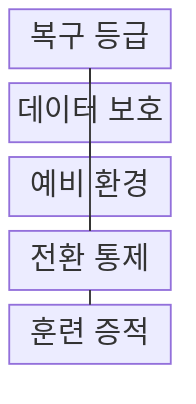
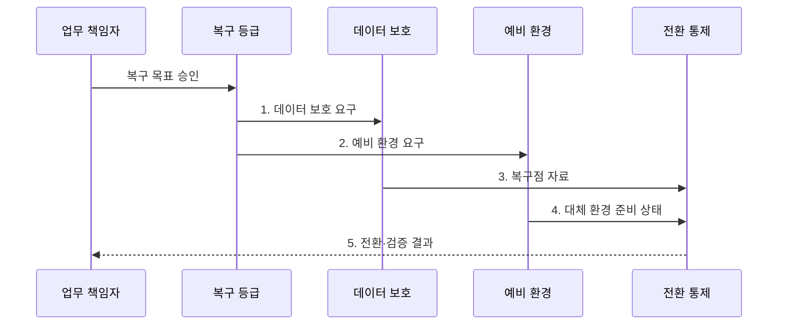

---
sidebar:
  order: 197
  label: "197. 재해 복구 RTO·RPO (Disaster Recovery RTO RPO)"
  badge:
    text: "미출 · 70%"
    variant: note
title: "재해 복구 RTO·RPO (Disaster Recovery RTO RPO)"
date: "2026-08-02T12:00:00+09:00"
tags:
  - "notes-software"
weight: 197
extra:
  question_no: "197"
  source_status: "미출"
  source_history: ""
  priority: 70
  priority_note: "복구 시간·데이터 손실 목표가 설계 핵심임"
---

## Ⅰ. 개요

핵심 용어

- **복구 전략**: 재해 복구는 업무별 RTO와 RPO에 맞춰 데이터와 서비스를 대체 환경에서 복원하는 복구 전략이다.

- 정의/개념: **재해 복구**는 업무별 허용 중단시간인 RTO와 시간으로 나타낸 허용 데이터 손실 범위인 RPO에 맞춰 데이터와 서비스를 대체 환경에 복원하는 **업무 연속성 복구 전략**
- 배경/필요성: 단일 복구 방식으로는 업무별 **허용 중단·손실 차이** 충족 불가

#### 한줄 요약
- 가게 문을 다시 여는 시한이 RTO이고 마지막 장부를 어디까지 되살릴지가 RPO이므로 업무마다 다른 복구 준비가 필요하다.

## Ⅱ. 특징

핵심 용어

- **BIA·MTD**: BIA는 업무 중단 영향을 분석하고 MTD는 견딜 수 있는 최대 중단 시간을 정해 RTO·RPO의 근거가 된다.

> 장애 시점 왼쪽은 **RPO 복구점**, 오른쪽은 **RTO 재개 시한**

- **BIA·MTD**로 RTO·RPO 복구 목표 결정
- **복제·예비 환경**으로 복구 등급 구성
- **Failover·Failback** 기반 전환·복귀 통제
- **전환·대사 훈련**으로 목표 달성 입증

#### 한줄 요약
- 결제는 수초 안에 예비 환경으로 넘기고 보고서는 백업에서 복원하듯, 중단 피해에 따라 준비 비용과 복구 속도를 달리한다.

## Ⅲ. 구조 및 구성요소

핵심 용어

- **복구 등급**: 복구 등급은 업무 중요도와 RTO·RPO를 기준으로 데이터 보호와 예비 환경의 준비 수준을 정한다.

| 구성요소 | 책임 |
|:---|:---|
| 복구 등급 | BIA·RTO·**RPO·순위 승인** |
| 데이터 보호 | 복제·백업·**스냅샷 구성** |
| 예비 환경 | 목표 시간별 **대체 자원 준비** |
| 전환 통제 | 선언·전환·**복귀 통제** |
| 훈련 증적 | 실행 시간·**정합성 기록** |

> 요약: **복구 목표**를 데이터 보호·예비 자원·전환 통제로 연결

#### 한줄 요약
- 복구 등급이 데이터 사본과 예비 환경 수준을 정하고 전환 통제와 훈련 증적이 실제 목표 달성을 확인한다.

## Ⅳ. 흐름도

핵심 용어

- **5. 전환·검증 결과**: 대체 환경으로 전환한 뒤 업무 거래, 데이터 무결성, 의존 서비스를 대사한 결과로 복귀를 승인한다.

**동작 원리**

1. **데이터 보호 요구**: RPO에 맞춰 복제·백업 주기 구성
2. **예비 환경 요구**: RTO에 맞춰 대체 자원 수준 구성
3. **복구점 자료**: 허용 손실 안의 일관된 복구 시점 제공
4. **대체 환경 준비 상태**: 용량·의존 서비스·전환 가능성 확인
5. **전환·검증 결과**: 거래·무결성 대사 후 복귀 승인

> 요약: **RTO·RPO**에 맞춘 복구점·예비 환경으로 전환

#### 한줄 요약
- 재해 선언 뒤 대체 환경을 켜고 거래를 확인한 후 원래 환경으로 돌아감

## Ⅴ. 종류 및 비교

핵심 용어

- **Active-Active**: Active-Active는 둘 이상의 환경이 평상시에도 동시에 요청을 처리해 매우 짧은 RTO·RPO를 지원한다.

| 재해 복구 방식 | Backup 복구 | Warm Standby | Active-Active |
|:---|:---|:---|:---|
| 적용 기준 | 긴 RTO·**비용 제한** | 중간 **RTO·RPO** | 매우 짧은 **RTO·RPO** |
| 핵심 특징 | 백업 기반 **환경 재구성** | 축소 환경 **상시 준비** | 두 환경 **동시 서비스** |
| 한계 | 복원 지연·**백업 오류** | 용량 부족·**전환 실패** | 쓰기 충돌·**높은 비용** |

> 요약: **RTO·RPO**와 비용으로 예비 환경 수준 선택

#### 한줄 요약
- 백업 복구는 창고에서 장비를 다시 꺼내고 웜 스탠바이는 예비 매장을 데우며 액티브-액티브는 두 매장이 평소에도 함께 영업한다.

## Ⅵ. 실무 고려사항 및 대책

핵심 용어

- **용량 부족**: 용량 부족은 예비 환경이 장애 시 전체 부하를 인계하지 못해 전환 후에도 서비스가 목표 수준을 유지하지 못하는 문제다.

| 문제 | 대책 | 효과 |
|:---|:---|:---|
| 전 업무의 **동일 등급** | BIA 기반 **RTO·RPO 차등화** | 투자 우선순위 **확보** |
| 복제의 **오류 동시 전파** | **불변 백업·복원 시점 분리** | 깨끗한 자료 **확보** |
| 예비 환경의 **용량 부족** | 최대·**N-1 부하 시험** | 전환 후 **서비스 유지** |
| 훈련 없는 **문서 런북** | 정기 전환·**대사 훈련** | 목표 달성 **증명** |

#### 한줄 요약
- 금융 거래의 원장과 잔액이 다른 시점으로 돌아가면 숫자가 맞지 않으므로 같은 복구점으로 대사해야 한다.

## Ⅶ. 결론

핵심 용어

- **액티브-액티브**: 짧은 RTO·RPO는 액티브-액티브, 중간 목표는 웜 스탠바이, 긴 목표는 백업 복구를 선택한다.

- 짧은 RTO·RPO는 **액티브-액티브**, 중간은 웜 스탠바이, 긴 목표는 백업 복구 선택

#### 한줄 요약
- 가장 비싼 예비 환경을 모두 쓰는 대신 업무 손실 한도에 맞는 등급을 고르고 훈련에서 거래 복구 성공을 확인한다.
