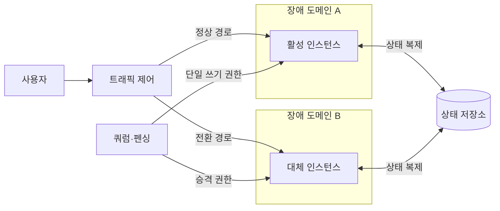
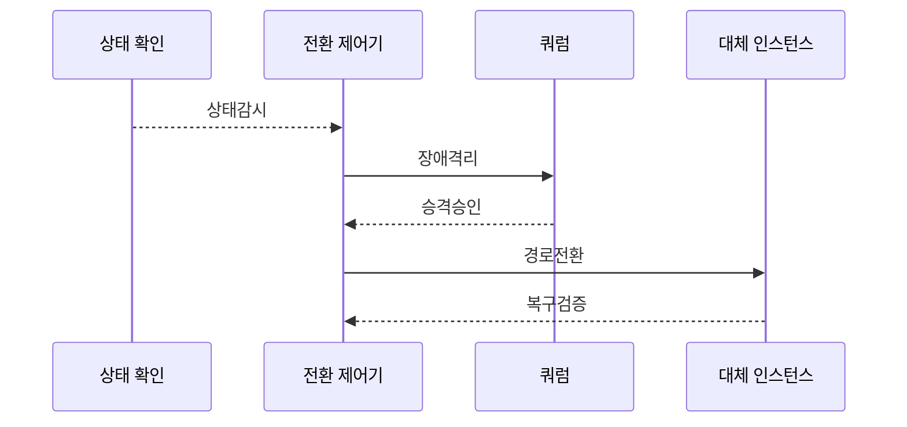

---
sidebar:
  order: 198
  label: "198. 고가용성 설계 — Active-Active·Active-Standby (High Availability Design)"
  badge:
    text: "기출 · 70%"
    variant: note
title: "고가용성 설계 — Active-Active·Active-Standby (High Availability Design)"
date: "2026-07-27T23:59:59+09:00"
tags:
  - "notes-software"
weight: 198
extra:
  question_no: "198"
  source_status: "기출"
  source_history: "137회"
  priority: 70
  priority_note: "이중화 방식과 장애 전환 비교가 최근 출제됨"
---

## 미리 알고가기

- **고가용성(High Availability, HA)**: 계획·비계획 장애에도 서비스 중단을 최소화해 정한 가용성 목표를 유지하는 설계 능력임
- **액티브-액티브(Active-Active)**: 둘 이상의 활성 인스턴스가 동시에 요청을 처리하고 장애 시 남은 인스턴스가 부하를 인계하는 구조임
- **액티브-스탠바이(Active-Standby)**: 활성 인스턴스가 요청을 처리하고 대기 인스턴스가 상태를 동기화하다 장애 시 승격되는 구조임
- **쿼럼(Quorum)·분할 뇌(Split Brain)**: 쿼럼은 다수 동의로 단일 주 노드를 정하는 정족수이고 분할 뇌는 네트워크 단절 뒤 둘 이상의 노드가 자신을 주 노드로 판단하는 장애임
- **상태 확인(Health Check)**: 프로세스 생존뿐 아니라 의존 서비스와 실제 요청 처리 가능성을 검사해 트래픽 전달·전환 여부를 정함
- **오류 예산**: 목표 SLO에서 허용되는 중단량으로 변경 속도와 안정화 투자를 조절함
- **서비스 수준 목표(Service Level Objective, SLO)**: 일정 기간에 서비스가 달성해야 하는 가용성·지연 같은 내부 신뢰성 목표이며 오류 예산의 기준임
- **장애 도메인**: 전원·네트워크·지역 장애를 함께 공유하는 자원 범위임
- **펜싱(Fencing)**: 이전 Primary의 쓰기 권한을 차단해 두 노드의 동시 쓰기를 막는 조치임
- **준비 상태(Readiness)**: 인스턴스가 의존성을 포함해 실제 요청을 처리할 준비가 됐는지 나타내며 트래픽 전달 여부를 결정하는 상태임
- **엔 마이너스 원($N-1$) 용량**: ‘엔 마이너스 원’으로 읽고 개수(Number)의 머리글자 $N$에서 하나를 뺀 표기이며 한 요소가 고장 나도 남은 자원이 처리할 수 있는 용량을 나타냄
- **부하 차단(Load Shedding)**: 과부하 때 낮은 우선순위 요청을 거부해 한정된 용량을 핵심 요청에 남기는 방식임
- **카오스 테스트**: 의도적으로 장애를 주입해 감지·전환·복구 동작을 검증하는 시험임
- **핫·웜 스탠바이(Hot·Warm Standby)**: 핫은 즉시 승격 가능한 대기 환경이고 웜은 기동·데이터 복구 뒤 승격하는 축소 대기 환경임

## Ⅰ. 개요

- **정의/개념**: 장애 중에도 **목표 가용성을 유지**하는 설계
- **기존 한계**: 단일 자원 장애의 **서비스 전체 중단**

### 쉽게 이해하기 (학습용)
- 장애 발생 시 예비 자원으로 전환해 서비스 유지함

## Ⅱ. 특징

- 장애 도메인 분리해 동시 실패 방지한다.
- 다중 헬스 체크로 감지 오탐 최소화한다.
- 분산 상태 복제로 데이터 정합성 관리한다.

### 쉽게 이해하기 (학습용)
- 장애 범위를 분리해 동시 고장을 차단함

## Ⅲ. 아키텍처 및 구성요소

| 설계 요소 | 설명 |
|:---|:---|
| 트래픽 제어 | 정상 노드로 요청을 분산함 |
| 활성 인스턴스 | 정상 경로에서 요청을 처리 |
| 대체 인스턴스 | 다른 장애 도메인에서 부하를 인계 |
| 쿼럼·펜싱 | 단일 쓰기 권한과 승격을 통제 |
| 상태 저장소 | 두 인스턴스의 업무 상태를 동기화 |

> 요약: 다중화와 상태 합의 및 복구 지표 연계함

### 쉽게 이해하기 (학습용)
- 예비 노드를 구축하고 전환을 자동화함
## Ⅳ. 원리 및 절차 흐름도

| 절차 | 설명 |
|:---|:---|
| 상태감시 | 의존성·요청 처리 가능성을 판정 |
| 장애격리 | 이전 주 노드의 쓰기 권한 차단 |
| 승격승인 | 쿼럼으로 단일 대체 노드 선택 |
| 경로전환 | 정상 대체 노드로 트래픽 이동 |
| 복구검증 | 업무 거래·상태 정합성을 확인 |

> 요약: 위협 모델 기반 전환 단계 설계함

### 쉽게 이해하기 (학습용)
- 오염 대상을 분리하고 정상 자원으로 롤백

## Ⅴ. 종류 및 비교

| 고가용성 구성 | Active-Active | Hot Standby | Warm Standby |
|:---|:---|:---|:---|
| 적용 기준 | 무중단·**부하 분산** | 짧은 전환·**단일 쓰기** | 비용 절감·**긴 전환 허용** |
| 핵심 특징 | 다중 환경 **동시 처리** | 대기 환경 **즉시 승격** | 대기 환경 **기동 후 승격** |
| 한계 | 쓰기 충돌·**동기화 복잡도** | 유휴 비용·**승격 실패** | 기동·**데이터 복구 지연** |

> 요약: 목표 가용성 따라 이중화 방식 선정함

### 쉽게 이해하기 (학습용)
- 부하 특성과 가용 비용을 고려해 다중화

## Ⅵ. 실무 사례

1. 상태형 데이터베이스는 펜싱으로 이중 쓰기 방지
2. 주문 인터페이스는 과부하 때 낮은 우선 요청 차단

### 쉽게 이해하기 (학습용)
- 데이터베이스는 이전 주 노드의 쓰기 권한을 먼저 차단함
- 주문 인터페이스는 핵심 결제를 남기고 부가 요청을 거부함

## Ⅶ. 결론

- 펜싱과 N-1 용량을 검증한 뒤 자동 전환함

### 쉽게 이해하기 (학습용)
- 전환돼도 이중 쓰기나 남은 노드 과부하가 없어야 함
