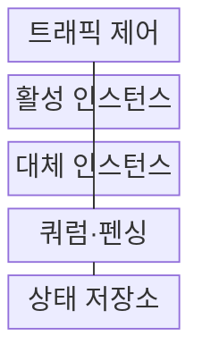
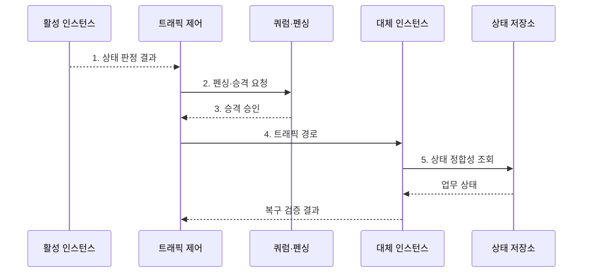

---
sidebar:
  order: 198
  label: "198. 고가용성 설계: Active-Active·Active-Standby (High Availability Design)"
  badge:
    text: "기출 · 70%"
    variant: note
title: "고가용성 설계: Active-Active·Active-Standby (High Availability Design)"
date: "2026-07-31T00:46:45+09:00"
tags:
  - "notes-software"
weight: 198
extra:
  question_no: "198"
  source_status: "기출"
  source_history: "137회"
  priority: 70
  priority_note: "이중화 방식과 장애 전환 비교가 최근 출제됨"
---

## 미리 알고가기

- **고가용성(High Availability, HA)**: 계획·비계획 장애에도 서비스 중단을 최소화해 정한 가용성 목표를 유지하는 설계 능력이다.
- **액티브-액티브(Active-Active)**: 둘 이상의 활성 인스턴스가 동시에 요청을 처리하고 장애 시 남은 인스턴스가 부하를 인계하는 구조이다.
- **액티브-스탠바이(Active-Standby)**: 활성 인스턴스가 요청을 처리하고 대기 인스턴스가 상태를 동기화하다 장애 시 승격되는 구조이다.
- **쿼럼(Quorum)·분할 뇌(Split Brain)**: 쿼럼은 다수 동의로 단일 주 노드를 정하는 정족수이고 분할 뇌는 네트워크 단절 뒤 둘 이상의 노드가 자신을 주 노드로 판단하는 장애이다.
- **상태 확인(Health Check)**: 프로세스 생존뿐 아니라 의존 서비스와 실제 요청 처리 가능성을 검사해 트래픽 전달·전환 여부를 정한다.
- **서비스 수준 목표(Service Level Objective, SLO)**: 일정 기간에 서비스가 달성해야 하는 가용성·지연 같은 내부 신뢰성 목표이며 오류 예산의 기준이다.
- **오류 예산**: 목표 SLO에서 허용되는 중단량으로 변경 속도와 안정화 투자를 조절한다.
- **장애 도메인**: 전원·네트워크·지역 장애를 함께 공유하는 자원 범위이다.
- **펜싱(Fencing)**: 이전 Primary의 쓰기 권한을 차단해 두 노드의 동시 쓰기를 막는 조치이다.
- **준비 상태(Readiness)**: 인스턴스가 의존성을 포함해 실제 요청을 처리할 준비가 됐는지 나타내며 트래픽 전달 여부를 결정하는 상태이다.
- **엔 마이너스 원($N-1$) 용량**: ‘엔 마이너스 원’으로 읽고 개수(Number)의 머리글자 $N$에서 하나를 뺀 표기이며 한 요소가 고장 나도 남은 자원이 처리할 수 있는 용량을 나타냄
- **부하 차단(Load Shedding)**: 과부하 때 낮은 우선순위 요청을 거부해 한정된 용량을 핵심 요청에 남기는 방식이다.
- **카오스 테스트**: 의도적으로 장애를 주입해 감지·전환·복구 동작을 검증하는 시험이다.
- **핫·웜 스탠바이(Hot·Warm Standby)**: 핫은 즉시 승격 가능한 대기 환경이고 웜은 기동·데이터 복구 뒤 승격하는 축소 대기 환경이다.

## Ⅰ. 개요

- 정의/개념: 독립 장애 도메인과 자동 전환으로 **목표 가용성**을 유지하는 시스템 구조
- 배경/필요성: 단일 자원 구조로는 장애 시 **서비스 전체 중단** 방지 불가

### 쉽게 이해하기 (학습용)
- 한 발전기가 멈추면 독립 전원의 예비 발전기로 부하를 넘기듯, 장애 도메인을 나누고 준비된 인스턴스로 요청을 전환한다.

## Ⅱ. 특징

- **장애 도메인 분리·다중화** 기반 지속 처리
- **헬스 체크·펜싱** 기반 안전 전환
- **상태 복제·N-1 용량** 기반 목표 가용성

### 쉽게 이해하기 (학습용)
- 두 매장을 다른 전원과 망에 두고 한쪽이 멈추면 상태 확인과 펜싱 뒤 다른 쪽으로 손님을 보내 동시 장애와 이중 쓰기를 피한다.

## Ⅲ. 구조 및 구성요소

| 구성요소 | 책임 |
|:---|:---|
| 트래픽 제어 | 정상·**전환 경로 관리** |
| 활성 인스턴스 | 정상 요청·**업무 처리** |
| 대체 인스턴스 | 독립 도메인·**부하 인계** |
| 쿼럼·펜싱 | 단일 쓰기·**승격 통제** |
| 상태 저장소 | 업무 상태·**복제 정합성** |

> 요약: 장애 도메인 다중화와 **쿼럼·상태 복제**로 안전 전환

### 쉽게 이해하기 (학습용)
- 트래픽 제어가 활성·대체 인스턴스를 잇고 쿼럼이 단일 쓰기를 보장하며 상태 저장소가 업무 상태를 대체 노드에 전달한다.
## Ⅳ. 흐름도

**동작 원리**

1. **상태 판정 결과**: 의존성·요청 처리 가능성 판정
2. **펜싱·승격 요청**: 이전 노드 쓰기 권한 차단
3. **승격 승인**: 쿼럼으로 단일 대체 선택
4. **트래픽 경로**: 정상 대체로 요청 전달
5. **상태 정합성 조회**: 업무 거래와 복제 상태 확인

> 요약: **펜싱·쿼럼 승인** 후 트래픽 전환·상태 검증

### 쉽게 이해하기 (학습용)
- 활성 노드가 멈추면 쓰기 권한을 먼저 끊고 쿼럼 승인을 받은 대체 노드가 복제 상태를 확인한 뒤 요청을 인계한다.

## Ⅴ. 종류 및 비교

| 고가용성 구성 | Active-Active | Hot Standby | Warm Standby |
|:---|:---|:---|:---|
| 적용 기준 | 무중단·**부하 분산** | 짧은 전환·**단일 쓰기** | 비용 절감·**긴 전환 허용** |
| 핵심 특징 | 다중 환경 **동시 처리** | 대기 환경 **즉시 승격** | 대기 환경 **기동 후 승격** |
| 한계 | 쓰기 충돌·**동기화 복잡도** | 유휴 비용·**승격 실패** | 기동·**데이터 복구 지연** |

> 요약: **목표 가용성·비용**에 따라 이중화 방식 선택

### 쉽게 이해하기 (학습용)
- 두 매장이 평소 함께 영업하면 액티브-액티브, 한 매장은 즉시 대기하면 핫 스탠바이, 준비 시간이 필요하면 웜 스탠바이다.

## Ⅵ. 실무 고려사항 및 대책

| 고려사항 | 대책 | 효과 |
|:---|:---|:---|
| 같은 전원·망의 **공통 실패** | 장애 도메인별 **물리 분리** | 동시 장애 **범위 축소** |
| 감지기의 **오탐 전환** | 다중 신호·**지속 시간 판정** | 불필요한 전환 **방지** |
| 승격 전 **이전 노드 생존** | 쿼럼·**펜싱 선행** | 이중 쓰기 **차단** |
| 전환 뒤 **용량 부족** | N-1·최대 **부하 시험** | 목표 가용성 **유지** |

### 쉽게 이해하기 (학습용)
- 데이터베이스 전환 때 이전 주 노드의 쓰기 권한을 먼저 차단해야 두 계산대가 같은 장부를 동시에 고치지 않는다.

## Ⅶ. 결론

- 동시 처리와 N-1 여유면 **Active-Active**, 단일 쓰기 우선이면 Hot Standby 선택

### 쉽게 이해하기 (학습용)
- 두 노드가 동시에 쓸 위험이 크면 하나만 주 노드로 두고, 동시 처리와 남은 용량이 검증되면 둘 다 활성화한다.
