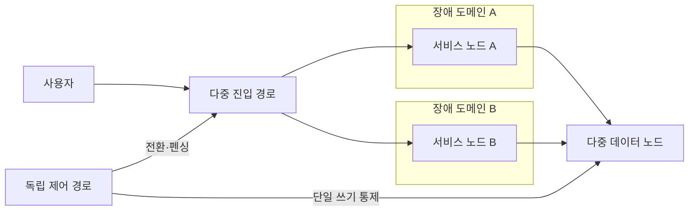
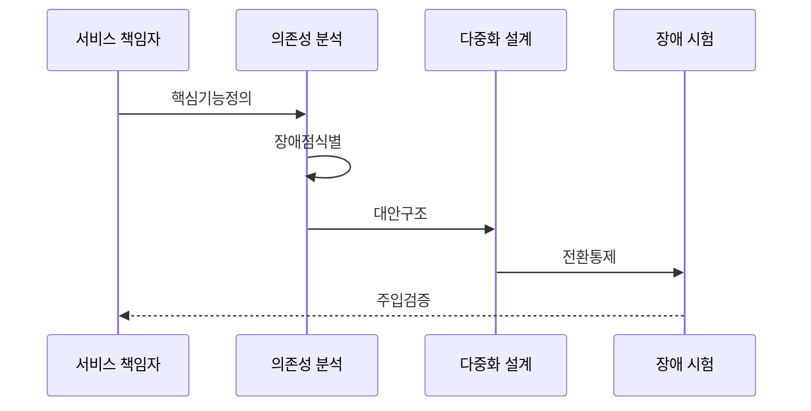

---
sidebar:
  order: 199
  label: "199. 단일 장애점 SPOF 제거 (SPOF Elimination)"
  badge:
    text: "기출 · 50%"
    variant: note
title: "단일 장애점 SPOF 제거 (SPOF Elimination)"
date: "2026-07-27T23:59:59+09:00"
tags:
  - "notes-software"
weight: 199
extra:
  question_no: "199"
  source_status: "기출"
  source_history: "137회"
  priority: 50
  priority_note: "단일 장애점 제거는 고가용성 설계 하위축임"
---

## 미리 알고가기

- **단일 장애점(Single Point of Failure, SPOF)**: 한 요소의 고장이 전체 서비스 중단을 일으키는 지점이며 제거 대상의 범위를 물리 장비뿐 아니라 논리 의존성까지 넓힘
- **장애 도메인**: 전원·구역·계정 등 동일 원인으로 동시 실패하는 물리·논리적 범위임
- **도메인 이름 시스템(Domain Name System, DNS)**: 서비스 이름을 접속 주소로 바꾸는 분산 시스템이며 단일 DNS 경로나 계정에 의존하면 논리적 SPOF가 됨
- **논리적 SPOF**: 장비를 이중화해도 단일 DNS·인증서·관리 권한 의존으로 시스템 전체가 멈추는 지점임
- **공통 원인 장애**: 복제본이 동일 버그·설정·제공자에 의존해 동시에 실패하는 현상임
- **고장 형태 및 영향 분석(Failure Mode and Effects Analysis, FMEA)**: 구성요소별 고장 형태·원인·영향을 평가해 SPOF 제거 우선순위를 정하는 분석 기법임
- **점진적 기능 저하(Graceful Degradation)**: 장애 발생 시 비핵심 기능을 차단하고 한정된 자원으로 핵심 기능을 축소 유지하는 방식임
- **펜싱**: 이전 활성 노드의 쓰기 권한을 차단해 두 노드가 동시에 상태를 변경하는 일을 방지하는 조치임
- **헬스 체크**: 구성요소가 실제 요청을 처리할 수 있는지 주기적으로 확인하는 검사임
- **서킷 브레이커**: 연속 실패한 의존 호출을 일시 차단해 장애 전파를 줄이는 패턴임
- **수평 다중화**: 같은 역할의 노드를 여러 개 두어 요청과 장애를 분산하는 구조임
- **액티브-스탠바이(Active-Standby)**: 활성 노드가 요청을 처리하고 대기 노드가 장애 시 역할을 승계하는 구조임
- **장애 주입**: 구성요소를 의도적으로 중단해 감지·우회·복구가 작동하는지 검증함

## Ⅰ. 개요

- **정의/개념**: 단일 요소 고장의 **전체 중단 경로 제거**
- **기존 한계**: 단일 의존성 고장이 **전체 서비스로 전파**

### 쉽게 이해하기 (학습용)
- 한 곳이 고장 나도 전체가 멈추지 않도록 구조를 설계함

## Ⅱ. 특징

- 경로별 의존성 지도 분석한다.
- 독립 하드웨어에 대체망 배치한다.
- 투표와 펜싱으로 무결성 유지한다.

### 쉽게 이해하기 (학습용)
- 경로별 의존 고리를 끊어 단일 장애를 방지함

## Ⅲ. 아키텍처 및 구성요소

| 설계 요소 | 설명 |
|:---|:---|
| 다중 진입 경로 | 이름 해석·라우팅 경로를 이중화 |
| 서비스 노드 A | 첫 장애 도메인에서 요청 처리 |
| 서비스 노드 B | 독립 장애 도메인에서 요청 인계 |
| 다중 데이터 노드 | 복제·쿼럼으로 상태를 보존 |
| 독립 제어 경로 | 전환·펜싱 권한을 업무 경로와 분리 |

> 요약: 계층별 다중화와 자동 펜싱으로 장애 격리함

### 쉽게 이해하기 (학습용)
- 하드웨어 이중화뿐 아니라 소프트웨어 및 관리 권한까지 분산함

## Ⅳ. 원리 및 절차 흐름도

| 절차 | 설명 |
|:---|:---|
| 핵심기능정의 | 중단 시 전체 업무에 미치는 기능 지정 |
| 장애점식별 | 의존성 지도·FMEA로 SPOF 식별 |
| 대안구조 | 노드 이중화·기능 저하 경로 설계 |
| 전환통제 | 상태 확인·펜싱·라우팅 구현 |
| 주입검증 | 의도적 장애로 우회·용량 검증 |

> 요약: 장애점 식별부터 모의 장애 주입 순환 검증함

### 쉽게 이해하기 (학습용)
- 취약 부위를 식별하고 우회 및 대체 경로를 이식함

## Ⅴ. 종류 및 비교

| SPOF 제거 방식 | 수평 다중화 | Active-Standby | 기능 저하 우회 |
|:---|:---|:---|:---|
| 적용 기준 | 무상태·**트래픽 확장** | 상태형·**단일 쓰기** | 의존 장애 **전파 차단** |
| 핵심 특징 | 다중 노드 **요청 분산** | 대기 노드 **장애 승격** | 비핵심 기능 **차단** |
| 한계 | 공유 의존성 **잔존** | 승격 실패·**이중 쓰기** | 핵심 기능 **오분류** |

> 요약: 시스템 특성 따라 다중화와 우회 적용함

### 쉽게 이해하기 (학습용)
- 부하 분산, 대기 노드 승격, 기능 우회를 상황별 적용함

## Ⅵ. 실무 사례

1. 데이터·제어 영역의 전원과 망을 분리함
2. 배포 도구와 관리자 권한을 이중화함

### 쉽게 이해하기 (학습용)
- 데이터 경로 장애가 제어 경로까지 막지 않게 함
- 단일 도구·계정 장애에도 긴급 배포를 가능하게 함

## Ⅶ. 결론

- 변경마다 SPOF를 다시 찾고 장애 주입으로 검증함

### 쉽게 이해하기 (학습용)
- 장비 수보다 같은 원인으로 함께 멈추는지를 확인함
