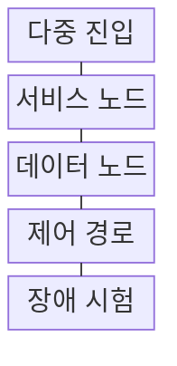
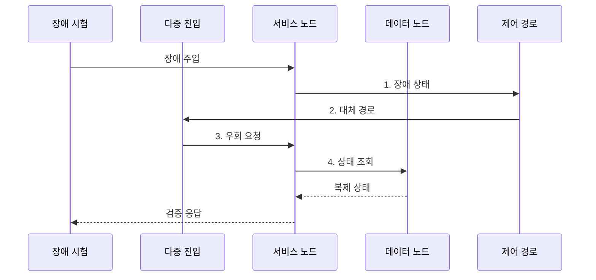

---
sidebar:
  order: 199
  label: "199. 단일 장애점 SPOF 제거 (SPOF Elimination)"
  badge:
    text: "기출 · 50%"
    variant: note
title: "단일 장애점 SPOF 제거 (SPOF Elimination)"
date: "2026-07-31T00:49:40+09:00"
tags:
  - "notes-software"
weight: 199
extra:
  question_no: "199"
  source_status: "기출"
  source_history: "137회"
  priority: 50
  priority_note: "단일 장애점 제거는 고가용성 설계 하위축임"
---

## 미리 알고가기

- **단일 장애점(Single Point of Failure, SPOF)**: 한 요소의 고장이 전체 서비스 중단을 일으키는 지점이며 제거 대상의 범위를 물리 장비뿐 아니라 논리 의존성까지 넓힘
- **장애 도메인**: 전원·구역·계정 등 동일 원인으로 동시 실패하는 물리·논리적 범위이다.
- **도메인 네임 시스템(Domain Name System, DNS)**: 서비스 이름을 접속 주소로 바꾸는 분산 시스템이며 단일 DNS 경로나 계정에 의존하면 논리적 SPOF가 됨
- **논리적 SPOF**: 장비를 이중화해도 단일 DNS·인증서·관리 권한 의존으로 시스템 전체가 멈추는 지점이다.
- **공통 원인 장애**: 복제본이 동일 버그·설정·제공자에 의존해 동시에 실패하는 현상이다.
- **고장 형태 및 영향 분석(Failure Mode and Effects Analysis, FMEA)**: 구성요소별 고장 형태·원인·영향을 평가해 SPOF 제거 우선순위를 정하는 분석 기법이다.
- **점진적 기능 저하(Graceful Degradation)**: 장애 발생 시 비핵심 기능을 차단하고 한정된 자원으로 핵심 기능을 축소 유지하는 방식이다.
- **펜싱**: 이전 활성 노드의 쓰기 권한을 차단해 두 노드가 동시에 상태를 변경하는 일을 방지하는 조치이다.
- **헬스 체크**: 구성요소가 실제 요청을 처리할 수 있는지 주기적으로 확인하는 검사이다.
- **서킷 브레이커**: 연속 실패한 의존 호출을 일시 차단해 장애 전파를 줄이는 패턴이다.
- **수평 다중화**: 같은 역할의 노드를 여러 개 두어 요청과 장애를 분산하는 구조이다.
- **액티브-스탠바이(Active-Standby)**: 활성 노드가 요청을 처리하고 대기 노드가 장애 시 역할을 승계하는 구조이다.
- **장애 주입**: 구성요소를 의도적으로 중단해 감지·우회·복구가 작동하는지 검증한다.

## Ⅰ. 개요

- 정의/개념: 단일 요소 고장이 전체 중단으로 전파되지 않도록 **독립 대체 경로**를 두는 설계 기법
- 배경/필요성: 장비만 이중화하면 공유 전원·망·제어의 **논리적 SPOF** 잔존

### 쉽게 이해하기 (학습용)
- 다리가 하나뿐인 섬은 그 다리가 끊기면 고립되므로 서로 다른 지반과 관리 체계를 쓰는 두 번째 길까지 마련해야 한다.

## Ⅱ. 특징

- **의존성 지도·FMEA** 기반 장애점 식별
- **독립 도메인·다중 경로** 기반 대체 구조
- **쿼럼·펜싱**과 장애 주입 기반 전환 검증

### 쉽게 이해하기 (학습용)
- 서버가 두 대여도 같은 전원과 DNS 계정을 쓰면 함께 멈추므로 물리·논리 의존 지도를 따라 공통 고리를 끊는다.

## Ⅲ. 구조 및 구성요소

| 구성요소 | 책임 |
|:---|:---|
| 다중 진입 | DNS·망·**라우팅 경로 이중화** |
| 서비스 노드 | 독립 도메인·**요청 처리** |
| 데이터 노드 | 복제·쿼럼·**상태 보존** |
| 제어 경로 | 전환·펜싱·**권한 분리** |
| 장애 시험 | 주입·우회·**용량 검증** |

> 요약: 계층별 다중화와 **자동 펜싱**으로 장애 격리

### 쉽게 이해하기 (학습용)
- 입구·서비스·데이터·제어 경로를 서로 다른 장애 도메인에 두고 장애 시험이 한 경로를 끊어도 나머지가 이어지는지 확인한다.

## Ⅳ. 흐름도

**동작 원리**

1. **장애 상태**: 처리 불가 노드와 영향 경로 판정
2. **대체 경로**: 펜싱 후 독립 진입 경로 갱신
3. **우회 요청**: 정상 서비스 노드로 트래픽 전달
4. **상태 조회**: 쿼럼이 승인한 복제 상태 사용

> 요약: 장애 주입 후 **독립 대체 경로·상태** 검증

### 쉽게 이해하기 (학습용)
- 장애 시험이 한 서비스 노드를 끊으면 제어 경로가 입구를 바꾸고 정상 노드가 복제 데이터를 읽어 응답하는지 확인한다.

## Ⅴ. 종류 및 비교

| SPOF 제거 방식 | 수평 다중화 | Active-Standby | 기능 저하 우회 |
|:---|:---|:---|:---|
| 적용 기준 | 무상태·**트래픽 확장** | 상태형·**단일 쓰기** | 의존 장애 **전파 차단** |
| 핵심 특징 | 다중 노드 **요청 분산** | 대기 노드 **장애 승격** | 비핵심 기능 **차단** |
| 한계 | 공유 의존성 **잔존** | 승격 실패·**이중 쓰기** | 핵심 기능 **오분류** |

> 요약: **상태·장애 전파 조건**에 따라 다중화·우회 선택

### 쉽게 이해하기 (학습용)
- 무상태 요청은 여러 창구로 나누고 상태형 쓰기는 대기 창구 하나만 승격하며 부가 기능 장애는 핵심 기능에서 분리한다.

## Ⅵ. 실무 고려사항 및 대책

| 고려사항 | 대책 | 효과 |
|:---|:---|:---|
| 노드만 다른 **공유 전원·망** | 물리 경로·**장애 도메인 분리** | 공통 원인 **제거** |
| 대체 경로의 **제어 의존** | 제어·데이터 **영역 분리** | 전환 가능성 **확보** |
| 상태형 서비스의 **이중 쓰기** | 쿼럼·**펜싱 적용** | 데이터 훼손 **방지** |
| 미검증된 **우회 용량** | 정기 장애·**최대 부하 주입 시험** | 실제 전환 **증명** |

### 쉽게 이해하기 (학습용)
- 데이터 노드를 끄는 시험이 제어 경로까지 멈추게 하면 공통 의존성이 남은 것이므로 전원·망·권한을 다시 분리한다.

## Ⅶ. 결론

- 공통 원인 분리와 장애 주입 전환을 통과해야 **SPOF 제거 완료**, 실패 경로는 재설계

### 쉽게 이해하기 (학습용)
- 서버 수를 세는 대신 한 전원·망·계정 장애를 넣었을 때 대체 경로가 실제 요청을 끝내는지 확인한다.
