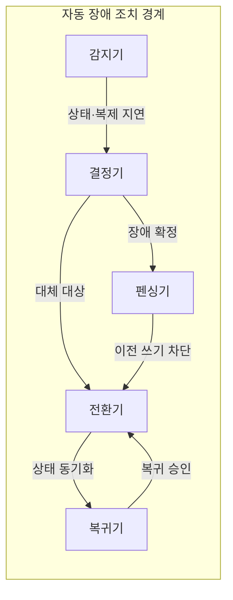
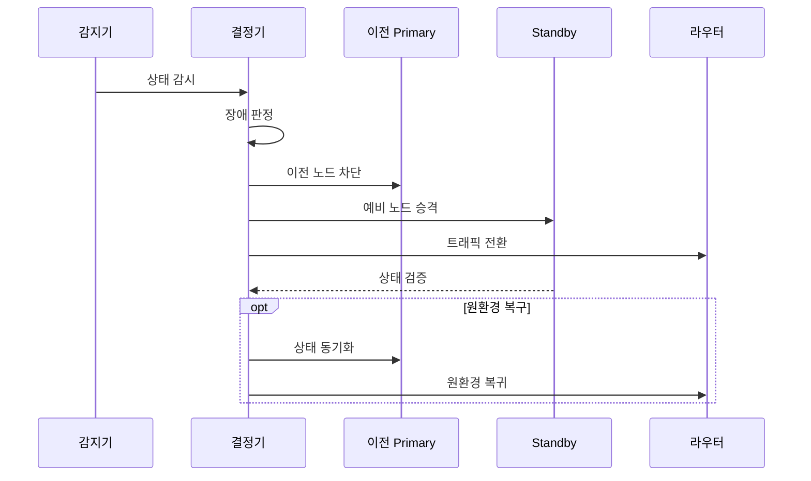

---
sidebar:
  order: 200
  label: "200. 자동 페일오버 (Auto Failover)"
  badge:
    text: "기출 · 50%"
    variant: note
title: "자동 페일오버 (Auto Failover)"
date: "2026-07-27T23:59:59+09:00"
tags:
  - "notes-software"
weight: 200
extra:
  question_no: "200"
  source_status: "기출"
  source_history: "137회"
  priority: 50
  priority_note: "상태 판정과 자동 전환은 고가용성 하위축임"
---

## 미리 알고가기

- **자동 장애 조치(Auto Failover)**: 장애를 자동 판정하고 이전 자원을 차단한 뒤 대체 자원 승격과 요청 경로 전환까지 수행하는 복구 방식
- **장애 조치(Failover)**: 장애 감지 뒤 대체 자원으로 서비스 역할과 요청 경로를 전환하는 동작
- **장애 복귀(Failback)**: 장애 원인을 제거하고 상태를 동기화·검증한 뒤 원래 자원으로 역할을 되돌리는 동작
- **하트비트(Heartbeat)**: 노드가 살아 있고 요청을 처리할 수 있는지 주기적으로 알리는 상태 신호
- **분할 뇌(Split Brain)**: 네트워크 분할로 둘 이상의 노드가 자신을 주 노드로 판단해 동시에 쓰기를 수행할 수 있는 상태
- **주 노드·대기 노드(Primary·Standby Node)**: 주 노드는 현재 쓰기와 서비스를 담당하고 대기 노드는 상태를 복제해 장애 시 승격할 자원
- **펜싱(Fencing)**: 이전 주 노드의 전원·스토리지·쓰기 권한을 차단해 승격 노드와의 이중 쓰기를 방지하는 조치
- **히스테리시스(Hysteresis)**: 장애 진입·해제 임계값이나 지속 시간을 다르게 정해 일시 오류의 잦은 전환을 억제하는 방식
- **쿼럼(Quorum)**: 과반 등 정해진 수의 동의로 단일 장애 판정과 승격 대상을 결정하는 정족수
- **라우팅·복제 지연(Routing·Replication Lag)**: 라우팅은 요청이 향할 경로이고 복제 지연은 주 노드 변경이 복제본에 반영되기까지의 시간 차
- **백오프·지터(Backoff·Jitter)**: 백오프는 재시도 간격을 늘리고 지터는 각 호출자의 재시도 시점을 흩어 전환 대상의 요청 폭주를 줄이는 방식
- **카오스 시험(Chaos Testing)**: 장애를 통제된 범위에서 의도적으로 주입해 자동 전환·복귀와 용량을 검증하는 시험
- **클라이언트·서비스·데이터 장애 조치(Client·Service·Data Failover)**: 호출 대상 경로, 서비스 인스턴스, 데이터 주 노드를 각각 전환하는 계층별 하위 유형
- **엔 마이너스 원 용량(N-1 Capacity)**: ‘엔 마이너스 원’으로 읽고 개수(Number)의 머리글자 $N$에서 하나를 뺀 표기이며 한 자원이 고장 나도 남은 자원이 전체 부하를 처리할 수 있는 용량
- **데이터베이스(Database, DB)**: 데이터를 영속 저장하며 자동 장애 조치에서 단일 쓰기 주 노드와 복제본 승격을 관리하는 시스템
- **응용 프로그래밍 인터페이스(Application Programming Interface, API)**: 서비스 호출 접점으로, 클라이언트 장애 조치에서 대체 서버 주소로 재시도하는 대상

## Ⅰ. 개요

- 정의/개념: **장애 판정·펜싱·승격·경로 전환** 자동화
- 기존 한계: 수동 복구의 **전환 지연·이중 쓰기 위험**

### 쉽게 이해하기 (학습용)
- 사람이 개입하지 않고 안전하게 예비 자원으로 전환함

## Ⅱ. 특징

- 쿼럼·지속 시간으로 일시 지연과 장애를 구분한다.
- 펜싱을 승격보다 먼저 수행해 단일 쓰기 유지한다.
- 경로 갱신 뒤 N-1 용량이 전환 부하를 수용한다.
- 복귀 전 상태 동기화로 오래된 데이터 쓰기 방지한다.

### 쉽게 이해하기 (학습용)
- 고장 노드 권한을 차단하고 복구 전환함

## Ⅲ. 아키텍처 및 구성요소

| 설계 요소 | 설명 |
|:---|:---|
| 감지기 | 상태·복제 지연·처리 가능성 수집 |
| 결정기 | 쿼럼·지속 시간으로 장애 판정 |
| 펜싱기 | 이전 노드의 쓰기 권한 차단 |
| 전환기 | 대체 노드 승격·요청 경로 갱신 |
| 복귀기 | 상태 동기화·검증 뒤 원환경 복귀 |

> 요약: 쓰기 권한 격리 및 경로 전환함

### 쉽게 이해하기 (학습용)
- 감지 결과를 합의한 뒤 이전 쓰기를 끊고 예비 자원과 요청 경로를 바꿈
## Ⅳ. 원리 및 절차 흐름도

| 절차 | 설명 |
|:---|:---|
| 상태 감시 | 생존·복제 지연·처리 가능성 관측 |
| 장애 판정 | 쿼럼·지속 시간으로 장애 확정 |
| 이전 노드 차단 | 이전 주 노드의 쓰기 권한 제거 |
| 예비 노드 승격 | 동기화된 대기 노드에 쓰기 권한 부여 |
| 트래픽 전환 | 라우팅 정보를 승격 노드로 갱신 |
| 상태 검증 | 서비스·데이터 정합성 확인 |
| 상태 동기화 | 원환경을 현재 상태로 갱신 |
| 원환경 복귀 | 검증된 원환경으로 경로 전환 |

> 요약: 이전 쓰기 차단 후 예비 승격·경로 전환
### 쉽게 이해하기 (학습용)
- 여러 신호로 장애를 확정하고 이전 쓰기를 끊은 뒤 예비 자원으로 전환함

## Ⅴ. 종류 및 비교

| 자동 전환 계층 | Client Failover | Service Failover | Data Failover |
|:---|:---|:---|:---|
| 적용 기준 | 다중 주소·**재시도 지원** | 무상태 서비스 **다중화** | 상태형 데이터 **단일 쓰기** |
| 핵심 특징 | 호출 대상 **경로 전환** | 정상 인스턴스로 **부하 이전** | 복제본을 **주 노드로 승격** |
| 한계 | 재시도 폭주·**주소 지연** | 오탐·**잔여 용량 부족** | 이중 쓰기·**데이터 손실** |

> 요약: 호출 경로·인스턴스·데이터 주체별 전환
### 쉽게 이해하기 (학습용)
- 호출 주소, 서비스 인스턴스, 데이터 쓰기 주체를 각각 다른 계층에서 바꿈

## Ⅵ. 실무 사례

1. DB는 쿼럼·펜싱 후 복제본을 승격함

### 쉽게 이해하기 (학습용)
- DB는 이전 Primary를 차단한 뒤 새 쓰기를 허용함

## Ⅶ. 결론

- 펜싱·전환·N-1 용량을 검증한 뒤 자동화함

### 쉽게 이해하기 (학습용)
- 빠른 전환보다 이중 쓰기 없는 전환이 먼저임
