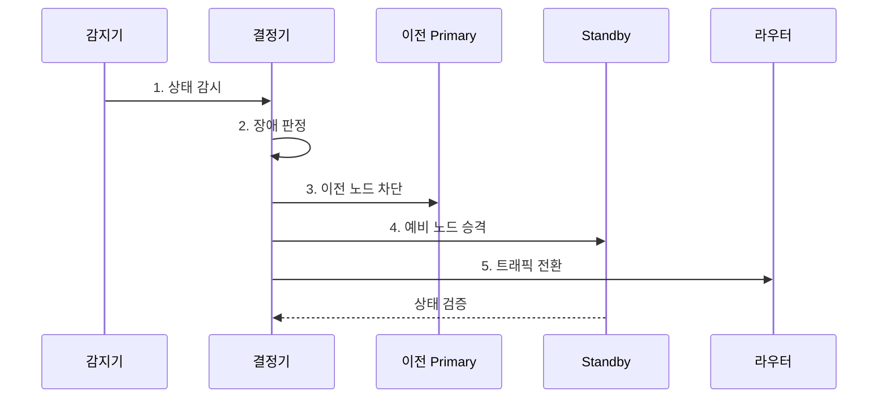

---
sidebar:
  order: 200
  label: "200. 자동 페일오버 (Auto Failover)"
  badge:
    text: "기출 · 50%"
    variant: note
title: "자동 페일오버 (Auto Failover)"
date: "2026-08-02T12:00:00+09:00"
tags:
  - "notes-software"
weight: 200
extra:
  question_no: "200"
  source_status: "기출"
  source_history: "137회"
  priority: 50
  priority_note: "상태 판정과 자동 전환은 고가용성 하위축임"
---

## Ⅰ. 개요

핵심 용어

- **펜싱·승격**: 자동 페일오버는 장애를 판정하고 이전 노드를 펜싱한 뒤 대기 노드를 승격해 요청 경로를 자동 전환한다.

- 정의/개념: 장애 판정과 **펜싱·승격**을 연계한 요청 경로 자동 전환
- 배경/필요성: 수동 복구의 권한 차단 지연으로 **서비스 중단·이중 쓰기 위험**

### 쉽게 이해하기 (학습용)
- 사람이 개입하지 않고 안전하게 예비 자원으로 전환함

## Ⅱ. 특징

핵심 용어

- **펜싱 선행·단일 승격**: 펜싱 선행은 이전 쓰기를 차단하고 단일 승격은 쿼럼이 승인한 하나의 대체 노드에만 쓰기 권한을 부여한다.

- **하트비트·쿼럼**과 지속 시간 기반 장애 판정
- **펜싱 선행·단일 승격** 기반 쓰기 안전
- **N-1 용량·상태 동기화** 기반 전환·복귀

### 쉽게 이해하기 (학습용)
- 고장 노드 권한을 차단하고 복구 전환함

## Ⅲ. 구조 및 구성요소

핵심 용어

- **펜싱기**: 펜싱기는 이전 주 노드의 전원, 스토리지, 쓰기 권한을 차단해 승격 노드와의 이중 쓰기를 막는다.

| 구성요소 | 책임 |
|:---|:---|
| 감지기 | 상태·지연·**처리 가능 여부 수집** |
| 결정기 | 쿼럼·시간·**장애 판정** |
| 펜싱기 | 이전 노드·**쓰기 권한 차단** |
| 전환기 | 대체 승격·**요청 경로 갱신** |
| 복귀기 | 동기화·검증 후 **장애 복귀** |

> 요약: **쓰기 권한 격리**와 요청 경로 전환

### 쉽게 이해하기 (학습용)
- 감지 결과를 합의한 뒤 이전 쓰기를 끊고 예비 자원과 요청 경로를 바꿈
## Ⅳ. 흐름도

핵심 용어

- **4. 예비 노드 승격**: 이전 주 노드의 펜싱 완료를 확인한 뒤 복제 상태가 RPO를 만족하는 예비 노드에 쓰기 권한을 부여한다.

**동작 원리**

1. **상태 감시**: 생존·복제 지연·처리성 관측
2. **장애 판정**: 쿼럼·지속 시간으로 확정
3. **이전 노드 차단**: 기존 쓰기 권한 제거
4. **예비 노드 승격**: 대기 노드에 쓰기 부여
5. **트래픽 전환**: 라우팅을 승격 노드로 갱신

> 요약: 이전 쓰기 차단 후 **예비 승격·경로 전환**
### 쉽게 이해하기 (학습용)
- 여러 신호로 장애를 확정하고 이전 쓰기를 끊은 뒤 예비 자원으로 전환함

## Ⅴ. 종류 및 비교

핵심 용어

- **Data Failover**: Data Failover는 상태형 데이터베이스의 복제본을 새 주 노드로 승격해 단일 쓰기 역할을 전환한다.

| 자동 전환 계층 | Client Failover | Service Failover | Data Failover |
|:---|:---|:---|:---|
| 적용 기준 | 다중 주소·**API 재시도** | 무상태 서비스 **다중화** | 상태형 **DB·단일 쓰기** |
| 핵심 특징 | 호출 대상 **경로 전환** | 정상 인스턴스로 **부하 이전** | 복제본을 **주 노드로 승격** |
| 한계 | 재시도 폭주·**주소 지연** | 오탐·**잔여 용량 부족** | 이중 쓰기·**데이터 손실** |

> 요약: **호출 경로·인스턴스**와 데이터 주체별 전환
### 쉽게 이해하기 (학습용)
- 호출 주소, 서비스 인스턴스, 데이터 쓰기 주체를 각각 다른 계층에서 바꿈

## Ⅵ. 실무 고려사항 및 대책

핵심 용어

- **장애 오판**: 장애 오판은 순간 지연이나 일시적 네트워크 오류를 실제 장애로 확정해 불필요한 전환을 일으키는 문제다.

| 문제 | 대책 | 효과 |
|:---|:---|:---|
| 순간 지연의 **장애 오판** | **히스테리시스** 기반 지속 시간 판정 | 불필요한 전환 **방지** |
| 이전 주 노드의 **생존** | 승격 전 **펜싱 완료 확인** | **분할 뇌·이중 쓰기** 차단 |
| 복제 지연의 **데이터 손실** | RPO 기준·**승격 후보 제한** | 손실 범위 **통제** |
| 전환 후 **재시도 폭주** | **백오프·지터**와 N-1 용량 검증 | 대체 노드 **과부하 방지** |
| 전환 절차의 **미검증** | 통제 범위의 **카오스 시험** 수행 | 복구 절차 **신뢰성 확인** |

### 쉽게 이해하기 (학습용)
- DB는 이전 Primary를 차단한 뒤 새 쓰기를 허용함

## Ⅶ. 결론

핵심 용어

- **쿼럼·펜싱**: 쿼럼·펜싱이 확보되면 자동 전환하고 복제 상태나 이전 노드 차단이 불확실하면 수동 승인을 사용해야 한다.

- **쿼럼·펜싱** 확보 시 자동 전환, 복제 불확실 시 수동 승인

### 쉽게 이해하기 (학습용)
- 빠른 전환보다 이중 쓰기 없는 전환이 먼저임
