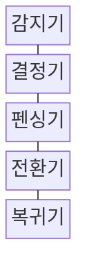
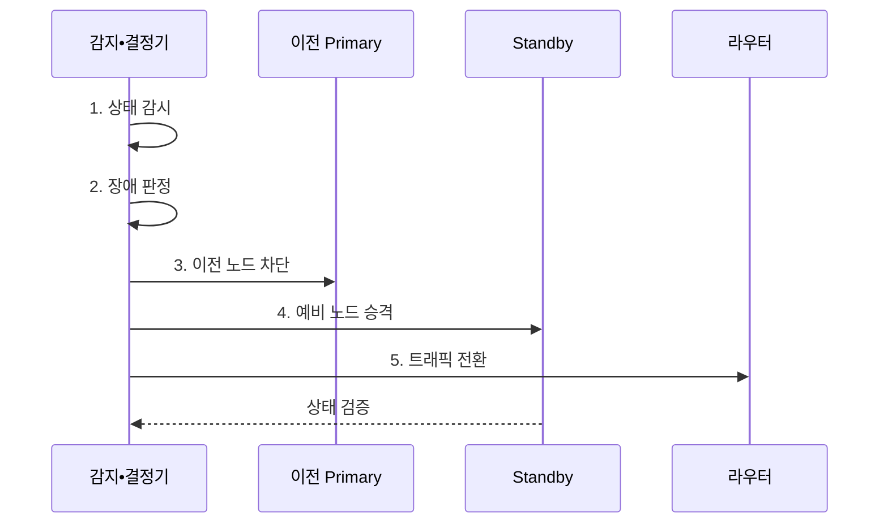

---
sidebar:
  order: 200
  label: "200. 자동 페일오버 (Auto Failover)"
  badge:
    text: "기출 • 50%"
    variant: note
title: "자동 페일오버 (Auto Failover)"
date: "2026-08-03T09:14:20+09:00"
tags:
  - "notes-software"
weight: 200
extra:
  question_no: "200"
  source_status: "기출"
  source_history: "137회"
  priority: 50
  priority_note: "상태 판정과 자동 전환은 고가용성 하위축임"
---

## Ⅰ. 개요

핵심 용어

- **자동 장애 전환(Auto Failover)**: 장애를 자동 판정하고 기존 활성 자원을 펜싱한 뒤 대체 자원을 승격해 요청 경로를 바꾸는 고가용성 전환 절차이다.

- 정의/개념: **자동 페일오버** 는 장애를 자동 판정하고 기존 활성 자원을 펜싱한 뒤 대체 자원을 승격해 요청 경로를 바꾸는 **고가용성 전환 절차**
- 배경/필요성: 수동 복구의 권한 차단 지연으로 **서비스 중단•이중 쓰기 위험**

#### 한줄 요약
- 사람이 개입하지 않고 안전하게 예비 자원으로 전환함

## Ⅱ. 특징

핵심 용어

- **펜싱 선행•단일 승격**: 펜싱 선행은 이전 쓰기를 차단하고 단일 승격은 쿼럼이 승인한 하나의 대체 노드에만 쓰기 권한을 부여한다.
- **하트비트•쿼럼(Heartbeat•Quorum)**: 생존 신호와 다수 합의로 순간 오류와 실제 장애를 구분하고 단일 승격을 결정하는 수단이다.
- **N-1 용량(N Minus One Capacity)**: 활성 자원 하나를 잃은 뒤에도 남은 자원이 최대 업무 부하를 감당하는 용량 기준이다.

- **하트비트•쿼럼** 과 지속 시간 기반 장애 판정
- **펜싱 선행•단일 승격** 기반 쓰기 안전
- **N-1 용량•상태 동기화** 기반 전환•복귀

#### 한줄 요약
- 고장 노드 권한을 차단하고 복구 전환함

## Ⅲ. 구조 및 구성요소

핵심 용어

- **펜싱기**: 펜싱기는 이전 주 노드의 전원, 스토리지, 쓰기 권한을 차단해 승격 노드와의 이중 쓰기를 막는다.
- **감지기(Detector)**: 생존•지연•복제•실제 처리 가능 상태를 수집하는 구성요소이다.
- **결정기(Decision Engine)**: 쿼럼•지속 시간•업무 영향으로 장애를 확정하는 구성요소이다.
- **전환기(Failover Controller)**: 대체 노드를 승격하고 요청 경로를 갱신하는 구성요소이다.
- **복귀기(Failback Controller)**: 원 환경의 상태 동기화와 검증 후 안전하게 복귀시키는 구성요소이다.

| 구성요소 | 책임 |
|:---|:---|
| 감지기 | 상태•지연•**처리 가능 여부 수집** |
| 결정기 | 쿼럼•시간•**장애 판정** |
| 펜싱기 | 이전 노드•**쓰기 권한 차단** |
| 전환기 | 대체 승격•**요청 경로 갱신** |
| 복귀기 | 동기화•검증 후 **장애 복귀** |

> 요약: **쓰기 권한 격리** 와 요청 경로 전환

#### 한줄 요약
- 감지 결과를 합의한 뒤 이전 쓰기를 끊고 예비 자원과 요청 경로를 바꿈
## Ⅳ. 흐름도

핵심 용어

- **4. 예비 노드 승격**: 이전 주 노드의 펜싱 완료를 확인한 뒤 복제 상태가 RPO를 만족하는 예비 노드에 쓰기 권한을 부여한다.
- **1. 상태 감시**: 생존•복제 지연•실제 요청 처리 가능성을 지속 관찰하는 단계이다.
- **2. 장애 판정**: 여러 신호가 임계 지속 시간을 넘고 쿼럼을 충족할 때 장애를 확정하는 단계이다.
- **3. 이전 노드 차단**: 전원•스토리지•쓰기 자격을 제거해 이전 활성 노드의 쓰기를 막는 단계이다.
- **복구 시점 목표(Recovery Point Objective, RPO)**: 장애 전환 시 허용 가능한 최대 데이터 손실 구간이다.
- **5. 트래픽 전환**: 라우터•서비스 발견•주소를 승격 노드로 갱신하는 단계이다.

**동작 원리**

1. **상태 감시**: 생존•복제 지연•처리성 관측
2. **장애 판정**: 쿼럼•지속 시간으로 확정
3. **이전 노드 차단**: 기존 쓰기 권한 제거
4. **예비 노드 승격**: 대기 노드에 쓰기 부여
5. **트래픽 전환**: 라우팅을 승격 노드로 갱신

> 요약: 이전 쓰기 차단 후 **예비 승격•경로 전환**
#### 한줄 요약
- 여러 신호로 장애를 확정하고 이전 쓰기를 끊은 뒤 예비 자원으로 전환함

## Ⅴ. 종류 및 비교

핵심 용어

- **클라이언트 장애 전환(Client Failover)**: 호출자가 다중 주소•재시도로 정상 대상 경로를 선택하는 방식이다.
- **서비스 장애 전환(Service Failover)**: 무상태 서비스의 비정상 인스턴스를 제외하고 남은 인스턴스로 부하를 옮기는 방식이다.
- **데이터 장애 전환(Data Failover)**: 상태형 데이터베이스 복제본을 새 주 노드로 승격해 단일 쓰기 역할을 전환하는 방식이다.
- **펜싱(Fencing)**: 장애로 판단한 이전 주 노드의 저장소•네트워크•쓰기 권한을 차단해 이중 쓰기를 막는 통제이다.

| 자동 전환 계층 | 전환 대상 | 필수 통제 |
|:---|:---|:---|
| **클라이언트 장애 전환(Client Failover)** | 호출자의 **대상 주소•경로** | 재시도 상한•주소 갱신 시간 |
| **서비스 장애 전환(Service Failover)** | 무상태 서비스의 **정상 인스턴스** | 상태 검사•잔여 처리 용량 |
| **데이터 장애 전환(Data Failover)** | 상태형 데이터의 **주 쓰기 노드** | 복제 지연 확인•이전 노드 **펜싱** |

> 요약: 호출 경로•서비스 인스턴스•**데이터 쓰기 주체** 를 계층별 전환
#### 한줄 요약
- 호출 주소, 서비스 인스턴스, 데이터 쓰기 주체를 각각 다른 계층에서 바꿈

## Ⅵ. 실무 고려사항 및 대책

핵심 용어

- **장애 오판**: 장애 오판은 순간 지연이나 일시적 네트워크 오류를 실제 장애로 확정해 불필요한 전환을 일으키는 문제다.
- **히스테리시스(Hysteresis)**: 장애 진입•해제 조건과 지속 시간을 다르게 두어 상태가 임계값 주변에서 반복 전환되는 현상을 막는 제어이다.
- **백오프•지터(Backoff•Jitter)**: 재시도 간격을 점차 늘리고 무작위 편차를 더해 전환 직후 요청 폭주를 분산하는 방식이다.
- **카오스 시험(Chaos Test)**: 통제된 장애를 주입해 감지•펜싱•승격•복구 절차를 실제 검증하는 시험이다.

| 문제 | 대책 | 효과 |
|:---|:---|:---|
| 순간 지연의 **장애 오판** | **히스테리시스** 기반 지속 시간 판정 | 불필요한 전환 **방지** |
| 이전 주 노드의 **생존** | 승격 전 **펜싱 완료 확인** | **분할 뇌•이중 쓰기** 차단 |
| 복제 지연의 **데이터 손실** | RPO 기준•**승격 후보 제한** | 손실 범위 **통제** |
| 전환 후 **재시도 폭주** | **백오프•지터** 와 N-1 용량 검증 | 대체 노드 **과부하 방지** |
| 전환 절차의 **미검증** | 통제 범위의 **카오스 시험** 수행 | 복구 절차 **신뢰성 확인** |

#### 한줄 요약
- DB는 이전 Primary를 차단한 뒤 새 쓰기를 허용함

## Ⅶ. 결론

핵심 용어

- **쿼럼•펜싱**: 쿼럼•펜싱이 확보되면 자동 전환하고 복제 상태나 이전 노드 차단이 불확실하면 수동 승인을 사용해야 한다.

- **쿼럼•펜싱** 확보 시 자동 전환, 복제 불확실 시 수동 승인

#### 한줄 요약
- 빠른 전환보다 이중 쓰기 없는 전환이 먼저임
