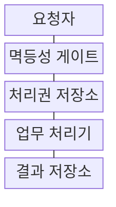
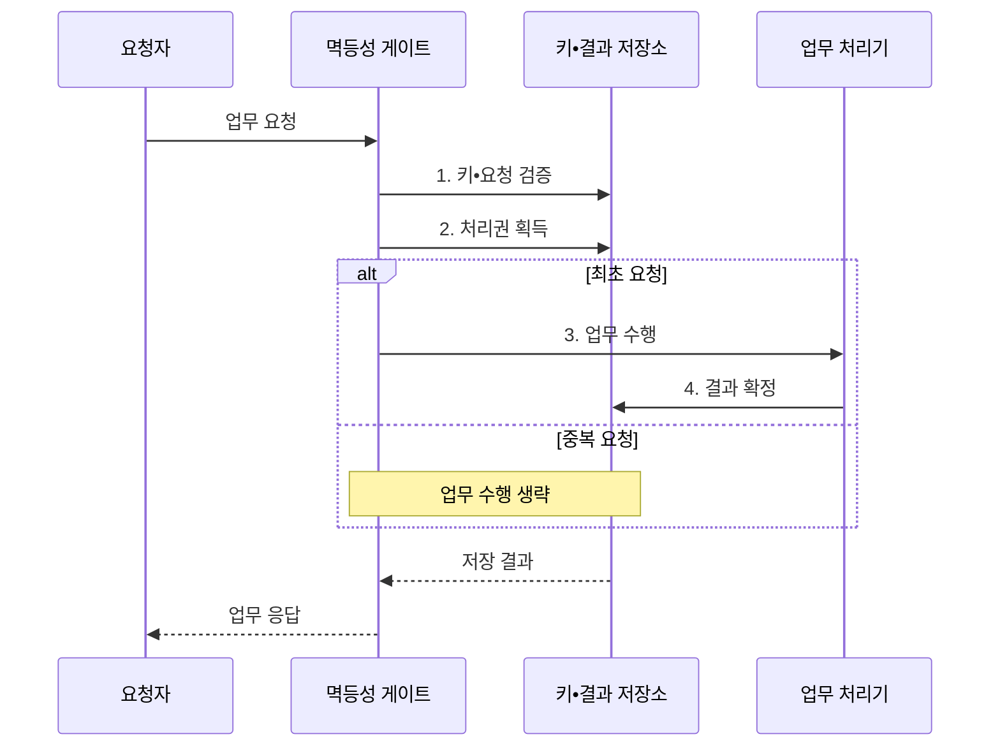

---
sidebar:
  order: 201
  label: "201. 멱등성 설계 (Idempotency Design)"
  badge:
    text: "미출 • 50%"
    variant: note
title: "멱등성 설계 (Idempotency Design)"
date: "2026-08-04T14:41:00+09:00"
tags:
  - "notes-software"
weight: 201
extra:
  question_no: "201"
  source_status: "미출"
  source_history: ""
  priority: 50
  priority_note: "중복 요청의 단일 효과 보장이 분산 설계 핵심임"
---

## Ⅰ. 개요

핵심 용어

- **멱등성(Idempotency)**: 같은 요청을 한 번 또는 여러 번 처리해도 최종 업무 결과가 동일하게 유지되는 성질이다.
- **응용 프로그래밍 인터페이스(Application Programming Interface, API)**: 프로그램 사이에서 요청과 응답을 주고받도록 정한 호출 규약이다.

- 정의/개념: 분산 시스템의 재시도•중복 요청에도 **동일한 최종 업무 효과** 를 보장하는 **API•메시지 처리 설계 원칙**
- 배경/필요성: 재시도•중복 전달로 **중복 결제** 발생

#### 한줄 요약
- 같은 주문이 여러 번 도착해도 한 번만 결제하고 처음 영수증을 다시 보여 준다

## Ⅱ. 특징

핵심 용어

- **멱등 키(Idempotency Key)**: 같은 업무의 최초 요청과 재시도를 식별하는 고유 값이다.
- **요청 지문(Request Fingerprint)**: 같은 키로 다른 요청 본문이 들어오는 충돌을 검출하는 값이다.
- **원자적 확정(Atomic Commit)**: 처리권과 업무 결과를 모두 반영하거나 모두 반영하지 않아 중간 상태를 남기지 않는 처리이다.
- **응답 재생(Response Replay)**: 중복 요청에 업무를 다시 실행하지 않고 최초 저장 응답을 반환하는 방식이다.

- **멱등 키•요청 지문** 기반 동일 요청 식별
- **처리권•업무 결과** 를 원자적으로 확정해 단일 효과 보장
- **응답 재생•보존 기간** 기반 재시도 통제

#### 한줄 요약
- 요청 이름표와 결과를 함께 저장해야 동시에 도착한 복사본도 한 번만 처리할 수 있다

## Ⅲ. 구조 및 구성요소

핵심 용어

- **처리권 저장소**: 처리권 저장소는 같은 키의 동시 요청 중 하나에만 원자적으로 최초 실행권을 부여한다.
- **멱등성 게이트(Idempotency Gate)**: 멱등 키와 요청 지문을 검사해 최초 요청만 업무 처리기로 전달하는 진입 제어 구성요소이다.
- **결과 저장소(Result Store)**: 멱등 키와 처리 상태•응답을 연결해 중복 요청에 재사용할 결과를 보존하는 저장소이다.

| 구성요소 | 책임 |
|:---|:---|
| 요청자 | 동일 키•**재시도 요청 전송** |
| 멱등성 게이트 | 키•지문•**동일성 판정** |
| 처리권 저장소 | 원자적 **최초 실행권 부여** |
| 업무 처리기 | 처리권 요청만 **업무 실행** |
| 결과 저장소 | 키•상태•**응답 원자 보존** |

> 요약: 게이트가 최초 요청만 실행하고 저장 응답 재생

#### 한줄 요약
- 게이트가 주문 이름표를 확인해 처음 주문만 실행하고 복사본에는 저장한 결과를 돌려준다

## Ⅳ. 흐름도

핵심 용어

- **2. 처리권 획득**: 멱등성 게이트는 저장소의 조건부 연산으로 최초 실행권을 원자적으로 획득한다.
- **1. 키•요청 검증**: 멱등 키의 형식•유효 기간과 요청 지문 일치 여부를 확인하는 단계이다.
- **3. 업무 수행**: 처리권을 획득한 최초 요청에만 실제 상태 변경을 허용하는 단계이다.
- **4. 결과 확정**: 업무 결과와 반환 응답을 멱등 키에 연결해 원자적으로 저장하는 단계이다.

**동작 원리**

1. **키•요청 검증**: 형식•기간•요청 지문 확인
2. **처리권 획득**: 최초 실행권 원자 획득
3. **업무 수행**: 처리권을 얻은 요청만 실행
4. **결과 확정**: 업무 결과•응답을 함께 저장

> 요약: 최초 요청만 실행하고 중복에는 저장 응답 반환

#### 한줄 요약
- 같은 이름표로 먼저 온 주문만 처리하고 나머지는 처음 영수증을 받는다

## Ⅴ. 종류 및 비교

핵심 용어

- **조건부 갱신**: 조건부 갱신은 현재 버전이나 상태가 기대 조건과 일치할 때만 값을 바꿔 동시 수정 충돌을 막는다.
- **멱등 키 적용**: 자연 멱등이 아닌 요청의 최초 호출과 재시도 식별
- **자연 멱등 연산(Naturally Idempotent Operation)**: 동일 값을 설정하거나 이미 없는 자원을 삭제하는 것처럼 반복해도 결과가 달라지지 않는 연산이다.

| 멱등 처리 방식 | 멱등성 키 | 자연 멱등 연산 | 조건부 갱신 |
|:---|:---|:---|:---|
| 적용 기준 | 생성•결제 **요청 재시도** | 상태 설정•**삭제 요청** | 동시 수정 **충돌 방지** |
| 핵심 특징 | 최초 결과 **저장•재생** | 동일 값을 **반복 설정** | 조건 일치 시 **갱신** |
| 한계 | 키 충돌•**보존 만료** | 증가 연산 **적용 불가** | 버전 충돌 **재시도** |

> 요약: 생성은 키, 상태 설정은 자연 멱등, 수정은 조건부

#### 한줄 요약
- 새 주문은 이름표를 저장하고 상태 설정은 같은 값을 반복하며 수정은 버전을 확인한다

## Ⅵ. 실무 고려사항 및 대책

핵심 용어

- **부분 확정**: 부분 확정은 업무 결과와 멱등 키•응답 중 일부만 저장되어 재시도 때 업무 효과가 반복되는 문제다.
- **트랜잭셔널 아웃박스(Transactional Outbox)**: 업무 데이터와 발행할 메시지를 같은 트랜잭션에 기록한 뒤 별도 전달기가 메시지를 발행하는 패턴이다.
- **유효 시간(Time To Live, TTL)**: 멱등 키와 저장 결과를 자동 만료시키기까지 유지하는 시간이다.

| 문제 | 대책 | 효과 |
|:---|:---|:---|
| 다른 요청의 **키 재사용** | 사용자•업무별 **키 범위 분리** | 결과 혼선 **방지** |
| 같은 키의 **본문 변경** | 정규화 지문•**충돌 응답** | 요청 동일성 **보장** |
| 업무와 결과의 **부분 확정** | 거래•Outbox **원자 처리** | 중복 효과 **차단** |
| 짧은 **보존 기간** | 재시도 창보다 긴 **TTL 설정** | 만료 후 중복 **예방** |

#### 한줄 요약
- 결제 요청이 다시 와도 주문 키에 저장한 승인 결과만 반환한다

## Ⅶ. 결론

핵심 용어

- **멱등성 키**: 생성•결제처럼 자연 멱등이 아닌 재시도에는 멱등성 키를 사용하고 동시 수정에는 조건부 갱신을 적용한다.
- **조건부 갱신 적용**: 기대 버전과 현재 값의 일치 여부로 동시 수정 충돌 감지

- 생성•결제 재시도는 **멱등성 키**, 동시 갱신은 **조건부 갱신** 적용

#### 한줄 요약
- 요청이 어디서 재시도되든 같은 업무 키와 최초 결과를 끝까지 추적해야 한다
