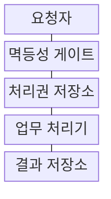
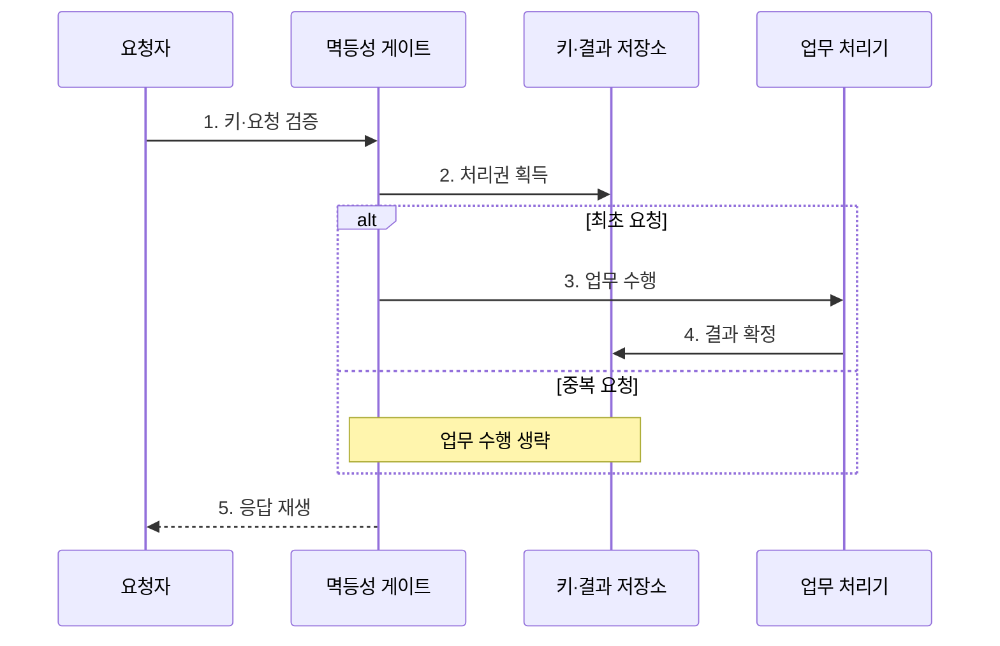

---
sidebar:
  order: 201
  label: "201. 멱등성 설계 (Idempotency Design)"
  badge:
    text: "미출 · 50%"
    variant: note
title: "멱등성 설계 (Idempotency Design)"
date: "2026-07-30T18:00:00+09:00"
tags:
  - "notes-software"
weight: 201
extra:
  question_no: "201"
  source_status: "미출"
  source_history: ""
  priority: 50
  priority_note: "중복 요청의 단일 효과 보장이 분산 설계 핵심임"
---

## 미리 알고가기

- **멱등성(Idempotency)**: 같은 요청을 반복해도 시스템의 최종 상태와 효과가 한 번 처리한 결과와 같은 성질
- **최소 한 번 전달(At-least-once Delivery)**: 메시지 유실을 줄이려고 확인 전까지 재전송해 중복이 생길 수 있는 방식
- **멱등성 키(Idempotency Key)**: 같은 업무 요청의 재시도를 식별해 최초 결과를 재사용하는 고유 키
- **요청 지문(Request Fingerprint)**: 요청 본문을 요약해 같은 키에 다른 내용이 들어오는 것을 검출하는 값
- **원자적 기록(Atomic Record)**: 처리 결과와 멱등성 키를 함께 확정해 중간 상태를 방지하는 기록
- **응답 재생(Response Replay)**: 중복 요청에 저장한 최초 응답을 반환해 업무 처리를 반복하지 않는 동작
- **단일 처리권(Single Processing Right)**: 같은 키로 동시에 들어온 요청 중 하나만 업무 처리를 시작하도록 저장소에서 원자적으로 획득하는 실행 권한
- **키 보존 기간(Key Retention Period)**: 멱등성 키와 최초 결과를 중복 판정에 사용할 수 있도록 저장하는 기간으로, 만료 뒤 같은 키는 새 요청이 될 수 있음
- **자연 멱등 연산(Naturally Idempotent Operation)**: 같은 값을 반복 설정하거나 이미 없는 대상을 삭제해 추가 장치 없이도 최종 상태가 같은 연산
- **조건부 갱신(Conditional Update)**: 현재 버전이나 상태가 기대 조건과 일치할 때만 값을 바꿔 동시 수정 충돌을 검출하는 연산
- **응용 프로그래밍 인터페이스(Application Programming Interface, API)**: 외부 요청이 업무 기능으로 들어오는 호출 접점으로, 결제 재시도에 멱등성 키를 전달하는 경로
- **이벤트 식별자(Event Identifier, ID)**: 메시지 사건마다 붙인 고유 값으로, 소비자가 재전달된 이벤트를 식별해 중복 처리를 건너뛰는 기준
- **커밋(Commit)**: 처리 결과와 이벤트 식별자를 저장소에 함께 확정해 이후 재전달에서도 같은 완료 상태를 보존하는 동작

## Ⅰ. 개요

- 정의/개념: 중복 요청의 업무 효과를 한 번만 확정
- 배경/필요성: 재시도·중복 전달의 **중복 업무 효과 방지**

### 쉽게 이해하기 (학습용)
- 같은 주문이 여러 번 도착해도 한 번만 결제하고 처음 영수증을 다시 보여 준다

## Ⅱ. 특징

- **멱등 키·요청 지문** 기반 동일 요청 식별
- **처리권·업무 결과 원자 확정** 기반 단일 효과
- **응답 재생·보존 기간** 기반 재시도 통제

### 쉽게 이해하기 (학습용)
- 요청 이름표와 결과를 함께 저장해야 동시에 도착한 복사본도 한 번만 처리할 수 있다

## Ⅲ. 구조 및 구성요소

| 구성요소 | 책임 |
|:---|:---|
| 요청자 | 동일 키·**재시도 요청 전송** |
| 멱등성 게이트 | 키·지문·**동일성 판정** |
| 처리권 저장소 | 원자적 **최초 실행권 부여** |
| 업무 처리기 | 처리권 요청만 **업무 실행** |
| 결과 저장소 | 키·상태·**응답 원자 보존** |

> 요약: 게이트가 최초 요청만 실행하고 저장 응답 재생

### 쉽게 이해하기 (학습용)
- 게이트가 주문 이름표를 확인해 처음 주문만 실행하고 복사본에는 저장한 결과를 돌려준다

## Ⅳ. 흐름도

**동작 원리**

1. **키·요청 검증**: 형식·기간·요청 지문 확인
2. **처리권 획득**: 최초 실행권 원자 획득
3. **업무 수행**: 처리권을 얻은 요청만 실행
4. **결과 확정**: 업무 결과·응답을 함께 저장
5. **응답 재생**: 중복 요청에 최초 결과 반환

> 요약: 최초 요청만 실행하고 중복에는 저장 응답 반환

### 쉽게 이해하기 (학습용)
- 같은 이름표로 먼저 온 주문만 처리하고 나머지는 처음 영수증을 받는다

## Ⅴ. 종류 및 비교

| 멱등 처리 방식 | 멱등성 키 | 자연 멱등 연산 | 조건부 갱신 |
|:---|:---|:---|:---|
| 적용 기준 | 생성·결제 **요청 재시도** | 상태 설정·**삭제 요청** | 동시 수정 **충돌 방지** |
| 핵심 특징 | 최초 결과 **저장·재생** | 동일 값을 **반복 설정** | 조건 일치 시 **갱신** |
| 한계 | 키 충돌·**보존 만료** | 증가 연산 **적용 불가** | 버전 충돌 **재시도** |

> 요약: 생성은 키, 상태 설정은 자연 멱등, 수정은 조건부

### 쉽게 이해하기 (학습용)
- 새 주문은 이름표를 저장하고 상태 설정은 같은 값을 반복하며 수정은 버전을 확인한다

## Ⅵ. 실무 고려사항 및 대책

| 고려사항 | 대책 | 효과 |
|:---|:---|:---|
| 다른 요청의 **키 재사용** | 사용자·업무별 **키 범위 분리** | 결과 혼선 **방지** |
| 같은 키의 **본문 변경** | 정규화 지문·**충돌 응답** | 요청 동일성 **보장** |
| 업무와 결과의 **부분 확정** | 거래·Outbox **원자 처리** | 중복 효과 **차단** |
| 짧은 **보존 기간** | 재시도 창보다 긴 **TTL 설정** | 만료 후 중복 **예방** |

### 쉽게 이해하기 (학습용)
- 결제 요청이 다시 와도 주문 키에 저장한 승인 결과만 반환한다

## Ⅶ. 결론

- **키 범위·요청 동일성·원자 확정**으로 멱등 처리 결정

### 쉽게 이해하기 (학습용)
- 요청이 어디서 재시도되든 같은 업무 키와 최초 결과를 끝까지 추적해야 한다
