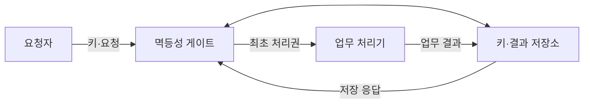
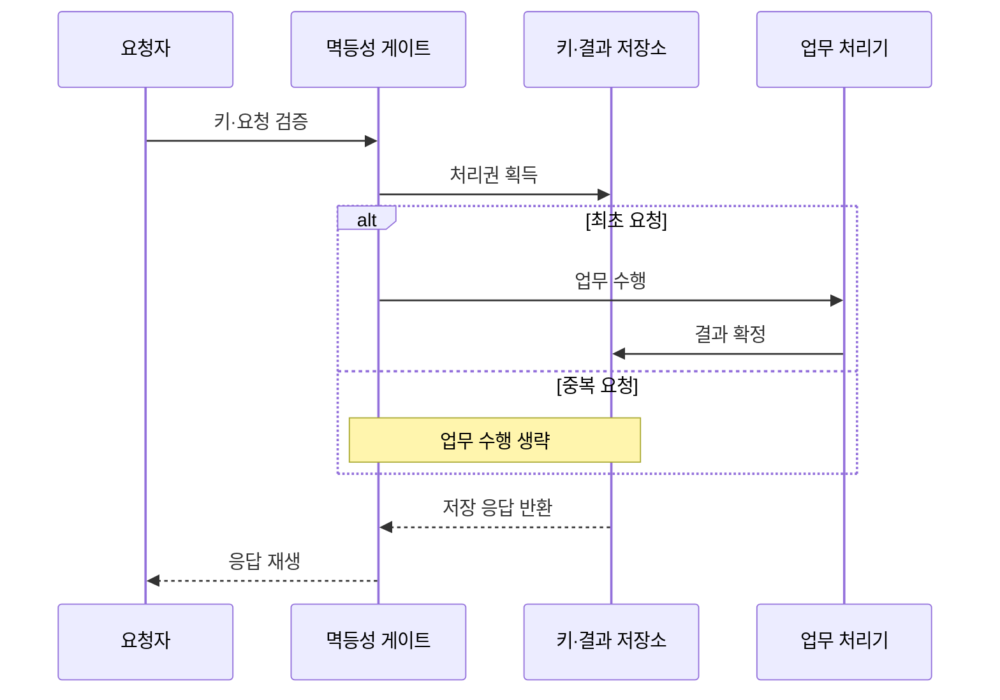

---
sidebar:
  order: 201
  label: "201. 멱등성 설계 (Idempotency Design)"
  badge:
    text: "미출제 · 50%"
    variant: note
title: "멱등성 설계 (Idempotency Design)"
date: "2026-07-25T00:30:00+09:00"
tags:
  - "notes-software"
weight: 201
extra:
  question_no: "201"
  source_status: "미출제"
  source_history: ""
  priority: 50
  priority_note: "중복 요청의 단일 효과 보장이 분산 설계 핵심임"
---

## 미리 알고가기

- **멱등성(Idempotency)**: 같은 요청을 반복해도 시스템의 최종 상태와 효과가 한 번 처리한 결과와 같은 성질
- **최소 한 번 전달(At-least-once Delivery)**: 메시지 유실을 줄이려고 확인 전까지 재전송해 중복이 생길 수 있는 방식
- **멱등성 키(Idempotency Key)**: 같은 업무 요청의 재시도를 식별해 최초 결과를 재사용하는 고유 키
- **요청 지문(Request Fingerprint)**: 요청 본문을 요약해 같은 키에 다른 내용이 들어오는 것을 검출하는 값
- **원자적 기록(Atomic Record)**: 처리 결과와 멱등성 키를 함께 확정해 중간 상태를 방지하는 기록
- **응답 재생(Response Replay)**: 중복 요청에 저장한 최초 응답을 반환해 업무 처리를 반복하지 않는 동작
- **단일 처리권(Single Processing Right)**: 같은 키로 동시에 들어온 요청 중 하나만 업무 처리를 시작하도록 저장소에서 원자적으로 획득하는 실행 권한
- **키 보존 기간(Key Retention Period)**: 멱등성 키와 최초 결과를 중복 판정에 사용할 수 있도록 저장하는 기간으로, 만료 뒤 같은 키는 새 요청이 될 수 있음
- **자연 멱등 연산(Naturally Idempotent Operation)**: 같은 값을 반복 설정하거나 이미 없는 대상을 삭제해 추가 장치 없이도 최종 상태가 같은 연산
- **조건부 갱신(Conditional Update)**: 현재 버전이나 상태가 기대 조건과 일치할 때만 값을 바꿔 동시 수정 충돌을 검출하는 연산
- **응용 프로그래밍 인터페이스(Application Programming Interface, API)**: 외부 요청이 업무 기능으로 들어오는 호출 접점으로, 결제 재시도에 멱등성 키를 전달하는 경로
- **이벤트 식별자(Event Identifier, ID)**: 메시지 사건마다 붙인 고유 값으로, 소비자가 재전달된 이벤트를 식별해 중복 처리를 건너뛰는 기준
- **커밋(Commit)**: 처리 결과와 이벤트 식별자를 저장소에 함께 확정해 이후 재전달에서도 같은 완료 상태를 보존하는 동작

## Ⅰ. 개요

- 정의/개념: 중복 요청의 업무 효과를 한 번만 확정
- **배경/필요성**: 재시도·중복 전달로 멱등 처리 기준 필요

### 쉽게 이해하기 (학습용)
- 같은 주문이 여러 번 도착해도 한 번만 결제하고 처음 영수증을 다시 보여 준다

## Ⅱ. 특징

- 재시도 동안 키를 고정해 같은 업무 요청을 식별한다.
- 키·업무 결과를 함께 확정해 부분 처리 상태 방지한다.
- 동시 중복은 단일 처리권으로 한 요청만 실행한다.
- 키 보존 기간이 지나면 같은 요청도 새 처리로 판정한다.

### 쉽게 이해하기 (학습용)
- 요청 이름표와 결과를 함께 저장해야 동시에 도착한 복사본도 한 번만 처리할 수 있다

## Ⅲ. 아키텍처 및 구성요소

| 설계 요소 | 설명 |
|:---|:---|
| 멱등성 게이트 | 키·지문으로 최초·중복 요청 판정 |
| 업무 처리기 | 처리권을 얻은 요청의 업무 실행 |
| 키·결과 저장소 | 키·상태·응답을 원자적으로 보관 |

> 요약: 게이트가 최초 요청만 실행하고 저장 응답 재생

### 쉽게 이해하기 (학습용)
- 게이트가 주문 이름표를 확인해 처음 주문만 실행하고 복사본에는 저장한 결과를 돌려준다

## Ⅳ. 원리 및 절차 흐름도

| 절차 | 설명 |
|:---|:---|
| 키·요청 검증 | 키 형식·보존 기간·요청 지문 확인 |
| 처리권 획득 | 저장소에서 최초 실행권을 원자 획득 |
| 업무 수행 | 처리권을 얻은 요청만 업무 실행 |
| 결과 확정 | 업무 결과·응답을 키와 함께 저장 |
| 저장 응답 반환 | 중복 요청에는 최초 응답 반환 |
| 응답 재생 | 요청자에게 동일 상태·응답 전달 |

> 요약: 최초 요청만 실행하고 중복에는 저장 응답 반환

### 쉽게 이해하기 (학습용)
- 같은 이름표로 먼저 온 주문만 처리하고 나머지는 처음 영수증을 받는다

## Ⅴ. 종류 및 비교

| 판단 기준 | 멱등성 키 | 자연 멱등 연산 | 조건부 갱신 |
|:---|:---|:---|:---|
| 핵심 특징 | 키별 최초 결과 저장·재생 | 같은 값을 반복 설정 | 버전·조건 일치 시 갱신 |
| 적용 기준 | 생성·결제 요청 재시도 | 상태 설정·삭제 요청 | 동시 수정 충돌 방지 |
| 주요 위험 | 키 충돌·보존 만료 | 증가·추가 연산에 부적합 | 버전 충돌 재시도 |

> 요약: 생성은 키, 상태 설정은 자연 멱등, 수정은 조건부

### 쉽게 이해하기 (학습용)
- 새 주문은 이름표를 저장하고 상태 설정은 같은 값을 반복하며 수정은 버전을 확인한다

## Ⅵ. 실무 사례

1. 결제 API는 주문별 멱등성 키로 중복 승인을 방지
2. 메시지 소비자는 이벤트 ID와 결과를 함께 커밋

### 쉽게 이해하기 (학습용)
- 결제 요청이 다시 와도 주문 키에 저장한 승인 결과만 반환한다
- 메시지 처리 결과와 이벤트 ID를 함께 저장해 재전달을 건너뛴다

## Ⅶ. 결론

- 재시도 가능한 생성은 키·결과를 원자 저장해 단일 효과 보장

### 쉽게 이해하기 (학습용)
- 요청이 어디서 재시도되든 같은 업무 키와 최초 결과를 끝까지 추적해야 한다
