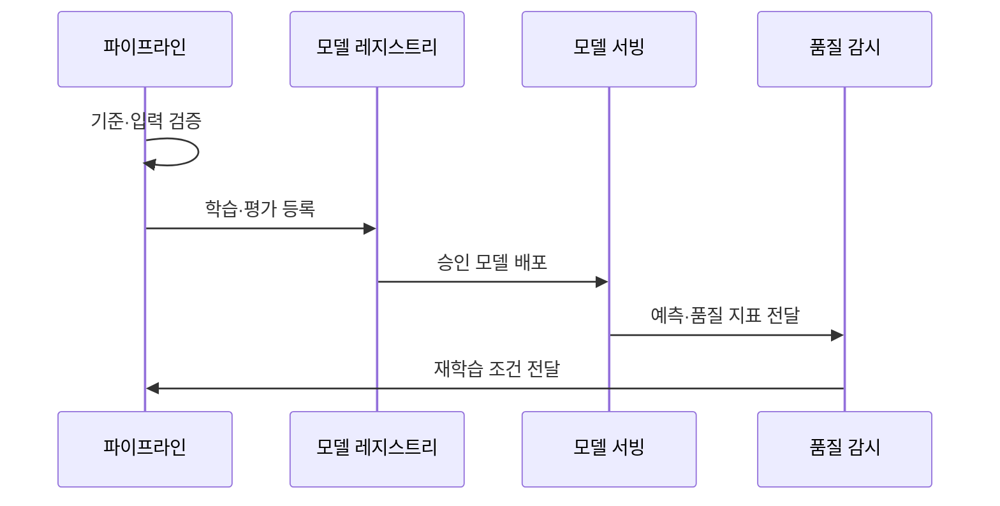

---
sidebar:
  order: 202
  label: "202. MLOps 파이프라인 (MLOps Pipeline)"
  badge:
    text: "기출 · 85%"
    variant: note
title: "MLOps 파이프라인 (MLOps Pipeline)"
date: "2026-07-27T23:59:59+09:00"
tags: ["notes-software"]
weight: 202
extra:
  question_no: "202"
  source_status: "기출"
  source_history: "135회, 137회"
  priority: 85
  priority_note: "학습·배포·관측 자동화가 최근 장문 출제됨"
---

## 미리 알고가기

- **기계학습 운영(Machine Learning Operations, MLOps)**: 데이터·학습·검증·배포·감시를 자동화해 모델 재현성과 품질을 유지하는 운영 체계
- **지속적 통합(Continuous Integration, CI)**: 파이프라인·피처·모델 코드 변경을 자동 검증하는 활동
- **지속적 학습(Continuous Training, CT)**: 새 데이터나 성능 저하를 감지해 모델을 자동 재학습하는 활동
- **지속적 전달(Continuous Delivery, CD)**: 검증된 파이프라인·모델·서빙 구성을 배포 가능 상태로 준비하는 활동
- **실험 실행(Experiment Run)**: 코드·데이터·파라미터·지표·산출물을 한 학습 실행으로 기록한 단위
- **데이터 계보(Data Lineage)**: 코드·데이터·모델 간 생성 이력과 관계를 추적함
- **챔피언·챌린저(Champion Challenger)**: 운영 및 후보 모델을 동일 기준으로 비교 평가함
- **피처(Feature)**: 원시 데이터를 모델이 학습·추론에 사용할 수 있도록 변환한 입력 변수
- **데이터·모델 게이트(Data·Model Gate)**: 데이터 품질과 모델 성능이 합격선을 충족할 때만 다음 학습·배포 단계로 진행시키는 통제
- **모델 레지스트리(Model Registry)**: 모델 버전·지표·산출물·승인 상태를 보관해 어떤 모델을 배포할지 관리하는 저장소
- **모델 서빙(Model Serving)**: 승인된 모델을 운영 환경에 배포하고 요청 입력에 대한 추론 결과를 제공하는 구성요소
- **추론(Inference)**: 학습된 모델에 새 입력을 넣어 예측·분류 결과를 계산하는 운영 동작
- **드리프트(Drift)**: 운영 데이터 분포나 입력과 정답의 관계가 학습 때와 달라져 모델 품질이 저하될 수 있는 변화
- **업무 지표(Business Metric)**: 추천 클릭률·승인 손실처럼 모델 예측이 실제 업무 목표에 미친 결과를 측정하는 값

## Ⅰ. 개요

- **정의/개념**: 모델 생명주기의 **자동화·재현성·품질 유지**
- **기존 한계**: 데이터·코드 변화로 **학습 재현·운영 품질 저하**

### 쉽게 이해하기 (학습용)
- 학습 재료·방법·결과를 함께 기록해 같은 모델을 다시 만들고 운영 변화를 감시한다

## Ⅱ. 특징

- 실행 환경을 버전화해 같은 학습 결과 재현한다.
- 데이터·모델 게이트로 기준 미달 배포 차단한다.
- 코드·데이터·모델 계보로 결과 원인 추적한다.
- 드리프트 감지 시 재학습 후보를 생성한다.

### 쉽게 이해하기 (학습용)
- 학습 조건과 결과를 기록하고 운영 품질이 떨어질 때 검증된 재학습을 시작한다

## Ⅲ. 아키텍처 및 구성요소

| 설계 요소 | 설명 |
|:---|:---|
| 데이터·피처 | 학습 입력의 버전·품질·계보 관리 |
| 학습 파이프라인 | 전처리·학습·평가 순서 실행 |
| 실험·모델 레지스트리 | 지표·산출물·승인 상태 보관 |
| 모델 서빙 | 승인 모델을 추론 환경에 배포 |
| 품질 감시·CT | 드리프트를 감지해 재학습 제어 |

> 요약: 데이터부터 감시까지 연결해 검증된 모델만 승격

### 쉽게 이해하기 (학습용)
- 학습 재료와 결과를 등록한 뒤 승인 모델만 배포하고 품질 저하 시 다시 학습한다

## Ⅳ. 원리 및 절차 흐름도

| 절차 | 설명 |
|:---|:---|
| 기준·입력 검증 | 업무 지표·데이터 품질 합격선 확인 |
| 학습·평가 등록 | 같은 조건에서 후보를 비교해 결과 등록 |
| 승인 모델 배포 | 게이트 통과 버전을 서빙 환경에 반영 |
| 예측·품질 지표 전달 | 운영 입력·예측·품질 지표 수집 |
| 재학습 조건 전달 | 드리프트·성능 저하 시 CT 시작 |

> 요약: 기준에 맞춰 배포하고 재학습을 관리함

### 쉽게 이해하기 (학습용)
- 운영 입력과 예측 품질이 달라지면 새 후보를 학습해 승인 모델과 다시 비교한다

## Ⅴ. 종류 및 비교

| MLOps 자동화 수준 | 수동 운영 | 파이프라인 자동화 | CI·CD·CT 자동화 |
|:---|:---|:---|:---|
| 적용 기준 | 소수 실험·**운영 배포 없음** | 반복 학습·**재현성 확보** | 지속 배포·**드리프트 대응** |
| 핵심 특징 | 학습·배포 **수동 반복** | 학습 단계 **자동 실행** | 검증·배포·**재학습 연결** |
| 한계 | 재현 불가·**수동 오류** | 배포·**감시 단절** | 오검출·**재학습 반복** |

> 요약: 반복 수준에 따라 수동·파이프라인·CI·CD·CT 선택

### 쉽게 이해하기 (학습용)
- 실험이 적으면 사람이 실행하고 반복 배포가 늘수록 검증·배포·재학습을 차례로 연결한다

## Ⅵ. 실무 사례

1. 추천 모델은 드리프트 감지 후 CT 후보를 재학습
2. 신용 모델은 데이터·코드·승인 버전을 함께 보관

### 쉽게 이해하기 (학습용)
- 추천 입력 분포가 달라지면 후보를 다시 학습하고 기존 모델과 비교한다
- 신용 모델의 판단을 재현하도록 학습 데이터와 코드·승인 기록을 함께 남긴다

## Ⅶ. 결론

- 데이터·모델 게이트를 통과한 버전만 배포하고 드리프트 시 CT

### 쉽게 이해하기 (학습용)
- 학습 기록과 합격선을 통과한 모델만 운영에 내보내고 품질 저하 때 다시 학습한다
