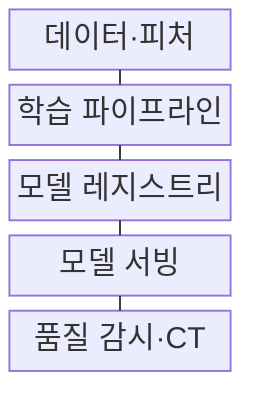
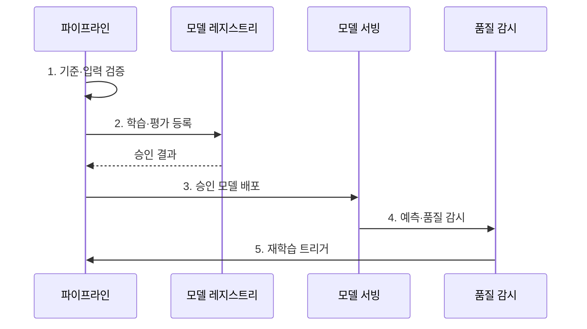

---
sidebar:
  order: 202
  label: "202. MLOps 파이프라인 (MLOps Pipeline)"
  badge:
    text: "기출 · 85%"
    variant: note
title: "MLOps 파이프라인 (MLOps Pipeline)"
date: "2026-08-02T12:00:00+09:00"
tags: ["notes-software"]
weight: 202
extra:
  question_no: "202"
  source_status: "기출"
  source_history: "135회, 137회"
  priority: 85
  priority_note: "학습·배포·관측 자동화가 최근 장문 출제됨"
---

## Ⅰ. 개요

핵심 용어

- **모델 생명주기**: MLOps는 데이터 준비부터 학습·검증·배포·감시·재학습까지 모델 생명주기를 자동화한다.

- 정의/개념: 모델 생명주기를 **자동화**해 재현성과 품질을 유지하는 운영 체계
- 배경/필요성: 수동 학습·배포에서는 데이터·코드 변경에 따른 **결과 재현이 어려움**

#### 한줄 요약
- 학습 재료·방법·결과를 함께 기록해 같은 모델을 다시 만들고 운영 변화를 감시한다

## Ⅱ. 특징

핵심 용어

- **계보·드리프트·CT**: 계보는 모델 생성 근거를 추적하고 드리프트 감시와 CT는 운영 품질 저하에 대응해 재학습을 제어한다.

- **코드·데이터·환경·모델 버전** 기반 재현
- **데이터·모델·배포 게이트** 기반 품질 통제
- **계보·드리프트·CT** 기반 지속 개선

#### 한줄 요약
- 학습 조건과 결과를 기록하고 운영 품질이 떨어질 때 검증된 재학습을 시작한다

## Ⅲ. 구조 및 구성요소

핵심 용어

- **모델 레지스트리**: 모델 레지스트리는 후보 모델의 버전, 지표, 산출물, 계보와 승인 상태를 보관해 배포 대상을 통제한다.

| 구성요소 | 책임 |
|:---|:---|
| 데이터·피처 | 입력 버전·**품질·계보 관리** |
| 학습 파이프라인 | 전처리·**학습·평가 실행** |
| 모델 레지스트리 | 지표·버전·**승인 상태 보관** |
| 모델 서빙 | 승인 모델·**추론 환경 배포** |
| 품질 감시·CT | 드리프트·**재학습 제어** |

> 요약: 데이터부터 감시까지 연결해 검증된 모델만 승격

#### 한줄 요약
- 학습 재료와 결과를 등록한 뒤 승인 모델만 배포하고 품질 저하 시 다시 학습한다

## Ⅳ. 흐름도

핵심 용어

- **5. 재학습 트리거**: 입력·예측·업무 성과의 드리프트나 품질 저하가 확인되면 검증된 CT 파이프라인을 시작한다.

**동작 원리**

1. **기준·입력 검증**: 업무 지표·데이터 합격선 확인
2. **학습·평가 등록**: 동일 조건의 후보 비교
3. **승인 모델 배포**: 통과 버전만 서빙 반영
4. **예측·품질 감시**: 입력·예측·성과 수집
5. **재학습 트리거**: 드리프트·저하 시 CT 시작

> 요약: 기준에 맞춰 배포하고 재학습을 관리함

#### 한줄 요약
- 운영 입력과 예측 품질이 달라지면 새 후보를 학습해 승인 모델과 다시 비교한다

## Ⅴ. 종류 및 비교

핵심 용어

- **CI·CD·CT 자동화**: CI·CD·CT 자동화는 코드와 모델 검증, 승인 배포, 드리프트 기반 재학습을 하나의 운영 흐름으로 연결한다.

| MLOps 자동화 수준 | 수동 운영 | 파이프라인 자동화 | CI·CD·CT 자동화 |
|:---|:---|:---|:---|
| 적용 기준 | 소수 실험·**운영 배포 없음** | 반복 학습·**재현성 확보** | 지속 배포·**드리프트 대응** |
| 핵심 특징 | 학습·배포 **수동 반복** | 학습 단계 **자동 실행** | 검증·배포·**재학습 연결** |
| 한계 | 재현 불가·**수동 오류** | 배포·**감시 단절** | 오검출·**재학습 반복** |

> 요약: 반복 수준에 따라 수동·파이프라인·CI·CD·CT 선택

#### 한줄 요약
- 실험이 적으면 사람이 실행하고 반복 배포가 늘수록 검증·배포·재학습을 차례로 연결한다

## Ⅵ. 실무 고려사항 및 대책

핵심 용어

- **재현 불가**: 재현 불가는 학습 데이터와 피처, 코드, 환경 버전이 고정되지 않아 같은 실험 결과를 다시 만들지 못하는 문제다.

| 문제 | 대책 | 효과 |
|:---|:---|:---|
| 학습 자료의 **재현 불가** | 데이터 Snapshot·**계보 고정** | 실험 결과 **재현성** |
| 오프라인·운영의 **지표 차이** | 업무 KPI·**온라인 검증 연결** | 모델 가치 **판정 정확성** |
| 드리프트의 **자동 배포 오용** | 재학습·배포 **Gate 분리** | 저품질 모델 **승격 방지** |
| 장애 모델의 **복구 지연** | 모델·피처 **버전 롤백** | 추론 서비스 **복구성** |

#### 한줄 요약
- 추천 입력 분포가 달라지면 후보를 다시 학습하고 기존 모델과 비교한다

## Ⅶ. 결론

핵심 용어

- **업무 성과**: 오프라인 성능뿐 아니라 온라인 업무 성과를 충족한 모델만 승격하고 드리프트가 확인되면 재학습해야 한다.

- **업무 성과** 충족 시 모델 승격, **드리프트** 발생 시 재학습

#### 한줄 요약
- 학습 기록과 합격선을 통과한 모델만 운영에 내보내고 품질 저하 때 다시 학습한다
