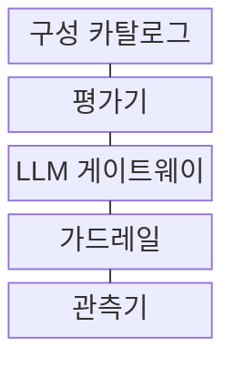
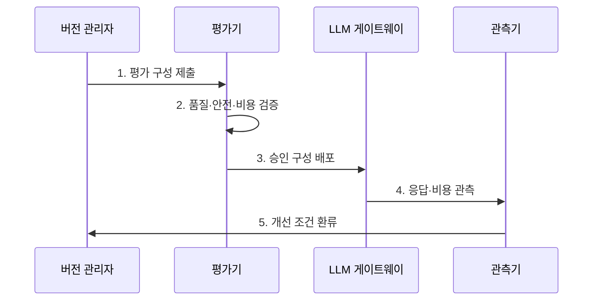

---
sidebar:
  order: 203
  label: "203. LLMOps (LLMOps)"
  badge:
    text: "기출 · 70%"
    variant: note
title: "LLMOps (LLMOps)"
date: "2026-07-30T18:00:00+09:00"
tags: ["notes-software"]
weight: 203
extra:
  question_no: "203"
  source_status: "기출"
  source_history: "138회"
  priority: 70
  priority_note: "언어모델 평가·배포·관측 수명주기가 최근 핵심임"
---

## 미리 알고가기

- **거대 언어 모델 운영(Large Language Model Operations, LLMOps)**: 모델·프롬프트·검색·평가·배포·감시를 연결해 생성형 AI 품질을 통제하는 체계
- **생성형 인공지능(Generative Artificial Intelligence, Generative AI)**: 학습한 패턴과 입력 문맥으로 텍스트·이미지 같은 새 콘텐츠를 생성하며 LLMOps가 품질·안전을 통제하는 대상
- **프롬프트 버전(Prompt Version)**: 지시문과 모델·검색 설정의 조합을 고정해 응답을 재현하는 버전
- **평가 세트(Evaluation Set)**: 정확성·안전성·근거성을 반복 비교하는 대표 입력·기대 결과 모음
- **근거성(Groundedness)**: 생성 답변이 제공된 문서나 확인 가능한 사실로 뒷받침되는 정도
- **가드레일(Guardrail)**: 유해·민감 입출력을 탐지·차단해 정책 위반을 줄이는 제어
- **거대 언어 모델 게이트웨이(Large Language Model Gateway, LLM Gateway)**: 모델 호출의 인증·라우팅·사용량 제한·관측을 한 접점에서 통제하는 계층
- **검색 증강 생성(Retrieval-Augmented Generation, RAG)**: 외부 문서를 검색해 프롬프트에 넣고 답변 근거를 보완하는 방식
- **미세조정(Fine-tuning)**: 학습 데이터로 모델 가중치를 갱신해 특정 작업 행동을 조정하는 방식
- **응용 프로그래밍 인터페이스(Application Programming Interface, API)**: 모델·서비스 기능을 정해진 형식으로 호출하는 계약
- **검색 색인(Retrieval Index)**: 문서를 검색 가능한 표현과 위치로 정리해 RAG가 질문과 관련된 근거를 찾도록 하는 구조
- **비결정 응답(Nondeterministic Response)**: 같은 입력에도 표본 선택에 따라 답변이 달라질 수 있어 반복 실행의 품질 분포로 평가해야 하는 응답 특성
- **환각(Hallucination)**: 모델이 입력 근거나 확인 가능한 사실과 맞지 않는 내용을 그럴듯하게 생성하는 오류
- **프롬프트 주입(Prompt Injection)**: 외부 입력이 기존 지시를 무시하거나 비밀 정보·금지 동작을 유도하도록 모델의 지시 문맥을 조작하는 공격
- **프롬프트 회귀(Prompt Regression)**: 지시문·모델·검색 설정 변경으로 이전 평가 세트에서 통과하던 응답 품질이 나빠지는 현상
- **과적합(Overfitting)**: 미세조정 모델이 학습 예시에 지나치게 맞아 새로운 입력에서 품질이 떨어지는 현상
- **카탈로그(Catalog)**: 모델·프롬프트·검색 구성의 버전과 승인 상태를 연결해 평가·배포 대상을 관리하는 목록
- **관측기(Observer)**: 입력·출력·지연·비용·정책 판정 이력을 수집해 품질 저하와 사고의 개선 근거를 제공하는 구성요소

## Ⅰ. 개요

- 정의/개념: 모델·프롬프트·검색의 **품질·안전 운영 통제**
- 배경/필요성: 비결정 응답·환각의 **재현·품질 판정 기준 확보**

### 쉽게 이해하기 (학습용)
- 요리법·재료·안전 검사를 한 묶음으로 기록해 검증된 조합만 손님에게 제공한다

## Ⅱ. 특징

- **모델·프롬프트·RAG 구성** 단위 버전 관리
- **반복 표본·평가 세트** 기반 품질·안전 판정
- **비용·가드레일·운영 이력** 기반 승격 통제

### 쉽게 이해하기 (학습용)
- 같은 질문을 여러 번 시험해 정확성·근거·안전·비용이 합격선 안인 구성을 선택한다

## Ⅲ. 구조 및 구성요소

| 구성요소 | 책임 |
|:---|:---|
| 구성 카탈로그 | 모델·프롬프트·**RAG 버전 관리** |
| 평가기 | 품질·안전·**비용 합격선 판정** |
| LLM 게이트웨이 | 인증·라우팅·**사용량 제한** |
| 가드레일 | 민감·유해 **입출력 차단** |
| 관측기 | 응답·지연·**비용·판정 수집** |

> 요약: 승인 구성만 가드레일을 거쳐 모델 호출

### 쉽게 이해하기 (학습용)
- 카탈로그의 한 구성 묶음을 시험한 뒤 게이트웨이가 안전 검사를 거쳐 모델을 호출하고 결과를 기록한다

## Ⅳ. 흐름도

**동작 원리**

1. **평가 구성 제출**: 모델·프롬프트·RAG 고정
2. **품질·안전·비용 검증**: 평가 세트 합격선 판정
3. **승인 구성 배포**: 통과 조합만 라우팅
4. **응답·비용 관측**: 입력·출력·지연·비용 기록
5. **개선 조건 환류**: 저하·사고를 평가 세트 반영

> 요약: 평가 합격 구성 배포 후 운영 이력을 재평가

### 쉽게 이해하기 (학습용)
- 시험 질문으로 합격한 조합만 배포하고 실제 대화의 품질·비용 문제를 다음 시험에 넣는다

## Ⅴ. 종류 및 비교

| LLM 개선 방식 | 프롬프트 설계 | 미세조정 | RAG |
|:---|:---|:---|:---|
| 적용 기준 | 행동·**출력 형식 조정** | 반복 행동 **가중치 내재화** | 최신·사내 **지식 답변** |
| 핵심 특징 | 지시문·**예시 변경** | 모델 가중치 **추가 학습** | 외부 문서 **검색·주입** |
| 한계 | 주입 공격·**프롬프트 회귀** | 과적합·**학습 비용** | 검색 누락·**잘못된 근거** |

> 요약: 형식은 프롬프트, 행동은 미세조정, 지식은 RAG

### 쉽게 이해하기 (학습용)

- 답변 형식은 지시문을 바꾸고 반복 행동은 학습하며 최신 문서 지식은 검색해 넣는다

## Ⅵ. 실무 고려사항 및 대책

| 고려사항 | 대책 | 효과 |
|:---|:---|:---|
| 비결정 응답의 **단일 평가** | 반복 표본·**분포 기준 적용** | 품질 판정 **신뢰성** |
| 구성 일부만의 **버전 기록** | 모델·프롬프트·**RAG 결속** | 응답 결과 **재현성** |
| 평균 품질의 **안전 실패 은폐** | 안전·근거성 **별도 Gate** | 고위험 응답 **승격 차단** |
| 토큰 증가의 **비용 급증** | 요청별 한도·**비용 예산 적용** | 서비스 비용 **통제** |

### 쉽게 이해하기 (학습용)
- 상담 답변은 검색 문서가 실제로 뒷받침하는지 확인한 뒤 새 구성을 배포한다

## Ⅶ. 결론

- **품질 분포·안전 기준·비용 예산**으로 LLM 구성 승격 결정

### 쉽게 이해하기 (학습용)
- 시험과 안전 검사를 통과하고 운영에서도 문제가 적은 모델·지시문·검색 조합만 승격한다
