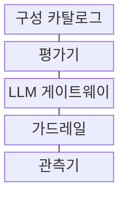
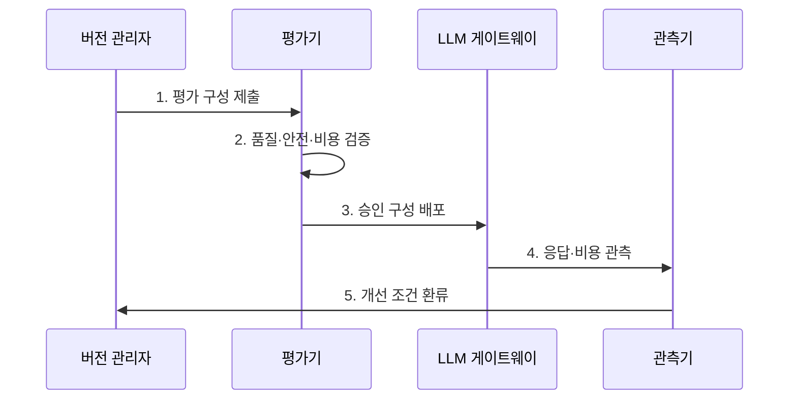

---
sidebar:
  order: 203
  label: "203. LLMOps (LLMOps)"
  badge:
    text: "기출 · 70%"
    variant: note
title: "LLMOps (LLMOps)"
date: "2026-08-02T12:00:00+09:00"
tags: ["notes-software"]
weight: 203
extra:
  question_no: "203"
  source_status: "기출"
  source_history: "138회"
  priority: 70
  priority_note: "언어모델 평가·배포·관측 수명주기가 최근 핵심임"
---

## Ⅰ. 개요

핵심 용어

- **대규모 언어 모델 운영(Large Language Model Operations, LLMOps)**: 생성형 인공지능 모델·프롬프트·검색 구성을 평가·배포·감시해 품질과 안전을 통제하는 운영 체계이다.
- **생성형 인공지능(Generative Artificial Intelligence, 생성형 AI)**: 학습 데이터의 패턴을 바탕으로 텍스트·이미지 등 새로운 콘텐츠를 생성하는 인공지능이다.

- 정의/개념: **생성형 AI** 모델·프롬프트·검색의 **품질·안전** 통제 체계
- 배경/필요성: 단일 정답 평가만으로는 **비결정 응답·환각의 품질을 판정하기 어려움**

#### 한줄 요약
- 요리법·재료·안전 검사를 한 묶음으로 기록해 검증된 조합만 손님에게 제공한다

## Ⅱ. 특징

핵심 용어

- **반복 표본·평가 세트**: 비결정 응답은 대표 평가 세트를 여러 번 실행한 표본 분포로 품질·근거성·안전성을 판정해야 한다.
- **검색 증강 생성(Retrieval-Augmented Generation, RAG)**: 외부 문서를 검색해 언어 모델의 입력에 제공하고 답변 근거를 보완하는 방식이다.
- **가드레일(Guardrail)**: 모델의 입력과 출력을 검사해 민감정보·유해 내용·정책 위반을 차단하는 통제 장치이다.

- **모델·프롬프트·RAG 구성** 단위 버전 관리
- **반복 표본·평가 세트** 기반 품질·안전 판정
- **비용·가드레일·운영 이력** 기반 승격 통제

#### 한줄 요약
- 같은 질문을 여러 번 시험해 정확성·근거·안전·비용이 합격선 안인 구성을 선택한다

## Ⅲ. 구조 및 구성요소

핵심 용어

- **LLM 게이트웨이**: LLM 게이트웨이는 모델 호출의 인증, 라우팅, 사용량 제한과 관측을 중앙 접점에서 통제한다.
- **구성 카탈로그(Configuration Catalog)**: 모델·프롬프트·검색 설정의 버전과 결합 관계를 보관하는 관리 목록이다.
- **평가기(Evaluator)**: 대표 질문과 판정 기준으로 품질·근거성·안전·비용의 합격 여부를 계산하는 구성요소이다.
- **관측기(Observer)**: 운영 입력·응답·지연·토큰·비용·안전 판정을 수집하는 구성요소이다.

| 구성요소 | 책임 |
|:---|:---|
| 구성 카탈로그 | 모델·프롬프트·**RAG 버전 관리** |
| 평가기 | 품질·안전·**비용 합격선 판정** |
| LLM 게이트웨이 | 인증·라우팅·**사용량 제한** |
| 가드레일 | 민감·유해 **입출력 차단** |
| 관측기 | 응답·지연·**비용·판정 수집** |

> 요약: 승인 구성만 가드레일을 거쳐 모델 호출

#### 한줄 요약
- 카탈로그의 한 구성 묶음을 시험한 뒤 게이트웨이가 안전 검사를 거쳐 모델을 호출하고 결과를 기록한다

## Ⅳ. 흐름도

핵심 용어

- **3. 승인 구성 배포**: 평가 세트의 품질·안전·비용 합격선을 통과한 모델·프롬프트·RAG 조합만 게이트웨이에 배포한다.
- **1. 평가 구성 제출**: 모델·프롬프트·검색 설정과 버전을 하나의 평가 대상으로 고정하는 단계이다.
- **2. 품질·안전·비용 검증**: 반복 평가 결과를 기준별 합격선과 예산에 대조하는 단계이다.
- **4. 응답·비용 관측**: 운영 입력·출력·지연·토큰 사용량과 판정 결과를 기록하는 단계이다.
- **5. 개선 조건 환류**: 품질 저하와 사고 사례를 다음 평가 세트와 구성 개선에 반영하는 단계이다.

**동작 원리**

1. **평가 구성 제출**: 모델·프롬프트·RAG 고정
2. **품질·안전·비용 검증**: 평가 세트 합격선 판정
3. **승인 구성 배포**: 통과 조합만 라우팅
4. **응답·비용 관측**: 입력·출력·지연·비용 기록
5. **개선 조건 환류**: 저하·사고 사례를 평가 세트에 반영

> 요약: 평가 합격 구성 배포 후 운영 이력을 재평가

#### 한줄 요약
- 시험 질문으로 합격한 조합만 배포하고 실제 대화의 품질·비용 문제를 다음 시험에 넣는다

## Ⅴ. 종류 및 비교

핵심 용어

- **프롬프트 설계(Prompt Engineering)**: 지시문·예시·출력 형식을 조정해 모델 행동을 바꾸는 방식이다.
- **미세조정(Fine-Tuning)**: 특정 데이터로 모델 가중치를 추가 학습해 반복 행동이나 도메인 특성을 내재화하는 방식이다.
- **검색 증강 생성(Retrieval-Augmented Generation, RAG)**: 외부 문서를 검색해 프롬프트에 주입함으로써 최신·사내 지식에 대한 답변 근거를 보완하는 방식이다.

| LLM 개선 방식 | 프롬프트 설계 | 미세조정 | RAG |
|:---|:---|:---|:---|
| 적용 기준 | 행동·**출력 형식 조정** | 반복 행동 **가중치 내재화** | 최신·사내 **지식 답변** |
| 핵심 특징 | 지시문·**예시 변경** | 모델 가중치 **추가 학습** | 외부 문서 **검색·주입** |
| 한계 | 주입 공격·**프롬프트 회귀** | 과적합·**학습 비용** | 검색 누락·**잘못된 근거** |

> 요약: 형식은 프롬프트, 행동은 미세조정, 지식은 RAG

#### 한줄 요약

- 답변 형식은 지시문을 바꾸고 반복 행동은 학습하며 최신 문서 지식은 검색해 넣는다

## Ⅵ. 실무 고려사항 및 대책

핵심 용어

- **안전 실패 은폐**: 안전 실패 은폐는 평균 품질 점수가 높아도 일부 유해·민감 응답이 별도 기준 없이 승격되는 문제다.
- **프롬프트 회귀(Prompt Regression)**: 프롬프트 변경으로 기존에 정상 동작하던 질문의 품질이나 형식이 나빠지는 현상이다.
- **토큰(Token)**: 언어 모델이 입력과 출력을 계산하고 사용량을 과금하는 기본 텍스트 단위이다.
- **승격 게이트(Promotion Gate)**: 품질·근거성·안전·비용 기준을 각각 충족한 구성만 운영 배포로 통과시키는 관문이다.

| 문제 | 대책 | 효과 |
|:---|:---|:---|
| 비결정 응답의 **단일 평가** | 반복 표본·**분포 기준 적용** | 품질 판정 **신뢰성** |
| 구성 일부만의 **버전 기록** | 모델·프롬프트·**RAG 결속** | 응답 결과 **재현성** |
| 평균 품질의 **안전 실패 은폐** | 안전·근거성 **별도 Gate** | 고위험 응답 **승격 차단** |
| 토큰 증가의 **비용 급증** | 요청별 한도·**비용 예산 적용** | 서비스 비용 **통제** |

#### 한줄 요약
- 상담 답변은 검색 문서가 실제로 뒷받침하는지 확인한 뒤 새 구성을 배포한다

## Ⅶ. 결론

핵심 용어

- **품질 분포·안전 기준**: 반복 평가의 품질 분포와 안전 기준을 충족하고 비용 예산 안에 있는 LLM 구성만 승격해야 한다.
- **구성 승격(Configuration Promotion)**: 검증된 모델·프롬프트·검색 설정 묶음을 운영 라우팅 대상으로 지정하는 절차이다.

- **품질 분포·안전 기준** 충족과 비용 예산 내 LLM 구성만 승격

#### 한줄 요약
- 시험과 안전 검사를 통과하고 운영에서도 문제가 적은 모델·지시문·검색 조합만 승격한다
