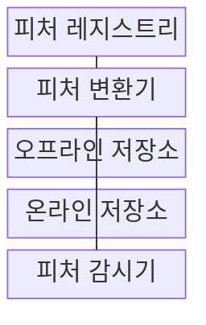
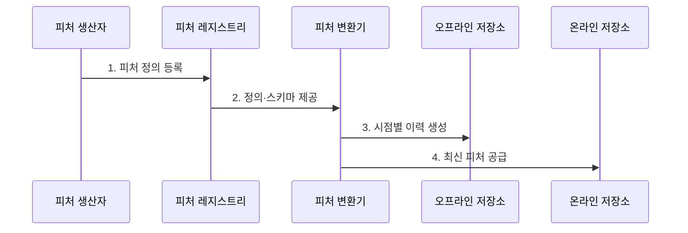

---
sidebar:
  order: 204
  label: "204. 피처 스토어 (Feature Store)"
  badge:
    text: "기출 · 50%"
    variant: note
title: "피처 스토어 (Feature Store)"
date: "2026-07-31T00:16:00+09:00"
tags: ["notes-software"]
weight: 204
extra:
  question_no: "204"
  source_status: "기출"
  source_history: "135회"
  priority: 50
  priority_note: "특징 일관성과 재사용 구조가 최근 출제됨"
---

## 미리 알고가기

- **피처(Feature)**: 원천 데이터를 변환해 모델 학습·추론 입력으로 사용하는 변수
- **피처 스토어(Feature Store)**: 피처 정의·계보·이력·실시간 값을 함께 관리해 재사용과 일관성을 제공하는 인프라
- **오프라인 저장소(Offline Store)**: 모델 학습용 대용량 이력 피처를 시점별로 보관하는 저장소
- **온라인 저장소(Online Store)**: 실시간 추론에 최신 피처를 짧은 지연으로 제공하는 저장소
- **시점 일치 조인(Point-in-time Join, PIT Join)**: ‘피아이티 조인’으로 읽고 영문 첫 글자를 딴 약어이며, 예측 시점 이전 데이터만 결합해 미래 정보 누수를 방지하는 조인
- **학습·서빙 편향(Training-serving Skew)**: 학습과 운영의 피처 계산·값 차이로 예측 품질이 달라지는 현상
- **피처 레지스트리(Feature Registry)**: 피처 정의·소유자·버전·스키마를 검색·통제하는 메타데이터 저장소
- **기계학습 운영(Machine Learning Operations, MLOps)**: ‘엠엘옵스’로 읽고 Machine Learning의 첫 글자 ML과 Operations를 결합한 명칭이며, 데이터·학습·배포·감시를 자동화하는 운영 체계
- **스키마(Schema)**: 피처 이름·자료형·필수 여부·허용 범위를 정의해 생산자와 소비자가 같은 데이터 구조를 사용하도록 하는 규칙
- **피처 계보(Feature Lineage)**: 원천 데이터에서 변환·저장·학습·추론까지 피처가 생성·사용된 관계와 버전을 추적하는 이력
- **피처 변환기(Feature Transformer)**: 레지스트리의 계산식과 스키마로 원천 데이터를 가공해 오프라인 이력과 온라인 최신값을 만드는 구성요소
- **피처 신선도(Feature Freshness)**: 온라인 피처가 원천 데이터의 최신 변화를 얼마나 늦지 않게 반영하는지 나타내는 상태
- **피처 감시기(Feature Monitor)**: 누락·범위·분포·갱신 지연을 관측해 학습·추론 입력의 품질과 신선도를 판정하는 구성요소
- **서비스 수준 목표(Service Level Objective, SLO)**: 피처 신선도·가용성에 대해 달성할 측정 목표
- **서비스 수준 협약(Service Level Agreement, SLA)**: 피처 제공자와 소비자가 합의한 품질·지원 책임

## Ⅰ. 개요

- 정의/개념: **피처 정의·이력·최신값**을 일관되게 제공하는 저장소
- 배경/필요성: 개별 변환 파이프라인으로 **중복·학습 서빙 편향** 발생

### 쉽게 이해하기 (학습용)
- 같은 재료 가공법을 등록해 과거 학습용 값과 지금 예측용 값을 한곳에서 일관되게 제공한다

## Ⅱ. 특징

- **중앙 피처 정의·버전·계보**로 검색·재사용
- **PIT 조인**으로 학습 데이터의 미래 정보 누수 방지
- **오프라인·온라인 동일 변환**으로 서빙 편향 통제

### 쉽게 이해하기 (학습용)
- 학습 때 쓴 가공법과 운영 때 쓴 가공법이 같아야 모델이 예상한 입력을 받는다

## Ⅲ. 구조 및 구성요소

| 구성요소 | 책임 |
|:---|:---|
| 피처 레지스트리 | **정의·소유자·버전·스키마** 관리 |
| 피처 변환기 | 동일 계산식으로 **원천 데이터 가공** |
| 오프라인 저장소 | 학습용 **시점별 이력 피처** 저장 |
| 온라인 저장소 | 추론용 **최신 피처 저지연 제공** |
| 피처 감시기 | **품질·분포·신선도** 관측 |

> 요약: 같은 정의로 이력·최신 피처 생성·감시

### 쉽게 이해하기 (학습용)
- 한 가공기가 과거용 창고와 실시간용 선반에 값을 나눠 넣고 감시기가 둘의 상태를 확인한다

## Ⅳ. 흐름도

**동작 원리**

1. **피처 정의 등록**: 계산식·스키마·소유자 고정
2. **정의·스키마 제공**: 등록된 계산식과 입력 계약 전달
3. **시점별 이력 생성**: PIT 조인으로 학습 자료 생성
4. **최신 피처 공급**: 같은 계산 결과 온라인 동기화

> 요약: 같은 정의로 시점별 이력과 최신 피처 생성

### 쉽게 이해하기 (학습용)
- 과거 학습에는 그 시점까지 알 수 있던 값만 넣고 같은 계산 결과를 운영 저장소에도 보낸다

## Ⅴ. 종류 및 비교

| 피처 스토어 영역 | 오프라인 저장소 | 온라인 저장소 | 피처 레지스트리 |
|:---|:---|:---|:---|
| 적용 기준 | 학습 데이터 **생성·재현** | 실시간 **추론 입력 조회** | 피처 **검색·중복 방지** |
| 핵심 특징 | 시점별 **대용량 이력 저장** | 최신값 **저지연 제공** | **정의·버전·소유권** 관리 |
| 한계 | 미래 정보 **누수 위험** | 동기화 지연·**오래된 값** | 정의 충돌·**소유자 부재** |

> 요약: 이력은 오프라인, 최신값은 온라인, 정의는 레지스트리

### 쉽게 이해하기 (학습용)
- 과거 값은 큰 창고에서 학습에 쓰고 최신값은 빠른 선반에서 예측에 쓰며 이름표는 레지스트리가 관리한다

## Ⅵ. 실무 고려사항 및 대책

| 고려사항 | 대책 | 효과 |
|:---|:---|:---|
| 학습 자료의 **미래 정보 누수** | 사건 시점 기반 **PIT 조인** | 평가 결과 **신뢰성** |
| 학습·추론의 **계산식 차이** | 단일 정의·**변환 코드 재사용** | 서빙 편향 **방지** |
| 온라인 값의 **갱신 지연** | 신선도 SLO·**지연 감시** | 추론 입력 **최신성** |
| 피처의 **소유자 부재** | 소유권·SLA·**폐기 절차 지정** | 품질 책임 **명확화** |

### 쉽게 이해하기 (학습용)
- 사기 모델은 미래 거래 정보가 학습 입력에 섞이지 않도록 시점을 맞춘다

## Ⅶ. 결론

- 배치 학습은 **오프라인**, 실시간 추론은 **온라인 저장소** 선택

### 쉽게 이해하기 (학습용)
- 같은 피처 정의를 여러 모델이 재사용하되 과거와 현재 값이 같은 계산법으로 만들어지는지 확인한다
