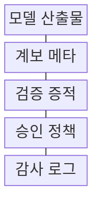
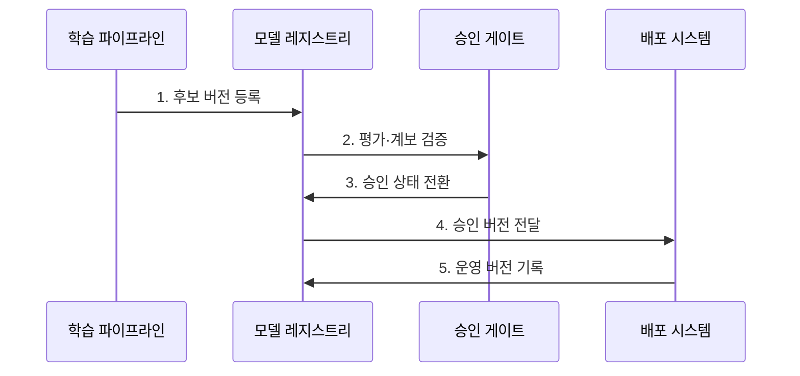

---
sidebar:
  order: 205
  label: "205. 모델 레지스트리 (Model Registry)"
  badge:
    text: "기출 · 50%"
    variant: note
title: "모델 레지스트리 (Model Registry)"
date: "2026-08-02T12:00:00+09:00"
tags: ["notes-software"]
weight: 205
extra:
  question_no: "205"
  source_status: "기출"
  source_history: "135회"
  priority: 50
  priority_note: "모델 승인·버전·배포 연결이 최근 출제됨"
---

## Ⅰ. 개요

핵심 용어

- **계보·승인 상태**: 모델 레지스트리는 불변 모델 버전에 코드·데이터·학습 계보와 평가·승인 상태를 연결한다.

- 정의/개념: 모델 버전과 **계보·승인 상태**를 연결해 배포를 통제하는 저장소
- 배경/필요성: 파일 저장만으로 **운영 승인·배포·복귀 통제 곤란**

### 쉽게 이해하기 (학습용)
- 모델마다 출생 기록과 시험 성적표를 붙이고 승인된 번호만 운영 이름표가 가리키게 한다

## Ⅱ. 특징

핵심 용어

- **승인 게이트·운영 별칭**: 승인 게이트는 승격 조건을 검사하고 운영 별칭은 현재 배포할 불변 모델 버전을 가리킨다.

- **불변 버전·산출물 해시**로 배포 결과 재현
- **코드·데이터·학습·평가 계보** 추적
- **승인 게이트·운영 별칭**으로 승격·복귀 통제

### 쉽게 이해하기 (학습용)
- 모델 파일을 고치지 않고 새 번호로 쌓아 두면 운영 이름표만 이전 번호로 돌려 같은 모델을 다시 배포할 수 있다

## Ⅲ. 구조 및 구성요소

핵심 용어

- **승인 정책**: 승인 정책은 검증 증적과 권한 조건을 바탕으로 모델의 단계 상태와 운영 별칭 전환을 통제한다.

| 구성요소 | 책임 |
|:---|:---|
| 모델 산출물 | 불변 파일·**해시·모델 서명** 보관 |
| 계보 메타 | **코드·데이터·학습 관계** 추적 |
| 검증 증적 | **성능·무결성·출처** 합격 근거 |
| 승인 정책 | 단계 상태와 **운영 별칭 전환** 제어 |
| 감사 로그 | **등록·승인·배포·복귀** 이력 저장 |

### 쉽게 이해하기 (학습용)
- 모델 파일과 학습 출처·시험 결과를 묶고 승인 정책이 운영 이름표를 바꾼 기록까지 남긴다

## Ⅳ. 흐름도

핵심 용어

- **4. 승인 버전 전달**: 모델 레지스트리는 운영 별칭이 가리키는 승인된 불변 버전과 산출물 해시를 배포 시스템에 전달한다.

**동작 원리**

1. **후보 버전 등록**: **산출물 해시·계보**를 불변 등록
2. **평가·계보 검증**: **성능·무결성·출처** 합격 판정
3. **승인 상태 전환**: 승인자·근거와 **단계 상태 변경**
4. **승인 버전 전달**: 운영 별칭의 **승인 버전 반영**
5. **운영 버전 기록**: 환경별 **배포·복귀 이력** 저장

### 쉽게 이해하기 (학습용)
- 후보 모델의 파일·출처·성적을 확인해 승인하고 운영 이름표를 해당 번호로 바꾼다

## Ⅴ. 종류 및 비교

핵심 용어

- **모델 레지스트리**: 모델 레지스트리는 실험·파일 증거를 운영 승인과 연결해 모델의 승격·배포·복귀를 통제한다.

| MLOps 저장소 | 모델 레지스트리 | 실험 추적기 | 산출물 저장소 |
|:---|:---|:---|:---|
| 적용 기준 | 운영 **승격·배포·복귀 통제** | 후보 실험 **재현·비교** | 대용량 파일 **보관·무결성** |
| 핵심 특징 | **승인 상태·운영 별칭** 관리 | **학습 실행·지표** 기록 | **불변 모델 파일** 보관 |
| 한계 | 잘못된 승인·**별칭 오변경** | 운영 버전 **통제 부족** | 계보·승인 **정보 부족** |

> 요약: 레지스트리는 실험·파일 증거를 운영 승인에 연결

### 쉽게 이해하기 (학습용)
- 파일 창고와 실험 기록은 재료를 보관하고 레지스트리는 그 증거로 운영할 모델 번호를 승인한다

## Ⅵ. 실무 고려사항 및 대책

핵심 용어

- **단일 장애**: 레지스트리의 단일 장애는 승인 모델 조회와 별칭 전환을 막아 전체 모델 배포 통제를 중단시킬 수 있다.

| 문제 | 대책 | 효과 |
|:---|:---|:---|
| 승인 없는 **운영 별칭 변경** | RBAC·2인 승인·**감사 로그** | 오배포·오복귀 **방지** |
| 산출물·계보의 **불일치** | 해시·데이터 Snapshot **결속** | 모델 결과 **재현성** |
| 레지스트리의 **단일 장애** | 복제·백업·**복구 시험** | 배포 통제 **지속성** |
| 폐기 모델의 **장기 잔존** | 보존·폐기·**규제 정책 적용** | 비용·위험 **축소** |

### 쉽게 이해하기 (학습용)
- 신용 모델은 누가 어떤 데이터로 만든 버전을 승인했는지 함께 확인한다

## Ⅶ. 결론

핵심 용어

- **운영 별칭**: 평가 증적과 계보가 합격 조건을 충족한 불변 버전만 운영 별칭으로 승격해야 한다.

- **평가 증적·계보** 충족 버전만 **운영 별칭**으로 승격

### 쉽게 이해하기 (학습용)
- 파일·학습 출처·시험 결과를 함께 승인하고 운영 이름표를 이전 번호로 돌릴 수 있어야 한다
