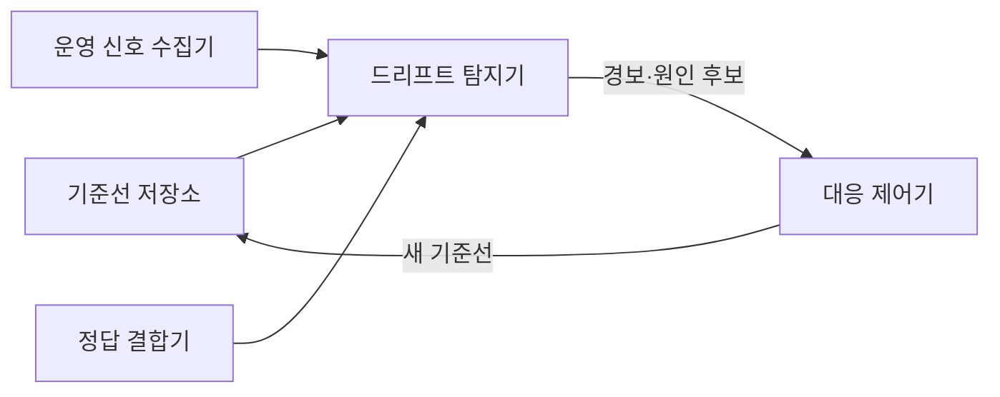
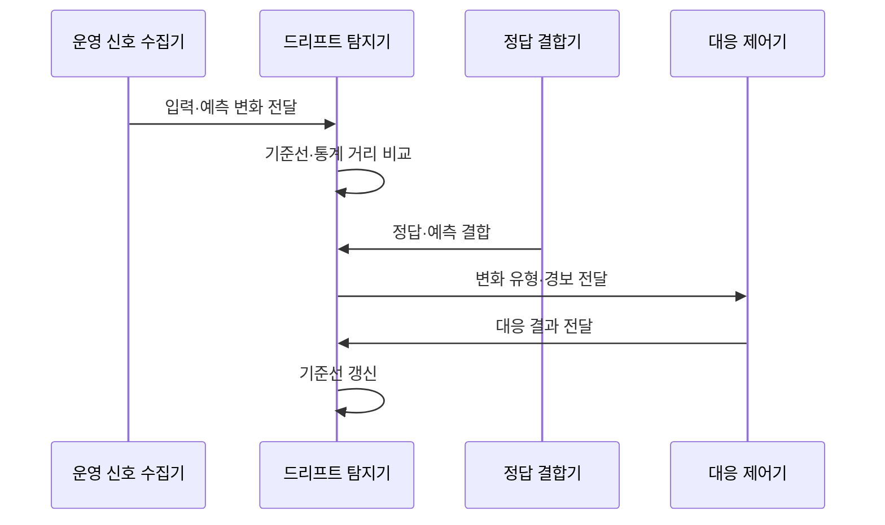

---
sidebar:
  order: 206
  label: "206. 모델 모니터링·드리프트 감지 (Model Monitoring Drift Detection)"
  badge:
    text: "기출 · 70%"
    variant: note
title: "모델 모니터링·드리프트 감지 (Model Monitoring Drift Detection)"
date: "2026-07-27T23:59:59+09:00"
tags: ["notes-software"]
weight: 206
extra:
  question_no: "206"
  source_status: "기출"
  source_history: ""
  priority: 70
  priority_note: "운영 모델의 드리프트 감지·대응"
---

## 미리 알고가기

- **데이터 드리프트(Data Drift)**: 운영 입력 피처 분포가 학습 기준선에서 달라지는 현상
- **개념 드리프트(Concept Drift)**: 입력과 정답의 관계가 바뀌어 같은 입력의 올바른 예측이 달라지는 현상
- **예측 드리프트(Prediction Drift)**: 모델 출력 점수·등급 분포가 기준선에서 달라지는 현상
- **정답 지연(Label Delay)**: 실제 결과가 늦게 확정돼 즉시 정확도를 계산할 수 없는 상태
- **학습·서빙 편향(Training-serving Skew)**: 학습과 운영의 입력·전처리 차이로 예측 품질이 달라지는 현상
- **슬라이스(Slice)**: 지역·기기·고객군처럼 성능을 따로 계산할 부분집합
- **기준선(Baseline)**: 학습·검증 시점의 입력·예측·성능 분포로 운영 변화를 비교하는 기준
- **통계 거리(Statistical Distance)**: 기준 분포와 운영 분포가 얼마나 다른지 나타내는 값
- **모델 모니터링(Model Monitoring)**: 운영 입력·예측·정답·성능을 지속 수집해 모델 품질 저하와 그 원인을 판정하는 활동
- **운영 신호(Production Signal)**: 실제 서비스에서 수집한 피처·예측·지연·오류·정답으로 기준선과 비교할 관측값
- **드리프트 탐지기(Drift Detector)**: 기준선과 운영 분포의 통계 거리·성능 차이를 계산해 변화 유형과 임계치 초과 여부를 판정하는 구성요소
- **정답 결합기(Label Joiner)**: 늦게 도착한 실제 결과를 과거 예측과 같은 사건 식별자로 연결해 운영 성능을 계산하는 구성요소
- **대응 제어기(Response Controller)**: 드리프트 경보의 원인과 영향을 검토해 재학습·이전 모델 복귀·기준선 갱신을 결정하는 구성요소
- **임계치(Threshold)**: 통계 거리나 성능 저하가 경보를 낼 수준인지 구분하도록 정한 경계값
- **재학습·복귀(Retraining·Rollback)**: 재학습은 새 데이터로 모델을 갱신하고 복귀는 문제가 생긴 운영 모델을 이전 승인 버전으로 되돌리는 대응

## Ⅰ. 개요

- 정의/개념: 운영 **입력·예측·정답·성능 변화** 감시
- 기존 한계: 배포 전 평가는 **운영 분포·개념 변화 반영 곤란**

### 쉽게 이해하기 (학습용)
- 학습 때와 운영 때의 입력·예측·정답을 비교해 모델이 낡았는지 찾는다

## Ⅱ. 특징

- **입력·예측·성능 기준선**으로 변화 대상 구분
- **통계 거리·슬라이스 감시**로 조기 경보
- 지연 정답 결합 후 **성능 확인·재학습·복귀** 결정

### 쉽게 이해하기 (학습용)
- 실제 결과가 늦게 와도 입력과 예측의 변화를 먼저 보고, 결과가 오면 정확도 저하인지 확인한다

## Ⅲ. 아키텍처 및 구성요소

| 설계 요소 | 설명 |
|:---|:---|
| 기준선 저장소 | **학습 입력·예측·성능 분포** 보관 |
| 운영 신호 수집기 | 신호를 **슬라이스별 수집** |
| 정답 결합기 | 지연 정답과 **과거 예측 연결** |
| 드리프트 탐지기 | **통계 거리·성능 차이** 판정 |
| 대응 제어기 | **재학습·복귀·기준 갱신** 결정 |

> 요약: 기준·운영·정답을 비교해 원인별 대응 연결

### 쉽게 이해하기 (학습용)
- 학습 때의 분포표와 운영 신호를 비교하고 실제 결과가 오면 예측의 정답 여부까지 연결한다

## Ⅳ. 원리 및 절차 흐름도

| 절차 | 설명 |
|:---|:---|
| 입력·예측 변화 전달 | **슬라이스별 운영 분포** 수집 |
| 기준선·통계 거리 비교 | 변화 크기와 **임계 초과** 판정 |
| 정답·예측 결합 | 지연 정답으로 **실제 성능** 계산 |
| 변화 유형·경보 전달 | **데이터·개념·예측 변화** 분류 |
| 대응 결과 전달 | 재학습·정책 조정의 효과 전달 |
| 기준선 갱신 | 대응 효과 확인 후 **기준 갱신** |

> 요약: 조기 분포 경보를 정답 성능으로 확인해 대응

### 쉽게 이해하기 (학습용)
- 입력만 달라졌는지 정답 관계까지 바뀌었는지 확인한 뒤 필요한 경우에만 다시 학습한다

## Ⅴ. 종류 및 비교

| 모델 드리프트 유형 | 데이터 드리프트 | 개념 드리프트 | 예측 드리프트 |
|:---|:---|:---|:---|
| 적용 기준 | 정답 전 **입력 분포 감시** | 정답 후 **성능 저하 확인** | **출력 점수·등급** 조기 감시 |
| 핵심 특징 | **운영 입력 분포** 변화 | **입력·정답 관계** 변화 | **모델 출력 분포** 변화 |
| 한계 | 무영향 변화의 **과잉 경보** | 정답 지연으로 **판정 지체** | 입력·정책과 **원인 혼동** |

> 요약: 입력·정답 관계·출력 중 바뀐 대상을 구분

### 쉽게 이해하기 (학습용)
- 재료가 달라졌는지 정답 규칙이 달라졌는지 출력만 치우쳤는지 나눠 대응한다

## Ⅵ. 실무 사례

1. 신용 모델은 **고객군별 입력·연체율** 변화 감시

### 쉽게 이해하기 (학습용)
- 전체 평균이 같아도 특정 고객군의 승인·연체 관계가 달라지는지 따로 확인한다

## Ⅶ. 결론

- 분포 변화는 **조기 경보**, 성능 저하는 **재학습**

### 쉽게 이해하기 (학습용)
- 분포가 달라졌다는 이유만으로 재학습하지 말고 실제 성능과 원인을 확인한 뒤 대응한다
