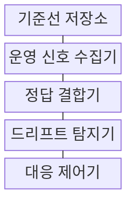
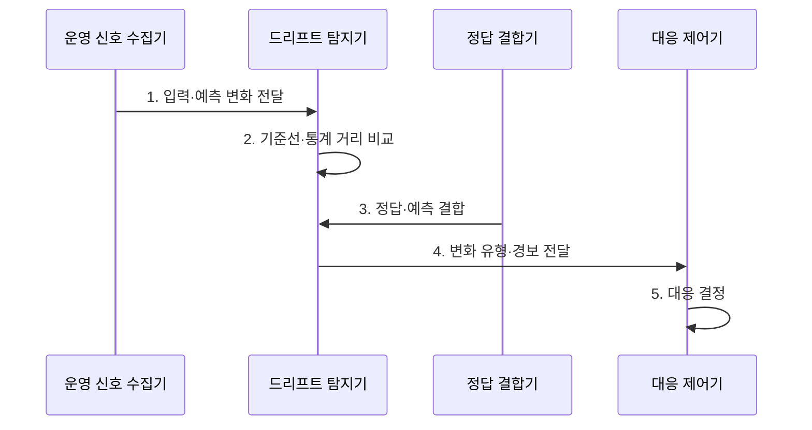

---
sidebar:
  order: 206
  label: "206. 모델 모니터링·드리프트 감지 (Model Monitoring Drift Detection)"
  badge:
    text: "기출 · 70%"
    variant: note
title: "모델 모니터링·드리프트 감지 (Model Monitoring Drift Detection)"
date: "2026-08-02T12:00:00+09:00"
tags: ["notes-software"]
weight: 206
extra:
  question_no: "206"
  source_status: "기출"
  source_history: ""
  priority: 70
  priority_note: "운영 모델의 드리프트 감지·대응"
---

## Ⅰ. 개요

핵심 용어

- **드리프트**: 모델 모니터링은 운영 입력·예측·정답을 기준선과 비교해 드리프트와 실제 품질 저하를 판정한다.

- 정의/개념: 운영 신호로 **드리프트**와 품질 저하를 판정하는 **모델 모니터링** 활동
- 배경/필요성: 배포 전 평가는 **운영 분포·개념 변화 반영 곤란**

### 쉽게 이해하기 (학습용)
- 학습 때와 운영 때의 입력·예측·정답을 비교해 모델이 낡았는지 찾는다

## Ⅱ. 특징

핵심 용어

- **통계 거리·슬라이스 감시**: 통계 거리는 운영 분포의 변화 크기를 측정하고 슬라이스 감시는 특정 사용자군의 국소 품질 저하를 찾는다.

> 파란 관측 거리가 붉은 경보 임계값을 넘는 시점부터 원인 조사와 재학습을 검토하는 예시이며, 거리 척도와 임계값은 데이터·위험 수준별로 검증해 정한다.

- **입력·예측·성능 기준선**으로 변화 대상 구분
- **통계 거리·슬라이스 감시**로 조기 경보
- 지연 정답 결합 후 **성능 확인·재학습·복귀** 결정

### 쉽게 이해하기 (학습용)
- 실제 결과가 늦게 와도 입력과 예측의 변화를 먼저 보고, 결과가 오면 정확도 저하인지 확인한다

## Ⅲ. 구조 및 구성요소

핵심 용어

- **드리프트 탐지기**: 드리프트 탐지기는 기준선과 운영 분포의 통계 거리·성능 차이를 계산해 변화 유형과 임계 초과를 판정한다.

| 구성요소 | 책임 |
|:---|:---|
| 기준선 저장소 | **학습 입력·예측·성능 분포** 보관 |
| 운영 신호 수집기 | 신호를 **슬라이스별 수집** |
| 정답 결합기 | 지연 정답과 **과거 예측 연결** |
| 드리프트 탐지기 | **통계 거리·성능 차이** 판정 |
| 대응 제어기 | **재학습·복귀·기준 갱신** 결정 |

### 쉽게 이해하기 (학습용)
- 학습 때의 분포표와 운영 신호를 비교하고 실제 결과가 오면 예측의 정답 여부까지 연결한다

## Ⅳ. 흐름도

핵심 용어

- **4. 변화 유형·경보 전달**: 입력, 예측, 정답의 변화를 데이터·개념·예측 드리프트로 분류해 대응 제어기에 경보를 전달한다.

**동작 원리**

1. **입력·예측 변화 전달**: **슬라이스별 운영 분포** 수집
2. **기준선·통계 거리 비교**: 변화 크기와 **임계 초과** 판정
3. **정답·예측 결합**: 지연 정답으로 **실제 성능** 계산
4. **변화 유형·경보 전달**: **데이터·개념·예측 변화** 분류
5. **대응 결정**: 재학습·복귀·기준선 갱신 선택

### 쉽게 이해하기 (학습용)
- 입력만 달라졌는지 정답 관계까지 바뀌었는지 확인한 뒤 필요한 경우에만 다시 학습한다

## Ⅴ. 종류 및 비교

핵심 용어

- **개념 드리프트**: 개념 드리프트는 입력과 정답의 관계가 바뀌어 기존 모델의 실제 성능이 저하되는 현상이다.

| 모델 드리프트 유형 | 데이터 드리프트 | 개념 드리프트 | 예측 드리프트 |
|:---|:---|:---|:---|
| 적용 기준 | 정답 전 **입력 분포 감시** | 정답 후 **성능 저하 확인** | **출력 점수·등급** 조기 감시 |
| 핵심 특징 | **운영 입력 분포** 변화 | **입력·정답 관계** 변화 | **모델 출력 분포** 변화 |
| 한계 | 무영향 변화의 **과잉 경보** | 정답 지연으로 **판정 지체** | 입력·정책과 **원인 혼동** |

> 요약: 입력·정답 관계·출력 중 바뀐 대상을 구분

### 쉽게 이해하기 (학습용)
- 재료가 달라졌는지 정답 규칙이 달라졌는지 출력만 치우쳤는지 나눠 대응한다

## Ⅵ. 실무 고려사항 및 대책

핵심 용어

- **드리프트 오판**: 드리프트 오판은 계절성과 정상적인 주기 변화를 이상 변화로 해석해 불필요한 경보와 재학습을 일으키는 문제다.

| 문제 | 대책 | 효과 |
|:---|:---|:---|
| 계절성의 **드리프트 오판** | 구간·요일별 **기준선 분리** | 경보 정확성 **향상** |
| 정답 도착의 **평가 지연** | 대리지표·**지연 라벨 결합** | 성능 저하 **조기 탐지** |
| 다중 지표의 **경보 폭주** | 영향·지속 시간 **상관 분석** | 대응 우선순위 **확보** |
| 데이터·개념 **원인 혼동** | 입력·예측·정답 **분리 진단** | 재학습 판단 **정확성** |

### 쉽게 이해하기 (학습용)
- 전체 평균이 같아도 특정 고객군의 승인·연체 관계가 달라지는지 따로 확인한다

## Ⅶ. 결론

핵심 용어

- **실제 성능 저하**: 정답 결합으로 실제 성능 저하가 확인되면 재학습하고 영향 없는 분포 변화는 검증 후 기준선을 갱신한다.

- **실제 성능 저하**는 재학습, 무영향 **분포 변화**는 기준선 갱신

### 쉽게 이해하기 (학습용)
- 분포가 달라졌다는 이유만으로 재학습하지 말고 실제 성능과 원인을 확인한 뒤 대응한다
