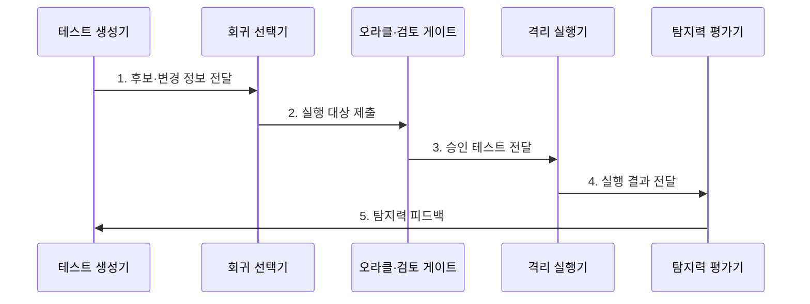

---
sidebar:
  order: 207
  label: "207. AI 기반 테스트 자동화 (AI Test Automation)"
  badge:
    text: "미출 · 70%"
    variant: note
title: "AI 기반 테스트 자동화 (AI Test Automation)"
date: "2026-08-02T12:00:00+09:00"
tags: ["notes-software"]
weight: 207
extra:
  question_no: "207"
  source_status: "미출"
  source_history: ""
  priority: 70
  priority_note: "테스트 생성·선택·판정 통제가 최신 응용축임"
---

## Ⅰ. 개요

핵심 용어

- **소프트웨어 테스트 자동화 기법**: AI 기반 테스트 자동화는 요구·코드·실행 이력을 분석해 테스트 생성·선택·실패 분석을 보조하는 소프트웨어 테스트 기법이다.

- 정의/개념: 요구·코드·실행 이력을 AI로 분석해 테스트 생성·회귀 선택·실패 분석을 보조하는 **소프트웨어 테스트 자동화 기법**
- 배경/필요성: 전체 회귀 실행·수작업 작성으로 **변경 대응 시간 증가**

### 쉽게 이해하기 (학습용)
- 변경 코드와 과거 실패로 검사를 생성·선택하되 합격 판정은 검증된 기준으로 통제한다

## Ⅱ. 특징

핵심 용어

- **오라클·사람 검토**: AI가 만든 테스트는 검증된 오라클과 사람의 검토를 통해 기대 결과, 보안, 중복, 유효성을 통제해야 한다.

- **변경·실패 이력** 기반 회귀 대상 압축
- **오라클·사람 검토** 기반 생성 결과 통제
- **실패 군집·원인 후보** 기반 분석 보조

### 쉽게 이해하기 (학습용)
- 모든 검사를 늘리는 대신 바뀐 곳과 자주 실패한 곳을 먼저 보되, AI가 만든 검사도 정답표와 재현성을 확인한다

## Ⅲ. 구조 및 구성요소

핵심 용어

- **격리 실행기**: 격리 실행기는 생성 테스트의 시스템·데이터 영향을 제한한 환경에서 승인된 테스트만 실행한다.

| 구성요소 | 책임 |
|:---|:---|
| 테스트 생성기 | 입력·시나리오·**스크립트 후보** 생성 |
| 회귀 선택기 | **변경 영향·실패 이력**으로 실행 대상 선택 |
| 오라클·검토 게이트 | 기대 결과·보안·중복과 **유효성** 검증 |
| 격리 실행기 | 승인 테스트를 **격리 환경**에서 실행 |
| 탐지력 평가기 | **변이 검출률·재현성**으로 실패 원인 평가 |

### 쉽게 이해하기 (학습용)
- 변경 이력으로 검사 후보를 만들고 정답표를 통과한 검사만 격리 실행해 실제 결함 탐지력을 다시 학습한다

## Ⅳ. 흐름도

핵심 용어

- **5. 탐지력 피드백**: 변이 검출률과 재현성으로 테스트의 실제 결함 탐지력을 평가해 생성기와 회귀 선택기에 환류한다.

**동작 원리**

1. **후보·변경 정보 전달**: 요구·코드로 생성한 후보와 변경 범위 결속
2. **실행 대상 제출**: 의존성·과거 실패로 회귀 대상 선택
3. **승인 테스트 전달**: 오라클·보안·중복 검증 통과
4. **실행 결과 전달**: 성공·실패·비결정 결과 기록
5. **탐지력 피드백**: 변이 검출률·재현성으로 생성기 개선

### 쉽게 이해하기 (학습용)
- 바뀐 코드에서 검사 후보를 만들고 일부러 넣은 결함을 실제로 잡는지 확인한 뒤 다음 선택에 반영한다

## Ⅴ. 종류 및 비교

핵심 용어

- **생성형 AI**: 생성형 AI는 요구와 코드 문맥을 바탕으로 신규 테스트 시나리오, 입력, 스크립트의 초안을 만든다.

| 테스트 자동화 방식 | 규칙 기반 | ML 기반 | 생성형 AI |
|:---|:---|:---|:---|
| 적용 기준 | 고정 핵심 경로·**정확한 오라클** | **변경·실패 이력** 충분 | **신규 시나리오 초안** 필요 |
| 핵심 특징 | **명시 시나리오** 반복 실행 | **이력 패턴**으로 선택·분류 | 요구·코드로 **테스트 생성** |
| 한계 | 변경 시 **유지 비용** | **편향·오선택** | **잘못된 오라클·유해 코드** |

> 요약: 회귀 선별은 **ML**, 신규 초안은 **생성형 AI** 적용

### 쉽게 이해하기 (학습용)
- 정답이 분명한 검사는 규칙으로 고정하고 과거 이력은 선택에, 생성형 AI는 새 검사 초안에 쓴다

## Ⅵ. 실무 고려사항 및 대책

핵심 용어

- **오라클 오류**: 오라클 오류는 AI가 잘못된 기대 결과를 생성해 정상 동작을 실패로 보거나 결함을 통과시키는 문제다.

| 문제 | 대책 | 효과 |
|:---|:---|:---|
| 생성 테스트의 **오라클 오류** | 규칙·사람의 **결과 교차 검증** | 오탐 테스트 **차단** |
| 코드·자료의 **외부 노출** | 비식별·사설 모델·**접근 통제** | 기밀 유출 **방지** |
| 비결정 테스트의 **Flaky 증가** | Seed·환경·**재현 정보 고정** | 실패 원인 **추적성** |
| 커버리지의 **품질 착시** | 결함 탐지율·**변이 점수 병행** | 테스트 효과 **검증** |

### 쉽게 이해하기 (학습용)
- 결제 코드 변경 뒤 관련 검사만 선택하되 인위적 결함을 놓치면 테스트를 보강한다

## Ⅶ. 결론

핵심 용어

- **변이 검출률**: 정확한 오라클과 높은 변이 검출률, 반복 실행 재현성이 확인될 때 AI 생성 테스트의 적용 범위를 확대해야 한다.

- 정확한 **오라클**과 높은 **변이 검출률**일 때 AI 생성 테스트 확대

### 쉽게 이해하기 (학습용)
- 검사 수보다 실제 결함을 잡고 같은 조건에서 다시 실행되는지를 기준으로 자동화를 확대한다
