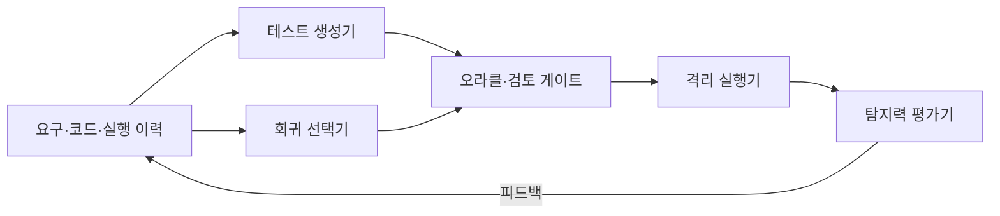
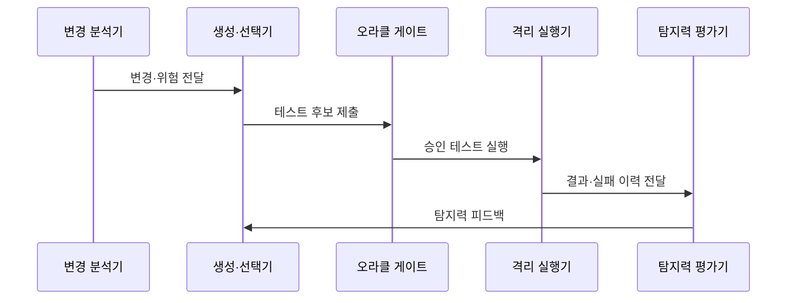

---
sidebar:
  order: 207
  label: "207. AI 기반 테스트 자동화 (AI Test Automation)"
  badge:
    text: "미출제 · 70%"
    variant: note
title: "AI 기반 테스트 자동화 (AI Test Automation)"
date: "2026-07-25T00:30:00+09:00"
tags: ["notes-software"]
weight: 207
extra:
  question_no: "207"
  source_status: "미출제"
  source_history: ""
  priority: 70
  priority_note: "테스트 생성·선택·판정 통제가 최신 응용축임"
---

## 미리 알고가기

- **인공지능 기반 테스트(AI-based Testing)**: 요구·코드·실행 이력으로 테스트 생성·선택·분석을 보조하는 방식
- **테스트 오라클(Test Oracle)**: 실제 결과의 합격 여부를 판정하는 기대값·불변식·속성
- **자가 복구(Self-healing)**: 사용자 인터페이스 변경 시 대체 요소를 찾아 테스트 경로를 자동 수정하는 기능
- **위험 기반 테스트(Risk-based Testing)**: 변경 영향과 실패 가능성으로 먼저 실행할 테스트를 선택하는 방식
- **변이 테스트(Mutation Testing)**: 코드에 작은 결함을 넣어 테스트가 이를 검출하는지 평가하는 기법
- **비결정 테스트(Flaky Test)**: 코드가 같아도 환경·순서·시간에 따라 성공과 실패가 반복되는 테스트
- **머신러닝(Machine Learning, ML)**: 데이터 패턴을 학습해 테스트 선택·분류를 보조하는 기법
- **사용자 인터페이스(User Interface, UI)**: 사용자가 시스템과 상호작용하는 화면·입력 요소
- **인공지능(Artificial Intelligence, AI)**: 데이터·규칙을 바탕으로 생성·분류·선택을 수행하며 테스트 후보와 분석을 보조하는 기술
- **생성형 인공지능(Generative Artificial Intelligence, Generative AI)**: 요구·코드 문맥으로 새 테스트 시나리오·입력·스크립트 초안을 생성하는 인공지능 유형
- **회귀 선택기(Regression Selector)**: 변경 코드의 의존성과 과거 실패 이력으로 이번 변경에서 먼저 실행할 기존 테스트를 선택하는 구성요소
- **격리 실행기(Isolated Runner)**: 생성 코드의 시스템·데이터 영향을 제한한 별도 환경에서 승인된 테스트만 실행하는 구성요소
- **변이 검출률(Mutation Detection Rate)**: 의도적으로 넣은 작은 코드 결함 중 테스트 실패로 찾아낸 비율로 테스트 수가 아닌 탐지력을 평가하는 값
- **불변식(Invariant)**: 입력이나 상태가 달라져도 항상 성립해야 하는 속성으로, 구체적 기대값이 없을 때 테스트 오라클 역할을 하는 규칙

## Ⅰ. 개요

- 정의/개념: AI로 테스트 생성·선택·분석 보조
- **배경/필요성**: 회귀 범위·작성 비용 증가로 AI 보조 필요

### 쉽게 이해하기 (학습용)
- 변경 코드와 과거 실패로 검사를 생성·선택하되 합격 판정은 검증된 기준으로 통제한다

## Ⅱ. 특징

- 변경 이력으로 회귀 대상을 좁혀 실행 시간 감소한다.
- 생성 결과는 오라클·사람 검토로 잘못된 합격 방지한다.
- 실패 로그를 묶어 중복 분석을 줄이고 원인 후보 제시한다.
- 변이 검출률·재현성으로 테스트 수보다 탐지력 평가한다.

### 쉽게 이해하기 (학습용)
- 모든 검사를 늘리는 대신 바뀐 곳과 자주 실패한 곳을 먼저 보되, AI가 만든 검사도 정답표와 재현성을 확인한다

## Ⅲ. 아키텍처 및 구성요소

| 설계 요소 | 설명 |
|:---|:---|
| 요구·코드·실행 이력 | 생성·선택의 근거와 변경 범위 제공 |
| 테스트 생성기 | 입력·시나리오·스크립트 후보 생성 |
| 회귀 선택기 | 변경 영향·실패 이력으로 실행 대상 선택 |
| 오라클·검토 게이트 | 기대 결과·보안·중복·유효성 검증 |
| 격리 실행기 | 승인 테스트를 격리 환경에서 실행 |
| 탐지력 평가기 | 변이 검출률·재현성·실패 원인 평가 |

> 요약: AI 후보를 오라클로 검증하고 탐지력 환류

### 쉽게 이해하기 (학습용)
- 변경 이력으로 검사 후보를 만들고 정답표를 통과한 검사만 격리 실행해 실제 결함 탐지력을 다시 학습한다

## Ⅳ. 원리 및 절차 흐름도

| 절차 | 설명 |
|:---|:---|
| 변경·위험 전달 | 수정 코드·의존성·과거 실패 범위 식별 |
| 테스트 후보 제출 | 생성 시나리오와 회귀 대상을 함께 제출 |
| 승인 테스트 실행 | 오라클·보안 검토 후 격리 실행 |
| 결과·실패 이력 전달 | 성공·실패·비결정 결과를 기록 |
| 탐지력 피드백 | 변이 검출률·재현성으로 생성기 개선 |

> 요약: 변경 위험으로 후보를 만들고 오라클·탐지력 검증

### 쉽게 이해하기 (학습용)
- 바뀐 코드에서 검사 후보를 만들고 일부러 넣은 결함을 실제로 잡는지 확인한 뒤 다음 선택에 반영한다

## Ⅴ. 종류 및 비교

| 판단 기준 | 규칙 기반 | ML 기반 | 생성형 AI |
|:---|:---|:---|:---|
| 핵심 특징 | 명시 시나리오 반복 실행 | 이력 패턴으로 선택·분류 | 요구·코드로 테스트 생성 |
| 적용 기준 | 고정 핵심 경로·정확한 오라클 | 변경·실패 이력 충분 | 신규 시나리오 초안 필요 |
| 주요 위험 | 변경 시 유지 비용 | 편향·오선택 | 잘못된 오라클·유해 코드 |

> 요약: 고정 검사는 규칙, 선별은 ML, 초안은 생성형 AI

### 쉽게 이해하기 (학습용)
- 정답이 분명한 검사는 규칙으로 고정하고 과거 이력은 선택에, 생성형 AI는 새 검사 초안에 쓴다

## Ⅵ. 실무 사례

1. 결제 회귀는 변경 영향으로 대상을 좁히고 변이 검출률 확인

### 쉽게 이해하기 (학습용)
- 결제 코드 변경 뒤 관련 검사만 선택하되 인위적 결함을 놓치면 테스트를 보강한다

## Ⅶ. 결론

- 테스트 설계 비용을 줄이면서 결함 검출 신뢰성을 유지하기 위해 **테스트 오라클·재현성·변이 검출률·중복·사람의 승인**을 검토하고, 기준을 통과한 AI 생성 테스트만 회귀 시험에 반영한다

### 쉽게 이해하기 (학습용)
- 검사 수보다 실제 결함을 잡고 같은 조건에서 다시 실행되는지를 기준으로 자동화를 확대한다
