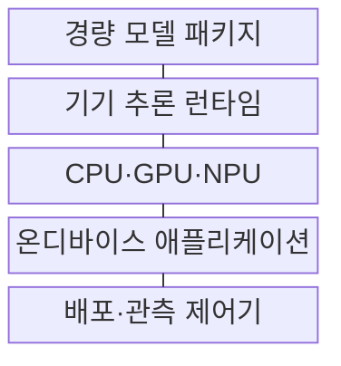
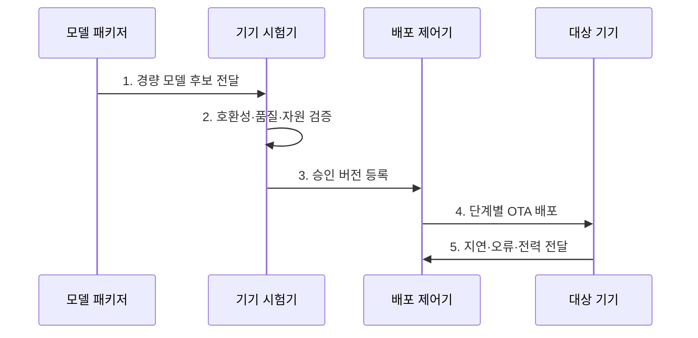

---
sidebar:
  order: 208
  label: "208. 온디바이스 AI 모델 배포: LiteRT·ONNX (On-Device Model Deployment)"
  badge:
    text: "기출 · 85%"
    variant: note
title: "온디바이스 AI 모델 배포: LiteRT·ONNX (On-Device Model Deployment)"
date: "2026-08-02T12:00:00+09:00"
tags: ["notes-software"]
weight: 208
extra:
  question_no: "208"
  source_status: "기출"
  source_history: "134회"
  priority: 85
  priority_note: "기기 추론·경량화·배포가 최근 반복 출제됨"
---

## Ⅰ. 개요

핵심 용어

- **저지연·오프라인 추론**: 온디바이스 배포는 모델을 단말에 설치해 네트워크 연결 없이 저지연·오프라인 추론을 제공한다.

- 정의/개념: 모델을 단말에 설치해 **저지연·오프라인 추론**을 제공하는 배포 방식
- 배경/필요성: 클라우드 추론은 **망 지연·전송 비용·정보 노출**

#### 한줄 요약

- 기기의 작은 작업 공간과 배터리에 맞게 모델을 줄여 인터넷이 없어도 바로 판단하게 한다

## Ⅱ. 특징

핵심 용어

- **LiteRT·ONNX**: LiteRT는 경량 모델을 단말에서 실행하는 런타임이고 ONNX는 학습·추론 도구 사이의 모델 그래프 교환 형식이다.

- **양자화·가지치기**로 크기·지연·전력 감소
- **LiteRT·ONNX** 모델 변환과 **가속기 호환성** 검증
- **단계 OTA·관측·폴백**으로 현장 배포 위험 통제

#### 한줄 요약

- 같은 모델도 기기 칩과 실행 엔진이 다르면 속도와 배터리가 달라 실제 기기에서 확인해야 한다

## Ⅲ. 구조 및 구성요소

핵심 용어

- **기기 추론 런타임**: 기기 추론 런타임은 모델 그래프를 해석하고 CPU·GPU·NPU에서 지원되는 연산기로 실행한다.

| 구성요소 | 책임 |
|:---|:---|
| 경량 모델 패키지 | **가중치·연산자·버전** 보관 |
| 기기 추론 런타임 | 모델 그래프를 **지원 연산기로 실행** |
| CPU·GPU·NPU | 기기별 지원 연산을 **NPU 등 가속기**로 실행 |
| 온디바이스 애플리케이션 | **전처리·추론·결과 사용** |
| 배포·관측 제어기 | **OTA·품질 관측·폴백** 관리 |

#### 한줄 요약

- 줄인 모델을 기기 칩에서 실행하고 문제가 생기면 이전 모델이나 클라우드 경로로 바꾼다

## Ⅳ. 흐름도

핵심 용어

- **4. 단계별 OTA 배포**: 승인한 기기군별 모델을 서명한 OTA 패키지로 소수 기기부터 배포하고 관측 결과에 따라 확대한다.

**동작 원리**

1. **경량 모델 후보 전달**: **양자화·가지치기·형식** 고정
2. **호환성·품질·자원 검증**: 기기별 **정확도·지연·전력** 측정
3. **승인 버전 등록**: 기기군별 **합격·폴백 버전** 지정
4. **단계별 OTA 배포**: **소수 기기부터** 버전 확대
5. **지연·오류·전력 전달**: 기기군별 **실행·품질 신호** 수집

#### 한줄 요약

- 모델을 작게 만든 뒤 실제 기기별로 속도·정확도·배터리를 확인하고 일부부터 배포한다

## Ⅴ. 종류 및 비교

핵심 용어

- **온디바이스 추론**: 온디바이스 추론은 민감 입력을 단말 내부의 경량 모델로 처리해 지연과 네트워크 의존을 줄인다.

| AI 추론 배치 방식 | 온디바이스 추론 | 클라우드 추론 | 하이브리드 추론 |
|:---|:---|:---|:---|
| 적용 기준 | 저지연·오프라인·**민감정보** | 대형 모델·**중앙 갱신** | 기기 자원·**품질 편차** |
| 핵심 특징 | 기기 내부 **경량 모델 실행** | 서버의 **고성능 모델 실행** | 기기 판정 후 **서버 폴백** |
| 한계 | 단편화·전력·**용량 제한** | 망 지연·**전송 비용** | 경로 일관성·**운영 복잡도** |

> 요약: 대형 모델은 클라우드, 저지연은 기기, 자원 편차는 하이브리드

#### 한줄 요약

- 큰 모델이 필요하면 서버, 즉시 판단하면 기기, 기기별 여유가 다르면 두 경로를 함께 쓴다

## Ⅵ. 실무 고려사항 및 대책

핵심 용어

- **정확도 저하**: 정확도 저하는 양자화나 가지치기로 모델 표현력이 줄어 원본 모델보다 예측 품질이 낮아지는 문제다.

| 문제 | 대책 | 효과 |
|:---|:---|:---|
| 기기별 **가속기·메모리 차이** | 기기 등급별 **호환 시험** | 배포 실패 **축소** |
| 양자화의 **정확도 저하** | 대표 자료·**허용 오차 검증** | 경량화 품질 **보장** |
| 단말 모델의 **추출 위험** | 암호화·난독화·**키 보호** | 지식재산 **노출 축소** |
| OTA 모델의 **오배포** | 서명·Canary·**자동 롤백** | 현장 장애 **복구성** |

#### 한줄 요약

- 음성 모델은 칩 종류마다 단어 정확도와 응답 속도를 확인해 맞는 버전을 배포한다

## Ⅶ. 결론

핵심 용어

- **하이브리드**: 단말 자원과 품질을 충족하면 온디바이스를 사용하고 정확도 손실이 크거나 기기 편차가 크면 하이브리드로 배포한다.

- 자원 충족 단말은 **온디바이스**, 정확도 손실이 크면 **하이브리드** 배포

#### 한줄 요약

- 모델 크기만 줄이지 말고 실제 기기에서 품질과 배터리를 확인한 뒤 안전한 복귀 경로까지 준비한다
