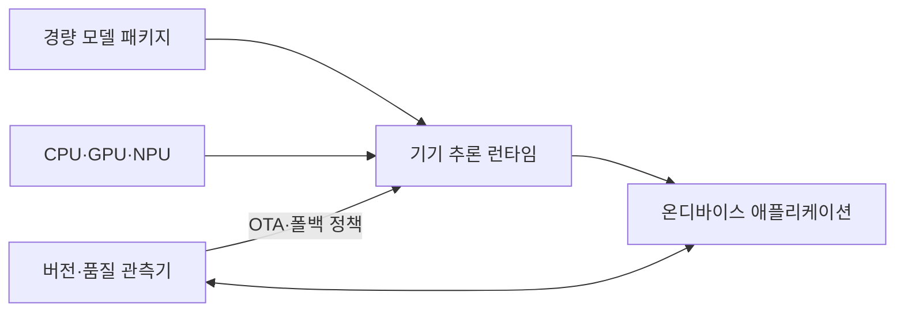
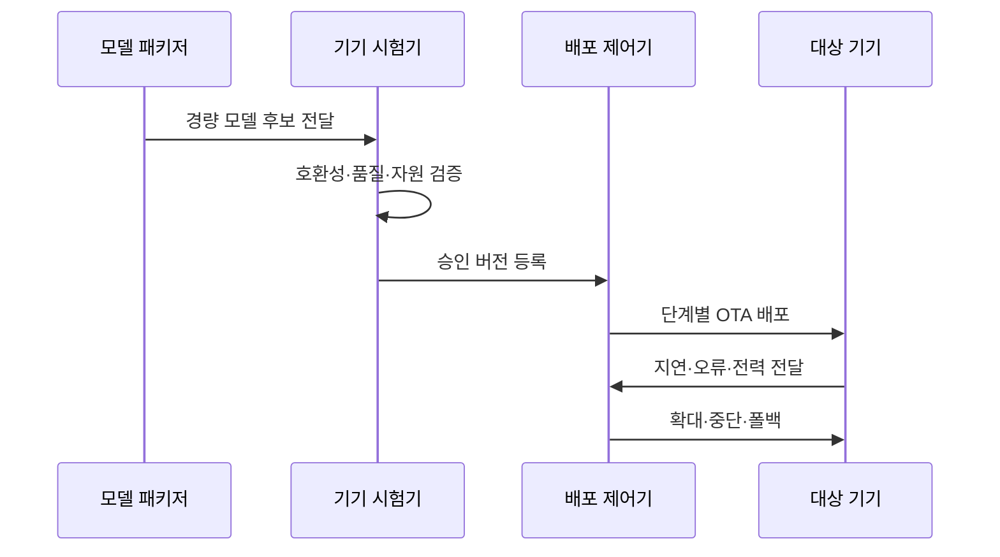

---
sidebar:
  order: 208
  label: "208. 온디바이스 AI 모델 배포 — LiteRT·ONNX (On-Device Model Deployment)"
  badge:
    text: "기출 · 85%"
    variant: note
title: "온디바이스 AI 모델 배포 — LiteRT·ONNX (On-Device Model Deployment)"
date: "2026-07-27T23:59:59+09:00"
tags: ["notes-software"]
weight: 208
extra:
  question_no: "208"
  source_status: "기출"
  source_history: "134회"
  priority: 85
  priority_note: "기기 추론·경량화·배포가 최근 반복 출제됨"
---

## 미리 알고가기

- **인공지능(Artificial Intelligence, AI)**: ‘에이아이’로 읽고 영문 첫 글자를 딴 약어이며, 학습 모델로 분류·예측·생성 작업을 수행하는 기술
- **온디바이스 모델 배포(On-device Model Deployment)**: 모델을 기기에 설치해 클라우드 연결 없이 입력을 추론하는 배포 방식
- **양자화(Quantization)**: 가중치·활성값의 정밀도를 낮춰 모델 크기·연산량·전력을 줄이는 기법
- **가지치기(Pruning)**: 영향이 작은 연결·채널을 제거해 모델 연산량과 크기를 줄이는 기법
- **LiteRT(라이트 알티)**: 공식 제품명을 그대로 표기한 Google의 온디바이스 추론 런타임이며, 모바일·임베디드 기기에서 경량 모델을 실행하는 역할
- **개방형 신경망 교환(Open Neural Network Exchange, ONNX·오닉스)**: Open·Neural Network·eXchange의 핵심 글자를 딴 공식 표기이며, 서로 다른 학습·추론 도구가 모델 그래프를 교환하는 형식
- **신경망 처리 장치(Neural Processing Unit, NPU)**: ‘엔피유’로 읽고 영문 첫 글자를 딴 약어이며, 신경망 연산을 저전력으로 가속하는 전용 장치
- **그래픽 처리 장치(Graphics Processing Unit, GPU)**: ‘지피유’로 읽고 영문 첫 글자를 딴 약어이며, 다수 연산 유닛으로 병렬 계산을 수행하는 장치
- **중앙처리장치(Central Processing Unit, CPU)**: ‘시피유’로 읽고 영문 첫 글자를 딴 약어이며, 범용 명령과 미지원 모델 연산을 처리하는 장치
- **무선 업데이트(Over-the-Air Update, OTA)**: ‘오티에이’로 읽고 영문 핵심어의 첫 글자를 딴 약어이며, 네트워크로 기기의 모델·소프트웨어를 원격 교체하는 방식
- **폴백(Fallback)**: 기기 실행이 불가능하거나 품질이 낮을 때 다른 모델·클라우드 경로로 전환하는 동작

## Ⅰ. 개요

- 정의/개념: 단말 내부의 **저지연·오프라인 AI 추론**
- 기존 한계: 클라우드 추론은 **망 지연·전송 비용·정보 노출**

### 쉽게 이해하기 (학습용)

- 기기의 작은 작업 공간과 배터리에 맞게 모델을 줄여 인터넷이 없어도 바로 판단하게 한다

## Ⅱ. 특징

- **양자화·가지치기**로 크기·지연·전력 감소
- **런타임·연산자·가속기 호환성**의 기기별 검증
- **단계 OTA·관측·폴백**으로 현장 배포 위험 통제

### 쉽게 이해하기 (학습용)

- 같은 모델도 기기 칩과 실행 엔진이 다르면 속도와 배터리가 달라 실제 기기에서 확인해야 한다

## Ⅲ. 아키텍처 및 구성요소

| 설계 요소 | 설명 |
|:---|:---|
| 경량 모델 패키지 | **가중치·연산자·버전** 보관 |
| 기기 추론 런타임 | 모델 그래프를 **지원 연산기로 실행** |
| CPU·GPU·NPU | 기기별 **정밀도·연산자 가속** |
| 온디바이스 애플리케이션 | **전처리·추론·결과 사용** |
| 버전·품질 관측기 | **지연·전력·품질·OTA** 관리 |

> 요약: 경량 모델을 기기 가속기로 실행하고 OTA·폴백 통제

### 쉽게 이해하기 (학습용)

- 줄인 모델을 기기 칩에서 실행하고 문제가 생기면 이전 모델이나 클라우드 경로로 바꾼다

## Ⅳ. 원리 및 절차 흐름도

| 절차 | 설명 |
|:---|:---|
| 경량 모델 후보 전달 | **양자화·가지치기·형식** 고정 |
| 호환성·품질·자원 검증 | 기기별 **정확도·지연·전력** 측정 |
| 승인 버전 등록 | 기기군별 **합격·폴백 버전** 지정 |
| 단계별 OTA 배포 | **소수 기기부터** 버전 확대 |
| 지연·오류·전력 전달 | 기기군별 **실행·품질 신호** 수집 |
| 확대·중단·폴백 | 임계치로 **확대·복귀** 결정 |

> 요약: 실제 기기 검증 후 단계 배포하고 지표로 폴백

### 쉽게 이해하기 (학습용)

- 모델을 작게 만든 뒤 실제 기기별로 속도·정확도·배터리를 확인하고 일부부터 배포한다

## Ⅴ. 종류 및 비교

| AI 추론 배치 방식 | 온디바이스 추론 | 클라우드 추론 | 하이브리드 추론 |
|:---|:---|:---|:---|
| 적용 기준 | 저지연·오프라인·**민감정보** | 대형 모델·**중앙 갱신** | 기기 자원·**품질 편차** |
| 핵심 특징 | 기기 내부 **경량 모델 실행** | 서버의 **고성능 모델 실행** | 기기 판정 후 **서버 폴백** |
| 한계 | 단편화·전력·**용량 제한** | 망 지연·**전송 비용** | 경로 일관성·**운영 복잡도** |

> 요약: 품질은 클라우드, 지연은 기기, 편차는 하이브리드

### 쉽게 이해하기 (학습용)

- 큰 모델이 필요하면 서버, 즉시 판단하면 기기, 기기별 여유가 다르면 두 경로를 함께 쓴다

## Ⅵ. 실무 사례

1. 음성 명령은 **기기군별 양자화 품질·지연** 검증

### 쉽게 이해하기 (학습용)

- 음성 모델은 칩 종류마다 단어 정확도와 응답 속도를 확인해 맞는 버전을 배포한다

## Ⅶ. 결론

- 저지연·오프라인·개인정보 요구를 만족하기 위해 **기기별 연산·메모리·배터리·양자화 품질·업데이트 가능성**을 검토하고, 기기 한계를 만족하는 모델만 온디바이스로 배포한다

### 쉽게 이해하기 (학습용)

- 모델 크기만 줄이지 말고 실제 기기에서 품질과 배터리를 확인한 뒤 안전한 복귀 경로까지 준비한다
