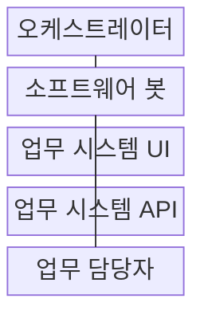

---
sidebar:
  order: 209
  label: "209. RPA 로보틱 프로세스 자동화 (Robotic Process Automation)"
  badge:
    text: "기출 · 50%"
    variant: note
title: "RPA 로보틱 프로세스 자동화 (Robotic Process Automation)"
date: "2026-08-02T12:00:00+09:00"
tags: ["notes-software"]
weight: 209
extra:
  question_no: "209"
  source_status: "기출"
  source_history: "131회"
  priority: 50
  priority_note: "업무 규칙 자동화와 봇 운영이 기존 출제됨"
---

## Ⅰ. 개요

핵심 용어

- **규칙 기반 화면 업무 자동화**: RPA는 사람이 화면에서 반복하는 정형 업무를 소프트웨어 봇이 정해진 규칙으로 모방·실행하는 자동화 방식이다.

- 정의/개념: 소프트웨어 봇의 **규칙 기반 화면 업무 자동화**
- 배경/필요성: 수작업 반복 입력은 **처리 지연·오류·인건비** 증가

### 쉽게 이해하기 (학습용)

- 사람이 매일 같은 화면을 열고 값을 옮기는 순서를 봇이 대신하되 예상 밖 상황은 사람에게 넘긴다

## Ⅱ. 특징

핵심 용어

- **오케스트레이터·작업 큐**: 오케스트레이터는 작업 큐를 기준으로 봇 배포, 일정, 자격증명, 로그와 실행 상태를 중앙 통제한다.

- 기존 **UI** 활용으로 시스템 변경 없이 신속 도입
- **오케스트레이터·작업 큐**로 봇 실행과 자격증명 중앙 통제
- **프로세스 마이닝**으로 반복·표준 업무 후보 발굴

### 쉽게 이해하기 (학습용)

- 기존 프로그램을 고치지 않고 자동화할 수 있지만 화면이 바뀌거나 판단이 필요하면 봇만으로 처리하지 않는다

## Ⅲ. 구조 및 구성요소

핵심 용어

- **소프트웨어 봇**: 소프트웨어 봇은 오케스트레이터가 준 작업과 권한에 따라 화면, 파일, API를 정해진 절차로 조작한다.

| 구성요소 | 책임 |
|:---|:---|
| 오케스트레이터 | **봇·일정·큐·권한·로그** 통제 |
| 소프트웨어 봇 | 규칙에 따라 **화면·파일·API** 조작 |
| 업무 시스템 UI | 기존 화면으로 **업무 입력·조회** |
| 업무 시스템 API | 안정된 계약으로 **기능·데이터 호출** |
| 업무 담당자 | **예외 판단·승인·규칙 보완** |

### 쉽게 이해하기 (학습용)

- 중앙 관리자가 봇에 일과 권한을 주고, 봇은 화면이나 호출 기능을 쓰며 막힌 건은 기록과 함께 담당자에게 보낸다

## Ⅳ. 흐름도

핵심 용어

- **4. 예외·증적 이관**: 봇은 규칙으로 처리할 수 없는 입력과 상태를 실행 증적과 함께 업무 담당자에게 넘긴다.

**동작 원리**

1. **작업·자격증명 전달**: 큐 작업과 **최소 권한** 할당
2. **업무 입력·조회**: UI·API로 **규칙 업무 실행**
3. **완료·증적 기록**: 결과·화면·로그를 **감사 이력화**
4. **예외·증적 이관**: 규칙 밖 입력을 **담당자에게 전달**

### 쉽게 이해하기 (학습용)

- 봇은 정해진 일을 실행해 결과를 남기고 모르는 화면이나 값이 나오면 멈춰 담당자의 결정을 기다린다

## Ⅴ. 종류 및 비교

핵심 용어

- **API 자동화**: API 자동화는 안정된 시스템 계약을 화면 조작 없이 직접 호출해 대규모 연계의 유지보수성과 신뢰성을 높인다.

| 업무 자동화 방식 | 참여형 봇 | 무인형 봇 | API 자동화 |
|:---|:---|:---|:---|
| 적용 기준 | 상담·승인 등 **사람 판단 포함** | 대량 정산 등 **고정 규칙** | 안정된 계약의 **대규모 연계** |
| 핵심 특징 | 사용자 단말의 **업무 보조** | 서버 큐·일정의 **무인 실행** | 화면 없이 **계약 직접 호출** |
| 한계 | 사용자 조작·**봇 실행 충돌** | 오류 확산·**권한 오용** | 개발 비용·**계약 변경 영향** |

> 요약: 사람 보조는 참여형, 대량 규칙은 무인형, 안정 연계는 API

### 쉽게 이해하기 (학습용)

- 사람 옆에서 도우면 참여형, 밤새 같은 일을 처리하면 무인형, 시스템이 공식 통로를 주면 API를 쓴다

## Ⅵ. 실무 고려사항 및 대책

핵심 용어

- **봇 실행 중단**: 봇 실행 중단은 화면 요소와 셀렉터가 변경돼 봇이 조작 대상을 찾지 못하면서 자동화 흐름이 멈추는 문제다.

| 문제 | 대책 | 효과 |
|:---|:---|:---|
| 화면 변경으로 **봇 실행 중단** | 셀렉터 추상화·**회귀 시험** | 유지보수성 **향상** |
| 봇 계정의 **과도한 권한** | Vault·최소 권한·**행위 감사** | 자격증명 위험 **축소** |
| 예외 건의 **무한 재시도** | 업무 예외함·**사람 인계** | 오류 확산 **방지** |
| 불안정 업무의 **자동화 고착** | 표준화·개선 후 **RPA 적용** | 변경 비용 **절감** |

### 쉽게 이해하기 (학습용)

- 상담원이 확인한 고객 정보를 봇이 여러 기존 시스템에 옮겨 중복 입력을 줄인다

## Ⅶ. 결론

핵심 용어

- **RPA**: 안정된 공식 계약이 있으면 API 자동화를 사용하고 규칙적인 화면 반복 업무에는 RPA를 적용한다.

- 안정된 계약은 **API 자동화**, 규칙적인 화면 반복은 **RPA** 적용

### 쉽게 이해하기 (학습용)

- 반복 화면 업무는 봇으로 줄이되 변경이 잦거나 API가 있으면 변경 영향이 작은 연계를 선택한다
