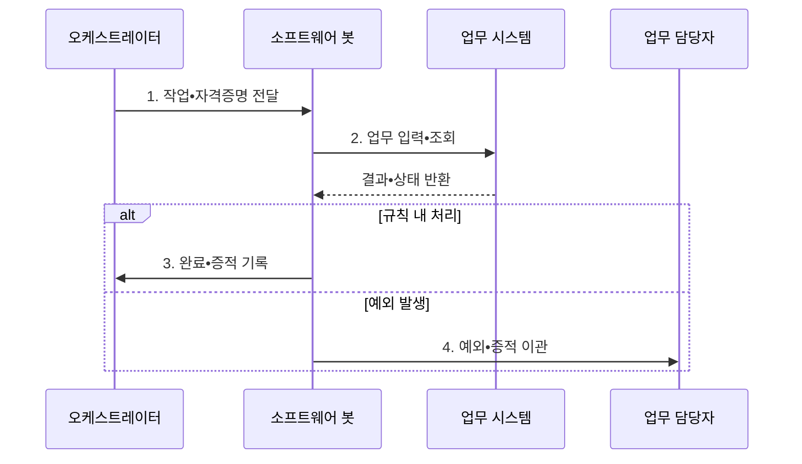

---
sidebar:
  order: 209
  label: "209. RPA 로보틱 프로세스 자동화 (Robotic Process Automation)"
  badge:
    text: "기출 • 50%"
    variant: note
title: "RPA 로보틱 프로세스 자동화 (Robotic Process Automation)"
date: "2026-08-05T07:00:00+09:00"
tags: ["notes-software"]
weight: 209
extra:
  question_no: "209"
  source_status: "기출"
  source_history: "131회"
  priority: 50
  priority_note: "업무 규칙 자동화와 봇 운영이 기존 출제됨"
---

## Ⅰ. 개요

<details>
<summary>핵심 용어</summary>

- **로보틱 프로세스 자동화(Robotic Process Automation, RPA)**: 사람이 화면에서 반복하는 정형 업무를 소프트웨어 봇이 정해진 규칙으로 모방•실행하는 자동화 방식이다.
- **소프트웨어 봇(Software Bot)**: 사용자 화면•파일•시스템 호출을 미리 정의한 순서로 수행하는 프로그램이다.

</details>

- 정의/개념: 소프트웨어 봇의 **규칙 기반 화면 업무 자동화**
- 배경/필요성: 수작업 반복 입력은 **처리 지연•오류•인건비** 증가

#### 한줄 요약

- 사람이 매일 같은 화면을 열고 값을 옮기는 순서를 봇이 대신하되 예상 밖 상황은 사람에게 넘긴다

## Ⅱ. 특징

<details>
<summary>핵심 용어</summary>

- **작업 큐(Work Queue)**: 봇이 처리할 업무와 상태를 순서대로 보관하는 대기열이다.
- **사용자 인터페이스(User Interface, UI)**: 사람이 업무 시스템을 입력•조회하도록 제공되는 화면 접점이다.
- **프로세스 마이닝(Process Mining)**: 시스템 이벤트 로그를 분석해 실제 업무 흐름과 반복•병목•자동화 후보를 찾는 기법이다.

</details>

- 기존 **UI** 활용으로 시스템 변경 없이 신속 도입
- **오케스트레이터•작업 큐** 로 봇 실행과 자격증명 중앙 통제
- **프로세스 마이닝** 으로 반복•표준 업무 후보 발굴

#### 한줄 요약

- 기존 프로그램을 고치지 않고 자동화할 수 있지만 화면이 바뀌거나 판단이 필요하면 봇만으로 처리하지 않는다

## Ⅲ. 구조 및 구성요소

<details>
<summary>핵심 용어</summary>

- **소프트웨어 봇 역할**: 할당된 작업과 권한에 따라 화면•파일•API 조작
- **오케스트레이터(Orchestrator)**: 봇 배포•일정•작업 큐•자격증명•실행 로그를 중앙 관리하는 구성요소이다.
- **응용 프로그래밍 인터페이스(Application Programming Interface, API)**: 화면 조작 없이 시스템 기능과 데이터를 호출하도록 정한 계약이다.
- **업무 담당자(Human Operator)**: 규칙 밖 예외를 판단•승인하고 자동화 규칙을 보완하는 사람이다.

</details>

```text
                       [오케스트레이터]
                              |
                       [소프트웨어 봇]
                       /      |       \
          [업무 시스템 UI] [업무 시스템 API] [업무 담당자]
```

선의 의미: 오케스트레이터가 소프트웨어 봇의 중앙 통제 경계를 이루고, 봇이 업무 시스템의 UI•API 및 예외 판단 담당자와 맞닿는 정적 운영 관계이다.

| 구성요소 | 책임 |
|:---|:---|
| 오케스트레이터 | **봇•일정•큐•권한•로그** 통제 |
| 소프트웨어 봇 | 규칙에 따라 **화면•파일•API** 조작 |
| 업무 시스템 UI | 기존 화면으로 **업무 입력•조회** |
| 업무 시스템 API | 안정된 계약으로 **기능•데이터 호출** |
| 업무 담당자 | **예외 판단•승인•규칙 보완** |


#### 한줄 요약

- 중앙 관리자가 봇에 일과 권한을 주고, 봇은 화면이나 호출 기능을 쓰며 막힌 건은 기록과 함께 담당자에게 보낸다

## Ⅳ. 흐름도

<details>
<summary>핵심 용어</summary>

- **4. 예외•증적 이관**: 봇은 규칙으로 처리할 수 없는 입력과 상태를 실행 증적과 함께 업무 담당자에게 넘긴다.
- **1. 작업•자격증명 전달**: 오케스트레이터가 큐의 작업과 최소 권한 자격증명을 봇에 할당하는 단계이다.
- **2. 업무 입력•조회**: 봇이 UI나 API로 정해진 업무 규칙을 실행하는 단계이다.
- **3. 완료•증적 기록**: 처리 결과•화면•로그를 감사 가능한 이력으로 남기는 단계이다.

</details>



**동작 원리**

1. **작업•자격증명 전달**: 큐 작업과 **최소 권한** 할당
2. **업무 입력•조회**: UI•API로 **규칙 업무 실행**
3. **완료•증적 기록**: 결과•화면•로그를 **감사 이력화**
4. **예외•증적 이관**: 규칙 밖 입력을 **담당자에게 전달**


#### 한줄 요약

- 봇은 정해진 일을 실행해 결과를 남기고 모르는 화면이나 값이 나오면 멈춰 담당자의 결정을 기다린다

## Ⅴ. 종류 및 비교

<details>
<summary>핵심 용어</summary>

- **API 자동화**: API 자동화는 안정된 시스템 계약을 화면 조작 없이 직접 호출해 대규모 연계의 유지보수성과 신뢰성을 높인다.
- **참여형 봇(Attended Bot)**: 사용자 단말에서 사람의 판단•승인과 함께 업무를 보조하는 봇이다.
- **무인형 봇(Unattended Bot)**: 서버의 일정이나 작업 큐에 따라 사람 개입 없이 고정 규칙 업무를 실행하는 봇이다.

</details>

| 업무 자동화 방식 | 참여형 봇 | 무인형 봇 | API 자동화 |
|:---|:---|:---|:---|
| 적용 기준 | 상담•승인 등 **사람 판단 포함** | 대량 정산 등 **고정 규칙** | 안정된 계약의 **대규모 연계** |
| 핵심 특징 | 사용자 단말의 **업무 보조** | 서버 큐•일정의 **무인 실행** | 화면 없이 **계약 직접 호출** |
| 한계 | 사용자 조작•**봇 실행 충돌** | 오류 확산•**권한 오용** | 개발 비용•**계약 변경 영향** |

> 요약: 사람 보조는 참여형, 대량 규칙은 무인형, 안정 연계는 API

#### 한줄 요약

- 사람 옆에서 도우면 참여형, 밤새 같은 일을 처리하면 무인형, 시스템이 공식 통로를 주면 API를 쓴다

## Ⅵ. 실무 고려사항 및 대책

<details>
<summary>핵심 용어</summary>

- **봇 실행 중단**: 봇 실행 중단은 화면 요소와 셀렉터가 변경돼 봇이 조작 대상을 찾지 못하면서 자동화 흐름이 멈추는 문제다.
- **셀렉터(Selector)**: 봇이 화면에서 입력창•버튼 등 조작 대상을 식별하는 속성이나 경로이다.
- **자격증명 금고(Credential Vault)**: 봇 계정의 비밀번호와 비밀 키를 암호화해 저장하고 실행 시 제한적으로 제공하는 보안 저장소이다.
- **업무 예외함(Business Exception Queue)**: 자동 처리할 수 없는 건을 원인•증적과 함께 보관해 담당자에게 인계하는 대기열이다.

</details>

| 문제 | 대책 | 효과 |
|:---|:---|:---|
| 화면 변경으로 **봇 실행 중단** | 셀렉터 추상화•**회귀 시험** | 유지보수성 **향상** |
| 봇 계정의 **과도한 권한** | Vault•최소 권한•**행위 감사** | 자격증명 위험 **축소** |
| 예외 건의 **무한 재시도** | 업무 예외함•**사람 인계** | 오류 확산 **방지** |
| 불안정 업무의 **자동화 고착** | 표준화•개선 후 **RPA 적용** | 변경 비용 **절감** |

#### 한줄 요약

- 상담원이 확인한 고객 정보를 봇이 여러 기존 시스템에 옮겨 중복 입력을 줄인다


## Ⅶ. 결론

<details>
<summary>핵심 용어</summary>

- **자동화 수단 선택**: 안정된 공식 계약이 있으면 API 자동화를 사용하고 규칙적인 화면 반복 업무에는 RPA를 적용해야 한다.

</details>

- 안정된 계약은 **API 자동화**, 규칙적인 화면 반복은 **RPA** 적용

#### 한줄 요약

- 반복 화면 업무는 봇으로 줄이되 변경이 잦거나 API가 있으면 변경 영향이 작은 연계를 선택한다
