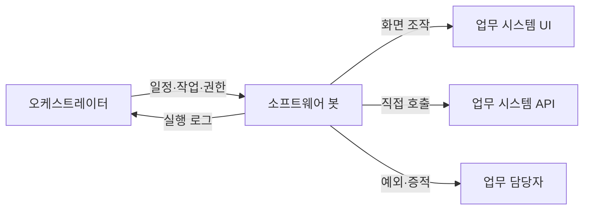
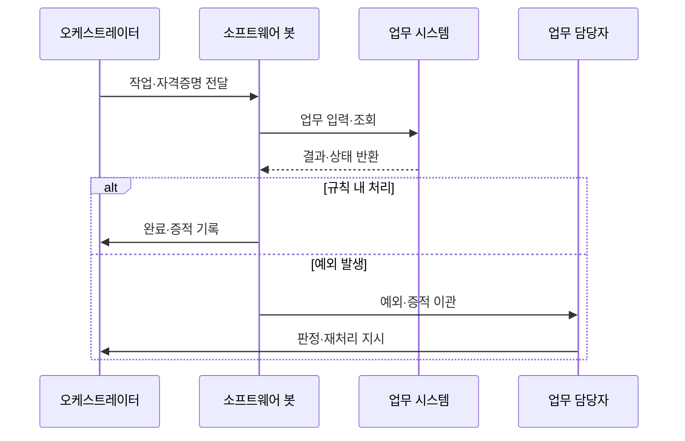

---
sidebar:
  order: 209
  label: "209. RPA 로보틱 프로세스 자동화 (Robotic Process Automation)"
  badge:
    text: "기출 · 50%"
    variant: note
title: "RPA 로보틱 프로세스 자동화 (Robotic Process Automation)"
date: "2026-07-27T23:59:59+09:00"
tags: ["notes-software"]
weight: 209
extra:
  question_no: "209"
  source_status: "기출"
  source_history: "131회"
  priority: 50
  priority_note: "업무 규칙 자동화와 봇 운영이 기존 출제됨"
---

## 미리 알고가기

- **로보틱 프로세스 자동화(Robotic Process Automation, RPA·알피에이)**: 영문 각 단어의 머리글자를 딴 표기이며, 사람이 화면에서 반복하는 규칙 업무를 소프트웨어 봇으로 모방·자동 실행하는 방식
- **소프트웨어 봇(Software Bot)**: 화면 요소·파일·응용 프로그램을 정해진 절차로 조작하는 실행 단위
- **사용자 인터페이스(User Interface, UI·유아이)**: 영문 각 단어의 머리글자를 딴 표기이며, 사용자가 시스템과 상호작용하는 화면·입력 요소
- **오케스트레이터(Orchestrator)**: 봇 배포·일정·작업 큐·자격증명·로그를 중앙 관리하는 제어 계층
- **참여형 봇(Attended Bot)**: 사용자 단말에서 사람의 시작·판단을 받아 업무 일부를 보조하는 봇
- **무인형 봇(Unattended Bot)**: 서버에서 일정·작업 큐에 따라 사람 개입 없이 실행하는 봇
- **응용 프로그래밍 인터페이스(Application Programming Interface, API·에이피아이)**: 영문 각 단어의 머리글자를 딴 표기이며, 시스템 기능·데이터를 화면 조작 없이 호출하는 계약
- **프로세스 마이닝(Process Mining)**: 시스템 이벤트 로그로 실제 업무 흐름·병목·변형을 찾는 분석
- **예외 이관(Exception Handoff)**: 봇이 처리할 수 없는 입력·상태를 증적과 함께 사람에게 넘기는 동작

## Ⅰ. 개요

- **정의/개념**: 소프트웨어 봇의 **규칙 기반 화면 업무 자동화**
- **기존 한계**: 수작업 반복 입력은 **처리 지연·오류·인건비** 증가

### 쉽게 이해하기 (학습용)

- 사람이 매일 같은 화면을 열고 값을 옮기는 순서를 봇이 대신하되 예상 밖 상황은 사람에게 넘긴다

## Ⅱ. 특징

- 기존 UI 활용으로 **시스템 변경 없이 신속 도입**
- **오케스트레이터·큐·자격증명**으로 봇 중앙 통제
- UI 변경·규칙 밖 입력은 **실패·예외 이관** 유발

### 쉽게 이해하기 (학습용)

- 기존 프로그램을 고치지 않고 자동화할 수 있지만 화면이 바뀌거나 판단이 필요하면 봇만으로 처리하지 않는다

## Ⅲ. 아키텍처 및 구성요소

| 설계 요소 | 설명 |
|:---|:---|
| 오케스트레이터 | **봇·일정·큐·권한·로그** 통제 |
| 소프트웨어 봇 | 규칙에 따라 **화면·파일·API** 조작 |
| 업무 시스템 UI | 기존 화면으로 **업무 입력·조회** |
| 업무 시스템 API | 안정된 계약으로 **기능·데이터 호출** |
| 업무 담당자 | **예외 판단·승인·규칙 보완** |

> 요약: 오케스트레이터가 봇을 통제하고 예외는 사람에게 이관

### 쉽게 이해하기 (학습용)

- 중앙 관리자가 봇에 일과 권한을 주고, 봇은 화면이나 호출 기능을 쓰며 막힌 건은 기록과 함께 담당자에게 보낸다

## Ⅳ. 원리 및 절차 흐름도

| 절차 | 설명 |
|:---|:---|
| 작업·자격증명 전달 | 큐 작업과 **최소 권한** 할당 |
| 업무 입력·조회 | UI·API로 **규칙 업무 실행** |
| 결과·상태 반환 | **성공·오류·업무 상태** 수신 |
| 완료·증적 기록 | 결과·화면·로그를 **감사 이력화** |
| 예외·증적 이관 | 규칙 밖 입력을 **담당자에게 전달** |
| 판정·재처리 지시 | 사람이 **수정·재실행·종료** 결정 |

> 요약: 규칙 업무는 봇이 완료하고 예외는 증적과 함께 이관

### 쉽게 이해하기 (학습용)

- 봇은 정해진 일을 실행해 결과를 남기고 모르는 화면이나 값이 나오면 멈춰 담당자의 결정을 기다린다

## Ⅴ. 종류 및 비교

| 업무 자동화 방식 | 참여형 봇 | 무인형 봇 | API 자동화 |
|:---|:---|:---|:---|
| 적용 기준 | 상담·승인 등 **사람 판단 포함** | 대량 정산 등 **고정 규칙** | 안정된 계약의 **대규모 연계** |
| 핵심 특징 | 사용자 단말의 **업무 보조** | 서버 큐·일정의 **무인 실행** | 화면 없이 **계약 직접 호출** |
| 한계 | 사용자 조작·**봇 실행 충돌** | 오류 확산·**권한 오용** | 개발 비용·**계약 변경 영향** |

> 요약: 사람 보조는 참여형, 대량 규칙은 무인형, 안정 연계는 API

### 쉽게 이해하기 (학습용)

- 사람 옆에서 도우면 참여형, 밤새 같은 일을 처리하면 무인형, 시스템이 공식 통로를 주면 API를 쓴다

## Ⅵ. 실무 사례

1. 보험 접수는 **참여형 봇**으로 다중 화면 입력
2. 일일 정산은 **무인형 봇·예외 이관**으로 처리

### 쉽게 이해하기 (학습용)

- 상담원이 확인한 고객 정보를 봇이 여러 기존 시스템에 옮겨 중복 입력을 줄인다
- 정산 봇은 정상 건을 계속 처리하고 금액·계정 규칙을 벗어난 건만 증적과 함께 사람에게 보낸다

## Ⅶ. 결론

- 안정 화면은 **RPA**, 공식 계약은 **API 연계**

### 쉽게 이해하기 (학습용)

- 반복 화면 업무는 봇으로 줄이되 변경이 잦거나 API가 있으면 변경 영향이 작은 연계를 선택한다
