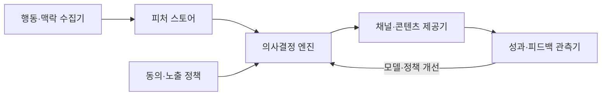
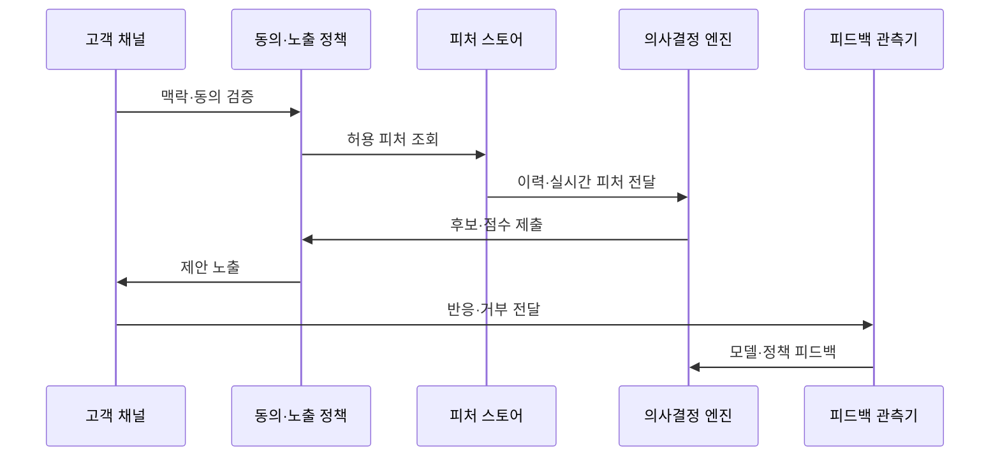

---
sidebar:
  order: 210
  label: "210. 초개인화 서비스 (Hyper-Personalization Service)"
  badge:
    text: "기출 · 50%"
    variant: note
title: "초개인화 서비스 (Hyper-Personalization Service)"
date: "2026-07-27T23:59:59+09:00"
tags: ["notes-software"]
weight: 210
extra:
  question_no: "210"
  source_status: "기출"
  source_history: "138회"
  priority: 50
  priority_note: "실시간 맥락 기반 추천이 최근 직접 출제됨"
---

## 미리 알고가기

- **초개인화(Hyper-personalization)**: 개인의 이력과 현재 맥락을 실시간 결합해 다음 제안·경험을 선택하는 방식
- **맥락(Context)**: 시간·위치·기기·현재 행동처럼 같은 사람에게도 순간별 선택을 바꾸는 정보
- **동의(Consent)**: 사용자가 정해진 목적과 범위의 개인정보 수집·활용을 허용한 상태
- **피처 스토어(Feature Store)**: 학습·실시간 추론에 같은 피처 정의와 최신 값을 제공하는 저장·관리 계층
- **의사결정 엔진(Decision Engine)**: 후보·규칙·예측 점수·제약을 결합해 노출할 제안을 선택하는 구성요소
- **피드백 루프(Feedback Loop)**: 노출·클릭·구매·거부 결과를 다음 모델·정책 개선에 반영하는 순환
- **필터 버블(Filter Bubble)**: 비슷한 정보만 반복 노출돼 사용자의 선택 다양성이 줄어드는 현상
- **빈도 제한(Frequency Capping)**: 같은 제안의 노출 횟수·간격을 제한해 피로도를 줄이는 정책

## Ⅰ. 개요

- 정의/개념: 개인 이력·**실시간 맥락으로 제안 선택**
- 기존 한계: 이력 중심 추천은 **현재 의도·상황 반영 부족**

### 쉽게 이해하기 (학습용)

- 같은 사람에게도 지금 위치와 시간·행동이 다르면 필요한 제안이 달라지므로 순간 정보를 함께 본다

## Ⅱ. 특징

- **개인 이력·실시간 맥락**으로 순간별 제안 선택
- **동의·목적·보존·최소 수집**으로 정보 활용 통제
- **빈도·다양성·장기 피드백**으로 피로·필터 버블 완화

### 쉽게 이해하기 (학습용)

- 당장 누른 항목만 반복하지 말고 사용 허락과 다양성·피로도를 함께 지켜야 오래 유용한 제안이 된다

## Ⅲ. 아키텍처 및 구성요소

| 설계 요소 | 설명 |
|:---|:---|
| 행동·맥락 수집기 | 동의 범위의 **행동·시간·위치** 수집 |
| 피처 스토어 | **이력·실시간 피처**를 동일 정의로 제공 |
| 동의·노출 정책 | **목적·보존·빈도·다양성** 제약 |
| 의사결정 엔진 | 후보 점수·정책으로 **제안 선택** |
| 채널·콘텐츠 제공기 | 제안을 **앱·웹·메시지**에 노출 |
| 성과·피드백 관측기 | **노출·반응·거부·장기 효과** 기록 |

> 요약: 동의한 맥락으로 제안하고 피드백으로 정책 개선

### 쉽게 이해하기 (학습용)

- 허락받은 현재 정보로 후보를 선택하고 노출 빈도·유사도 정책을 거친 뒤 반응을 기록한다

## Ⅳ. 원리 및 절차 흐름도

| 절차 | 설명 |
|:---|:---|
| 맥락·동의 검증 | **수집·활용 허용 범위** 확인 |
| 허용 피처 조회 | 목적에 필요한 **최소 피처** 요청 |
| 이력·실시간 피처 전달 | 동일 시점·정의의 **개인 피처** 제공 |
| 후보·점수 제출 | **예측 점수·선택 근거** 전달 |
| 제안 노출 | **빈도·다양성 제약** 통과 후보 제공 |
| 반응·거부 전달 | **노출·클릭·구매·거부** 기록 |
| 모델·정책 피드백 | 장기 효과로 **모델·제약 개선** |

> 요약: 동의 검증 후 맥락 제안하고 장기 반응을 환류

### 쉽게 이해하기 (학습용)

- 정보 사용 허락을 확인하고 현재 상황의 후보를 선택한 뒤 반응과 거부를 다음 제안에 반영한다

## Ⅴ. 종류 및 비교

| 개인화 수준 | 초개인화 | 개인 추천 | 세그먼트 제안 |
|:---|:---|:---|:---|
| 적용 기준 | 실시간 맥락·**채널 연계** | 반복 이용·**개인 이력 충분** | 데이터 부족·**단순 캠페인** |
| 핵심 특징 | **개인 이력·현재 맥락** 결합 | **개인 과거 이력** 중심 | **집단 속성별 동일 제안** |
| 한계 | 개인정보·**피로·필터 버블** | 과거 취향 **고착** | 집단 내 **개인 차이 무시** |

> 요약: 집단은 세그먼트, 이력은 개인, 순간 맥락은 초개인화

### 쉽게 이해하기 (학습용)

- 비슷한 사람을 묶으면 세그먼트, 한 사람의 과거를 보면 개인 추천, 지금 상황까지 보면 초개인화다

## Ⅵ. 실무 사례

1. 금융 앱은 **동의 맥락·빈도 제한**으로 혜택 노출

### 쉽게 이해하기 (학습용)

- 금융 앱은 사용 목적에 동의한 정보만 쓰고 같은 혜택을 너무 자주 보여 주지 않는다

## Ⅶ. 결론

- 개인의 현재 맥락에 맞는 서비스를 제공하면서 과도한 추적을 막기 위해 **동의 목적·실시간 맥락·추천 효과·빈도·차별 위험**을 검토하고, 통제 가능한 범위에서 초개인화를 적용한다

### 쉽게 이해하기 (학습용)

- 더 많은 정보를 쓰는 것보다 허락받은 최소 정보로 현재에 맞고 반복되지 않는 제안을 만드는 것이 중요하다
