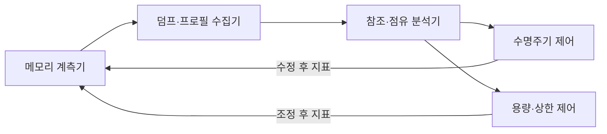
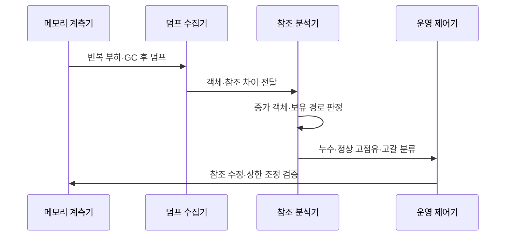

---
sidebar:
  order: 211
  label: "211. 메모리 누수·힙 고갈 (Memory Leak Heap Exhaustion)"
  badge:
    text: "기출 · 30%"
    variant: note
title: "메모리 누수·힙 고갈 (Memory Leak Heap Exhaustion)"
date: "2026-07-27T23:59:59+09:00"
tags: ["notes-software"]
weight: 211
extra:
  question_no: "211"
  source_status: "기출"
  source_history: "123회"
  priority: 30
  priority_note: "누수·힙 고갈의 원인과 진단이 기존 출제됨"
---

## 미리 알고가기

- **메모리 누수(Memory Leak)**: 더는 필요하지 않은 객체·자원이 참조에 남아 회수되지 않고 점유량이 누적되는 결함
- **힙 고갈(Heap Exhaustion)**: 필요한 새 객체를 할당할 연속·가용 힙이 부족해 할당이 실패하는 상태
- **메모리 부족(Out of Memory, OOM·오오엠)**: 영문 각 단어의 머리글자를 딴 표기이며, 힙·네이티브 영역 등에서 새 메모리 할당을 만족하지 못한 오류
- **가비지 컬렉션(Garbage Collection, GC·지씨)**: 영문 각 단어의 머리글자를 딴 표기이며, 실행 중 도달할 수 없는 객체를 찾아 힙 공간을 자동 회수하는 동작
- **힙 덤프(Heap Dump)**: 특정 시점의 객체·크기·참조 관계를 저장해 점유 원인을 분석하는 자료
- **보유 크기(Retained Size)**: 한 객체의 참조를 제거할 때 함께 회수될 수 있는 객체들의 총메모리
- **도미네이터(Dominator)**: 특정 객체에 가는 모든 참조 경로가 반드시 거치는 객체
- **네이티브 누수(Native Leak)**: 힙 밖의 버퍼·파일·라이브러리 자원을 해제하지 않아 메모리가 누적되는 결함

## Ⅰ. 개요

- 정의/개념: 누수는 **불필요 참조 누적**, 고갈은 **할당 실패**
- 기존 한계: OOM만으로는 **누수·정상 고점유·용량 부족 혼동**

### 쉽게 이해하기 (학습용)

- 쓰지 않는 물건을 계속 붙잡으면 창고가 차고, 결국 새 물건을 둘 수 없어 프로그램이 실패한다

## Ⅱ. 특징

- 누수는 **GC 후 기준 점유량·보유 크기** 지속 상승
- 고갈은 **누수·큰 작업 집합·과도한 동시 할당**으로 발생
- **힙 덤프·도미네이터 경로**로 잔존 참조 원인 추적

### 쉽게 이해하기 (학습용)

- 사용량이 줄었는데도 창고 바닥선이 계속 높아지면 누수를 의심하고, 한 번 큰 작업만 넘쳤다면 용량·상한도 함께 본다

## Ⅲ. 아키텍처 및 구성요소

| 설계 요소 | 설명 |
|:---|:---|
| 메모리 계측기 | **힙·네이티브·GC·할당 추이** 수집 |
| 덤프·프로필 수집기 | 시점별 **객체·참조·할당** 기록 |
| 참조·점유 분석기 | **보유 크기·도미네이터** 판정 |
| 수명주기 제어 | 리스너·스레드 로컬 **참조 해제** |
| 용량·상한 제어 | **캐시·큐·동시 작업·힙** 제한 |

> 요약: 추이와 참조 경로로 누수·용량 부족을 구분

### 쉽게 이해하기 (학습용)

- 메모리 증가 그래프와 객체 연결 지도를 함께 봐 누가 물건을 붙잡는지, 단순히 창고가 작은지를 나눈다

## Ⅳ. 원리 및 절차 흐름도

| 절차 | 설명 |
|:---|:---|
| 반복 부하·GC 후 덤프 | 부하 전후 **기준 점유량** 기록 |
| 객체·참조 차이 전달 | 시점별 **객체 수·보유 크기** 비교 |
| 증가 객체·보유 경로 판정 | 도미네이터의 **잔존 참조 추적** |
| 누수·정상 고점유·고갈 분류 | **회복 여부·원인 영역**으로 구분 |
| 참조 수정·상한 조정 검증 | 장기 부하의 **기준선·GC·OOM** 확인 |

> 요약: GC 후 기준선·참조 경로로 누수 원인을 검증

### 쉽게 이해하기 (학습용)

- 같은 일을 반복하고 청소한 뒤에도 남는 물건이 늘면 연결 지도를 따라 붙잡은 주인을 찾아 고친다

## Ⅴ. 종류 및 비교

| 메모리 상태 | 메모리 누수 | 정상 고점유 | 힙 고갈 |
|:---|:---|:---|:---|
| 적용 기준 | GC 후 **객체·보유 크기 증가** | 부하 종료 후 **점유량 회복** | 가용 힙 부족·**할당 실패** |
| 핵심 특징 | 불필요 참조의 **기준선 상승** | 작업 중 **일시적 점유 상승** | 새 객체의 **할당 불가 상태** |
| 한계 | 장기 지연·**반복 OOM** | 상한 오판·**불필요 수정** | 강제 종료·**GC 정지 증가** |

> 요약: GC 후 회복은 정상, 누적은 누수, 할당 실패는 고갈

### 쉽게 이해하기 (학습용)

- 일이 끝나 비워지면 정상이고 바닥선이 계속 오르면 누수이며 새 물건을 못 놓는 순간은 고갈이다

## Ⅵ. 실무 사례

1. 이벤트 리스너는 **도미네이터 경로**로 참조 해제
2. 이미지 큐는 **동시 작업 상한**으로 힙 고갈 방지

### 쉽게 이해하기 (학습용)

- 화면이 닫혀도 남은 이벤트 연결이 객체를 붙잡는다면 해제 시점에 그 연결을 끊는다
- 큰 이미지를 동시에 너무 많이 처리해 넘치면 큐와 작업자 수를 제한해 한꺼번에 필요한 공간을 줄인다

## Ⅶ. 결론

- 기준선 상승은 **누수**, 할당 실패는 **고갈**

### 쉽게 이해하기 (학습용)

- 힙부터 늘리지 말고 청소 뒤에도 남는 참조가 누적인지, 정상 작업량이 용량을 넘는지 먼저 구분한다
