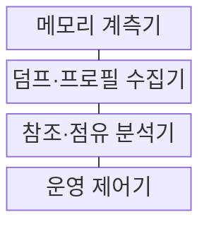
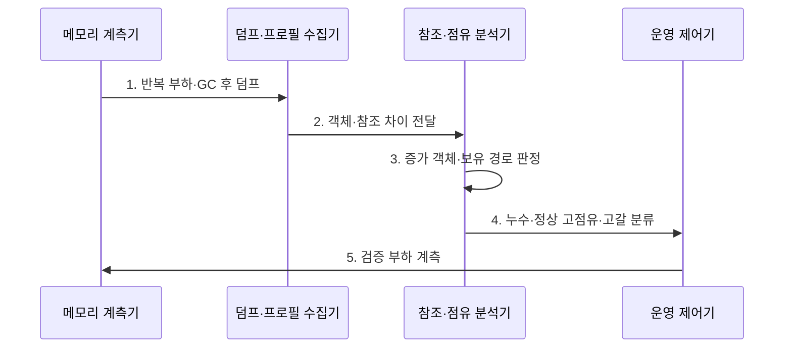

---
sidebar:
  order: 211
  label: "211. 메모리 누수·힙 고갈 (Memory Leak Heap Exhaustion)"
  badge:
    text: "기출 · 30%"
    variant: note
title: "메모리 누수·힙 고갈 (Memory Leak Heap Exhaustion)"
date: "2026-08-02T12:00:00+09:00"
tags: ["notes-software"]
weight: 211
extra:
  question_no: "211"
  source_status: "기출"
  source_history: "123회"
  priority: 30
  priority_note: "누수·힙 고갈의 원인과 진단이 기존 출제됨"
---

## Ⅰ. 개요

핵심 용어

- **불필요 참조 누적**: 메모리 누수는 더 이상 필요하지 않은 객체가 참조에 남아 회수되지 않고 점유량이 누적되는 결함이다.

- 정의/개념: **메모리 누수와 힙 고갈**은 각각 더 이상 필요 없는 객체의 참조가 남아 회수되지 않는 현상과 가용 힙이 부족해 새 할당이 실패하는 상태다
- 배경/필요성: OOM만으로는 **누수·정상 고점유·용량 부족 혼동**

### 쉽게 이해하기 (학습용)

- 쓰지 않는 물건을 계속 붙잡으면 창고가 차고, 결국 새 물건을 둘 수 없어 프로그램이 실패한다

## Ⅱ. 특징

핵심 용어

- **힙 덤프·도미네이터 경로**: 힙 덤프는 객체와 참조 관계를 기록하고 도미네이터 경로는 증가 객체를 붙잡는 핵심 참조 원인을 찾게 한다.

- 누수는 **GC 후 기준 점유량·보유 크기** 지속 상승
- 고갈은 **누수·큰 작업 집합·과도한 동시 할당**으로 발생
- **힙 덤프·도미네이터 경로**로 잔존 참조 원인 추적
- **리스너·ThreadLocal** 해제 누락에 따른 힙 참조 잔존
- **네이티브 자원** 해제 누락에 따른 힙 외부 누수

### 쉽게 이해하기 (학습용)

- 사용량이 줄었는데도 창고 바닥선이 계속 높아지면 누수를 의심하고, 한 번 큰 작업만 넘쳤다면 용량·상한도 함께 본다

## Ⅲ. 구조 및 구성요소

핵심 용어

- **참조·점유 분석기**: 참조·점유 분석기는 시점별 객체 수, 보유 크기, 도미네이터를 비교해 누수 후보를 판정한다.

| 구성요소 | 책임 |
|:---|:---|
| 메모리 계측기 | **힙·네이티브·GC·할당 추이** 수집 |
| 덤프·프로필 수집기 | 시점별 **객체·참조·할당** 기록 |
| 참조·점유 분석기 | **보유 크기·도미네이터** 판정 |
| 운영 제어기 | 참조 수명과 **캐시·큐·힙 상한** 조정 |

### 쉽게 이해하기 (학습용)

- 메모리 증가 그래프와 객체 연결 지도를 함께 봐 누가 물건을 붙잡는지, 단순히 창고가 작은지를 나눈다

## Ⅳ. 흐름도

핵심 용어

- **4. 누수·정상 고점유·고갈 분류**: 부하 종료와 GC 뒤 점유량의 회복 여부, 증가 영역, 할당 실패를 기준으로 세 상태를 구분한다.

**동작 원리**

1. **반복 부하·GC 후 덤프**: 부하 전후 **기준 점유량** 기록
2. **객체·참조 차이 전달**: 시점별 **객체 수·보유 크기** 비교
3. **증가 객체·보유 경로 판정**: 도미네이터의 **잔존 참조 추적**
4. **누수·정상 고점유·고갈 분류**: **회복 여부·원인 영역**으로 구분
5. **검증 부하 계측**: 수정 후 **기준선·GC·OOM** 재확인

### 쉽게 이해하기 (학습용)

- 같은 일을 반복하고 청소한 뒤에도 남는 물건이 늘면 연결 지도를 따라 붙잡은 주인을 찾아 고친다

## Ⅴ. 종류 및 비교

핵심 용어

- **메모리 누수**: 메모리 누수는 GC 뒤에도 불필요한 객체와 보유 크기가 계속 증가해 기준선이 상승하는 상태다.

| 메모리 상태 | 메모리 누수 | 정상 고점유 | 힙 고갈 |
|:---|:---|:---|:---|
| 적용 기준 | GC 후 **객체·보유 크기 증가** | 부하 종료 후 **점유량 회복** | 가용 힙 부족·**할당 실패** |
| 핵심 특징 | 불필요 참조의 **기준선 상승** | 작업 중 **일시적 점유 상승** | 새 객체의 **할당 불가 상태** |
| 한계 | 장기 지연·**반복 OOM** | 상한 오판·**불필요 수정** | 강제 종료·**GC 정지 증가** |

> 요약: GC 후 회복은 정상, 누적은 누수, 할당 실패는 고갈

### 쉽게 이해하기 (학습용)

- 일이 끝나 비워지면 정상이고 바닥선이 계속 오르면 누수이며 새 물건을 못 놓는 순간은 고갈이다

## Ⅵ. 실무 고려사항 및 대책

핵심 용어

- **누수 오판**: 누수 오판은 높은 할당률과 일시적 GC 증가를 잔존 객체의 지속 증가로 잘못 해석하는 문제다.

| 문제 | 대책 | 효과 |
|:---|:---|:---|
| GC 증가의 **누수 오판** | 할당률·잔존 객체 **동시 분석** | 원인 진단 **정확성** |
| Heap Dump의 **민감정보 노출** | 암호화·마스킹·**접근 통제** | 자료 유출 **방지** |
| 재시작의 **원인 은폐** | 덤프·지표 확보 후 **제한 재시작** | 근본 원인 **추적성** |
| 고갈 직전의 **늦은 경보** | 추세·증가율·**예측 임계치** | 장애 사전 **완화** |

### 쉽게 이해하기 (학습용)

- 화면이 닫혀도 남은 이벤트 연결이 객체를 붙잡는다면 해제 시점에 그 연결을 끊는다

## Ⅶ. 결론

핵심 용어

- **참조 해제**: GC 후 기준선이 지속 상승하면 불필요한 참조 해제를 우선하고 일시 고점유는 작업량과 용량 상한을 조정한다.

- GC 후 기준선 상승은 **참조 해제**, 일시 고점유는 **용량 상한** 조정

### 쉽게 이해하기 (학습용)

- 힙부터 늘리지 말고 청소 뒤에도 남는 참조가 누적인지, 정상 작업량이 용량을 넘는지 먼저 구분한다
