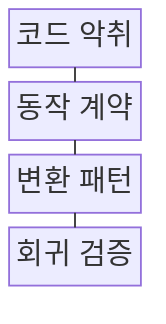
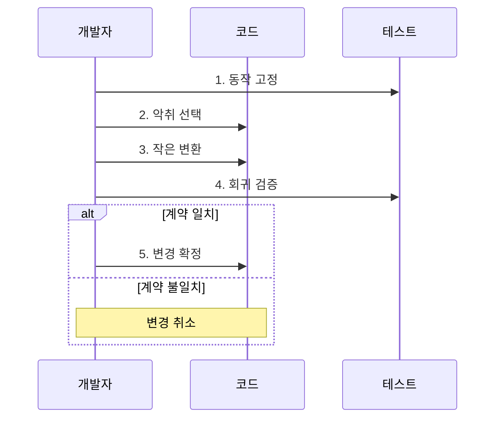

---
sidebar:
  order: 212
  label: "212. 소프트웨어 리팩터링 패턴 (Refactoring Patterns)"
  badge:
    text: "기출 • 50%"
    variant: note
title: "소프트웨어 리팩터링 패턴 (Refactoring Patterns)"
date: "2026-08-04T14:52:00+09:00"
tags: ["notes-software"]
weight: 212
extra:
  question_no: "212"
  source_status: "기출"
  source_history: "129회"
  priority: 50
  priority_note: "코드 악취 제거와 구조 개선이 반복 출제됨"
---

## Ⅰ. 개요

핵심 용어

- **소프트웨어 리팩터링(Software Refactoring)**: 외부에서 관찰되는 동작을 보존하면서 반복 가능한 작은 변환으로 내부 코드 구조를 개선하는 개발 기법이다.
- **코드 악취(Code Smell)**: 즉각적인 오류는 아니지만 높은 변경 비용과 결함 위험을 암시하는 코드 구조의 징후이다.

- 정의/개념: **소프트웨어 리팩토링 패턴** 은 외부에서 관찰되는 동작을 보존하면서 반복 가능한 변환으로 내부 코드 구조와 변경 용이성을 개선하는 개발 기법
- 배경/필요성: 코드 악취 누적은 **변경 비용•회귀 위험** 증가

#### 한줄 요약

- 사용법은 그대로 두고 복잡한 내부 코드를 작은 단계로 정리해 다음 변경을 쉽게 만드는 작업이다.

## Ⅱ. 특징

핵심 용어

- **외부 동작 계약 보존**: 리팩터링은 입력•출력•오류 같은 외부 동작 계약 보존을 전제로 작은 내부 변환을 반복한다.
- **메서드 추출(Extract Method)**: 긴 함수의 일부를 의도가 드러나는 별도 메서드로 분리하는 패턴이다.
- **함수 이동(Move Function)**: 함수가 주로 사용하는 데이터와 책임을 가진 모듈이나 클래스로 옮기는 패턴이다.
- **조건문 다형성 치환(Replace Conditional with Polymorphism)**: 유형별 반복 분기를 각 유형의 구현으로 분산하는 패턴이다.

- **외부 동작 계약 보존** 을 전제로 내부 구조 변경
- **작은 변환•즉시 회귀 검사** 로 실패 범위 축소
- **코드 악취별 변환 패턴** 으로 변경 비용 감소
- 긴 함수는 **메서드 추출**, 책임 불일치는 **함수 이동** 적용
- 유형별 반복 분기는 **조건문 다형성 치환** 적용

#### 한줄 요약

- 한꺼번에 뜯어고치지 않고 작은 구조 변경마다 기존 기능을 확인하므로 문제가 생긴 지점을 빨리 찾을 수 있다.

## Ⅲ. 구조 및 구성요소

핵심 용어

- **동작 계약**: 동작 계약은 리팩터링 전후에 같아야 하는 입력별 출력, 오류, 처리 순서 등의 관찰 조건이다.
- **변환 패턴(Refactoring Pattern)**: 특정 코드 악취를 제거하도록 절차와 안전 조건이 정리된 작은 구조 변경 방법이다.
- **회귀 검증(Regression Verification)**: 변경 후 기존 동작 계약이 그대로 유지되는지 테스트로 확인하는 활동이다.

| 구성요소 | 책임 |
|:---|:---|
| 코드 악취 | 구조 개선이 필요한 **변경 비용 징후** |
| 동작 계약 | 전후 동일해야 할 **외부 관찰 조건** |
| 변환 패턴 | 악취 원인별 **작은 구조 변경** |
| 회귀 검증 | 계약 비교로 **동작 보존 판정** |

#### 한줄 요약

- 고칠 징후를 찾고 유지할 사용법을 정한 뒤 알맞은 변환과 테스트를 연결해 구조만 바꾼다.

## Ⅳ. 흐름도

핵심 용어

- **4. 회귀 검증**: 각 작은 변환 뒤 특성화•회귀 테스트로 변경 전후의 동작 계약이 같은지 확인한다.
- **1. 동작 고정**: 특성화 테스트로 현재 입력•출력•오류 등 숨은 계약을 기록하는 단계이다.
- **2. 악취 선택**: 변경 비용을 크게 만드는 구조적 원인을 하나 선정하는 단계이다.
- **3. 작은 변환**: 원인에 맞는 리팩터링 패턴 하나만 적용하는 단계이다.
- **5. 변경 확정**: 계약이 일치할 때 변경을 저장하고 불일치하면 취소하는 단계이다.

**동작 원리**

1. **동작 고정**: 특성화 테스트로 **현재 계약 기록**
2. **악취 선택**: 변경 비용의 **구조적 원인** 선정
3. **작은 변환**: 원인에 맞는 **패턴 하나 적용**
4. **회귀 검증**: 전후 **동작 계약 비교**
5. **변경 확정**: 계약 일치 시 **변경 저장**

#### 한줄 요약

- 기존 동작을 먼저 기록하고 한 번에 하나만 고친 뒤 같으면 남기고 다르면 즉시 되돌린다.

## Ⅴ. 종류 및 비교

핵심 용어

- **리팩터링 적용**: 외부 동작을 보존하면서 내부 구조와 변경 비용 개선
- **기능 변경(Feature Change)**: 새로운 요구에 맞춰 외부에서 관찰되는 동작을 추가하거나 수정하는 변경이다.
- **재작성(Rewrite)**: 기존 구현을 점진적으로 개선하는 대신 새로운 구현으로 전체 대체하는 방식이다.

| 코드 변경 방식 | 리팩터링 | 기능 변경 | 재작성 |
|:---|:---|:---|:---|
| 적용 기준 | 동작 유지•**변경 비용 감소** | 새 요구의 **외부 동작 변경** | 점진 개선이 **비경제적** |
| 핵심 특징 | **동작 보존•내부 구조 개선** | **기능 추가•행위 변경** | **기존 구현 전체 대체** |
| 한계 | 숨은 계약의 **회귀 위험** | 호환성 훼손•**범위 증가** | 기능 누락•**전환 실패** |

> 요약: 동작 보존은 **리팩터링**, 전체 교체는 **재작성** 선택

#### 한줄 요약

- 사용법을 유지하며 정리하면 리팩터링, 사용법을 바꾸면 기능 변경, 기존 구현을 버리고 새로 만들면 재작성이다.

## Ⅵ. 실무 고려사항 및 대책

핵심 용어

- **구조 변경**: 테스트 없이 구조 변경을 수행하면 숨은 동작 계약이 깨져 이전 기능의 회귀를 발견하지 못할 수 있다.
- **특성화 테스트(Characterization Test)**: 문서화되지 않은 기존 코드의 현재 동작을 실행 결과로 고정하는 테스트이다.
- **추상화에 의한 분기(Branch by Abstraction)**: 기존 구현과 새 구현을 공통 추상화 뒤에 두고 단계적으로 전환하는 기법이다.
- **프로파일링(Profiling)**: 실행 시간•호출 빈도•자원 사용을 측정해 성능 병목과 회귀를 찾는 분석이다.

| 문제 | 대책 | 효과 |
|:---|:---|:---|
| 회귀 시험 없는 **구조 변경** | 특성화 테스트•**작은 단위 적용** | 행위 보존 **확인** |
| 대규모 일괄 **리팩터링** | 추상화에 의한 분기 **적용** | 변경 위험 **분산** |
| 성능 경로의 **회귀 발생** | 전후 벤치마크•**프로파일 비교** | 성능 저하 **탐지** |
| 경계 없는 **패턴 남용** | 변경 이유•**품질 목표 명시** | 불필요한 복잡성 **방지** |

#### 한줄 요약

- 한 함수에 섞인 주문 계산 단계를 이름 있는 작은 메서드로 나누면 계산 순서를 읽고 고치기 쉬워진다.

## Ⅶ. 결론

핵심 용어

- **코드 악취**: 동작 계약을 테스트로 고정한 뒤 변경 비용을 크게 만드는 고빈도 코드 악취부터 작은 패턴으로 제거해야 한다.
- **점진적 리팩터링(Incremental Refactoring)**: 작은 변환마다 검증하고 확정해 실패 범위와 회귀 원인을 제한하는 접근이다.

- **동작 계약을 먼저 고정**하고 고빈도 코드 악취부터 **작은 변환 적용**

#### 한줄 요약

- 유지할 동작을 테스트로 잠근 뒤 가장 큰 변경 비용을 만드는 악취부터 작은 패턴으로 제거해야 한다.
