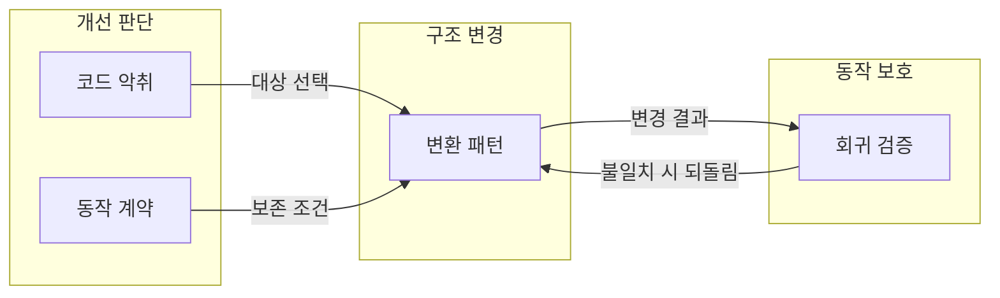
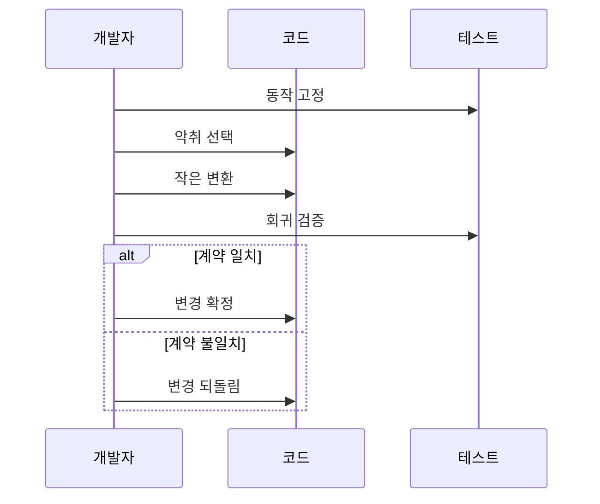

---
sidebar:
  order: 212
  label: "212. 소프트웨어 리팩터링 패턴 (Refactoring Patterns)"
  badge:
    text: "기출 · 50%"
    variant: note
title: "소프트웨어 리팩터링 패턴 (Refactoring Patterns)"
date: "2026-07-25T00:30:00+09:00"
tags: ["notes-software"]
weight: 212
extra:
  question_no: "212"
  source_status: "기출"
  source_history: "129회"
  priority: 50
  priority_note: "코드 악취 제거와 구조 개선이 반복 출제됨"
---

## 미리 알고가기

- **리팩터링(Refactoring)**: 외부에서 관찰되는 동작은 유지하면서 코드의 내부 구조를 작은 단위로 개선하는 작업이다.
- **코드 악취(Code Smell)**: 중복이나 긴 함수처럼 변경 비용이 커질 가능성을 알리는 구조적 징후이며, 결함 자체를 뜻하지는 않는다.
- **동작 계약**: 입력에 따른 출력, 오류, 처리 순서처럼 변경 전후에 같아야 하는 외부 관찰 조건이다.
- **특성화 테스트**: 문서가 부족한 기존 코드의 현재 동작을 먼저 기록해 리팩터링 전후 비교 기준으로 삼는 테스트다.
- **회귀**: 구조를 바꾼 뒤 이전에 정상 작동하던 기능이 다시 잘못되는 현상이다.
- **메서드 추출**: 긴 코드 일부를 이름 있는 별도 메서드로 분리해 의도와 책임을 드러내는 패턴이다.
- **함수 이동**: 함수가 주로 사용하는 데이터나 책임을 가진 모듈로 함수를 옮겨 결합을 줄이는 패턴이다.
- **조건문 다형성 치환**: 유형별로 반복되는 조건 분기를 각 유형의 동작으로 옮겨 분기 확장을 줄이는 패턴이다.

## Ⅰ. 개요

- **정의/개념**: 동작을 보존하며 내부 구조를 개선
- **배경/필요성**: 코드 악취 누적으로 리팩터링 패턴 필요

### 쉽게 이해하기 (학습용)

- 사용법은 그대로 두고 복잡한 내부 코드를 작은 단계로 정리해 다음 변경을 쉽게 만드는 작업이다.

## Ⅱ. 특징

- 작은 변환마다 검사해 회귀 범위 축소한다.
- 기능 추가와 분리해 변경 의도 명확화한다.
- 테스트 부족 시 동작 보존 입증 불가능하다.

### 쉽게 이해하기 (학습용)

- 한꺼번에 뜯어고치지 않고 작은 구조 변경마다 기존 기능을 확인하므로 문제가 생긴 지점을 빨리 찾을 수 있다.

## Ⅲ. 아키텍처 및 구성요소

| 설계 요소 | 설명 |
|:---|:---|
| 코드 악취 | 구조 개선이 필요한 징후 |
| 동작 계약 | 변경 전후에 같아야 할 관찰 조건 |
| 변환 패턴 | 악취 원인별 작은 구조 변경 |
| 회귀 검증 | 계약 비교로 동작 보존 판정 |

> 요약: 악취별 변환을 동작 계약으로 보호

### 쉽게 이해하기 (학습용)

- 고칠 징후를 찾고 유지할 사용법을 정한 뒤 알맞은 변환과 테스트를 연결해 구조만 바꾼다.

## Ⅳ. 원리 및 절차 흐름도

| 절차 | 설명 |
|:---|:---|
| 동작 고정 | 특성화 테스트로 계약 기록 |
| 악취 선택 | 변경 비용을 높이는 원인 선정 |
| 작은 변환 | 원인에 맞는 패턴 하나 적용 |
| 회귀 검증 | 변경 전후 동작 계약 비교 |
| 변경 확정 | 계약이 같으면 변경을 저장 |
| 변경 되돌림 | 계약이 다르면 이전 상태 복구 |

> 요약: 동작 고정 후 작은 변환마다 회귀 검사

### 쉽게 이해하기 (학습용)

- 기존 동작을 먼저 기록하고 한 번에 하나만 고친 뒤 같으면 남기고 다르면 즉시 되돌린다.

## Ⅴ. 종류 및 비교

| 판단 기준 | 리팩터링 | 기능 변경 | 재작성 |
|:---|:---|:---|:---|
| 핵심 특징 | 동작 보존·내부 구조 개선 | 외부 동작 추가·변경 | 기존 구현 전체 대체 |
| 적용 기준 | 변경 시 영향 범위 증가 | 새 요구로 동작 변경 필요 | 기존 구조로 개선 불가능 |
| 주요 위험 | 숨은 계약의 회귀 | 호환성 훼손·범위 증가 | 기능 누락·전환 실패 |

> 요약: 동작 보존 여부와 교체 범위로 선택

### 쉽게 이해하기 (학습용)

- 사용법을 유지하며 정리하면 리팩터링, 사용법을 바꾸면 기능 변경, 기존 구현을 버리고 새로 만들면 재작성이다.

## Ⅵ. 실무 사례

1. 긴 주문 계산식을 메서드 추출로 분리
2. 유형별 결제 분기를 다형성으로 치환

### 쉽게 이해하기 (학습용)

- 한 함수에 섞인 주문 계산 단계를 이름 있는 작은 메서드로 나누면 계산 순서를 읽고 고치기 쉬워진다.
- 결제 유형이 늘 때마다 조건문을 고치는 대신 각 유형이 자신의 결제 동작을 맡게 하면 분기 확장을 줄일 수 있다.

## Ⅶ. 결론

- 동작 계약을 고정하고 악취별 변환 선택

### 쉽게 이해하기 (학습용)

- 유지할 동작을 테스트로 잠근 뒤 가장 큰 변경 비용을 만드는 악취부터 작은 패턴으로 제거해야 한다.
