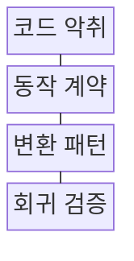
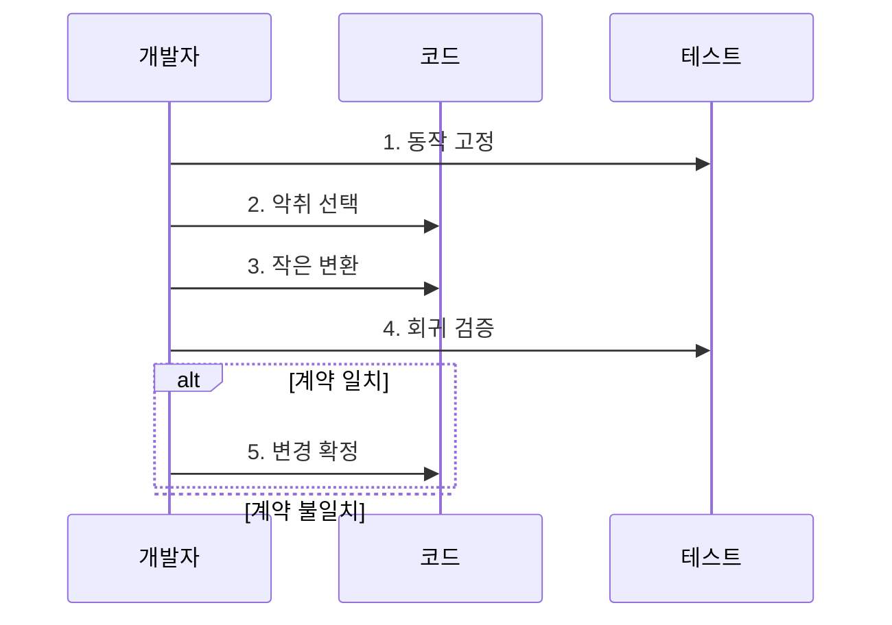

---
sidebar:
  order: 212
  label: "212. 소프트웨어 리팩터링 패턴 (Refactoring Patterns)"
  badge:
    text: "기출 · 50%"
    variant: note
title: "소프트웨어 리팩터링 패턴 (Refactoring Patterns)"
date: "2026-07-30T18:00:00+09:00"
tags: ["notes-software"]
weight: 212
extra:
  question_no: "212"
  source_status: "기출"
  source_history: "129회"
  priority: 50
  priority_note: "코드 악취 제거와 구조 개선이 반복 출제됨"
---

## 미리 알고가기

- **리팩터링(Refactoring)**: 외부에서 관찰되는 동작은 유지하면서 코드의 내부 구조를 작은 단위로 개선하는 작업이다.
- **코드 악취(Code Smell)**: 중복이나 긴 함수처럼 변경 비용이 커질 가능성을 알리는 구조적 징후이며, 결함 자체를 뜻하지는 않는다.
- **동작 계약**: 입력에 따른 출력, 오류, 처리 순서처럼 변경 전후에 같아야 하는 외부 관찰 조건이다.
- **특성화 테스트**: 문서가 부족한 기존 코드의 현재 동작을 먼저 기록해 리팩터링 전후 비교 기준으로 삼는 테스트다.
- **회귀**: 구조를 바꾼 뒤 이전에 정상 작동하던 기능이 다시 잘못되는 현상이다.
- **메서드 추출**: 긴 코드 일부를 이름 있는 별도 메서드로 분리해 의도와 책임을 드러내는 패턴이다.
- **함수 이동**: 함수가 주로 사용하는 데이터나 책임을 가진 모듈로 함수를 옮겨 결합을 줄이는 패턴이다.
- **조건문 다형성 치환**: 유형별로 반복되는 조건 분기를 각 유형의 동작으로 옮겨 분기 확장을 줄이는 패턴이다.

## Ⅰ. 개요

- 정의/개념: 외부 동작을 보존한 **내부 코드 구조 개선**
- 배경/필요성: 코드 악취 누적은 **변경 비용·회귀 위험** 증가

### 쉽게 이해하기 (학습용)

- 사용법은 그대로 두고 복잡한 내부 코드를 작은 단계로 정리해 다음 변경을 쉽게 만드는 작업이다.

## Ⅱ. 특징

- **외부 동작 계약 보존**을 전제로 내부 구조 변경
- **작은 변환·즉시 회귀 검사**로 실패 범위 축소
- **코드 악취별 변환 패턴**으로 변경 비용 감소

### 쉽게 이해하기 (학습용)

- 한꺼번에 뜯어고치지 않고 작은 구조 변경마다 기존 기능을 확인하므로 문제가 생긴 지점을 빨리 찾을 수 있다.

## Ⅲ. 구조 및 구성요소

| 구성요소 | 책임 |
|:---|:---|
| 코드 악취 | 구조 개선이 필요한 **변경 비용 징후** |
| 동작 계약 | 전후 동일해야 할 **외부 관찰 조건** |
| 변환 패턴 | 악취 원인별 **작은 구조 변경** |
| 회귀 검증 | 계약 비교로 **동작 보존 판정** |

### 쉽게 이해하기 (학습용)

- 고칠 징후를 찾고 유지할 사용법을 정한 뒤 알맞은 변환과 테스트를 연결해 구조만 바꾼다.

## Ⅳ. 흐름도

**동작 원리**

1. **동작 고정**: 특성화 테스트로 **현재 계약 기록**
2. **악취 선택**: 변경 비용의 **구조적 원인** 선정
3. **작은 변환**: 원인에 맞는 **패턴 하나 적용**
4. **회귀 검증**: 전후 **동작 계약 비교**
5. **변경 확정**: 계약 일치 시 **변경 저장**

### 쉽게 이해하기 (학습용)

- 기존 동작을 먼저 기록하고 한 번에 하나만 고친 뒤 같으면 남기고 다르면 즉시 되돌린다.

## Ⅴ. 종류 및 비교

| 코드 변경 방식 | 리팩터링 | 기능 변경 | 재작성 |
|:---|:---|:---|:---|
| 적용 기준 | 동작 유지·**변경 비용 감소** | 새 요구의 **외부 동작 변경** | 점진 개선이 **비경제적** |
| 핵심 특징 | **동작 보존·내부 구조 개선** | **기능 추가·행위 변경** | **기존 구현 전체 대체** |
| 한계 | 숨은 계약의 **회귀 위험** | 호환성 훼손·**범위 증가** | 기능 누락·**전환 실패** |

> 요약: 동작 보존 여부와 교체 범위로 선택

### 쉽게 이해하기 (학습용)

- 사용법을 유지하며 정리하면 리팩터링, 사용법을 바꾸면 기능 변경, 기존 구현을 버리고 새로 만들면 재작성이다.

## Ⅵ. 실무 고려사항 및 대책

| 고려사항 | 대책 | 효과 |
|:---|:---|:---|
| 회귀 시험 없는 **구조 변경** | 특성화 테스트·**작은 단위 적용** | 행위 보존 **확인** |
| 대규모 일괄 **리팩터링** | Branch by Abstraction **적용** | 변경 위험 **분산** |
| 성능 경로의 **회귀 발생** | 전후 Benchmark·**프로파일 비교** | 성능 저하 **탐지** |
| 경계 없는 **패턴 남용** | 변경 이유·**품질 목표 명시** | 불필요한 복잡성 **방지** |

### 쉽게 이해하기 (학습용)

- 한 함수에 섞인 주문 계산 단계를 이름 있는 작은 메서드로 나누면 계산 순서를 읽고 고치기 쉬워진다.

## Ⅶ. 결론

- **행위 보존·변경 빈도·복잡성 감소**로 리팩터링 결정

### 쉽게 이해하기 (학습용)

- 유지할 동작을 테스트로 잠근 뒤 가장 큰 변경 비용을 만드는 악취부터 작은 패턴으로 제거해야 한다.
