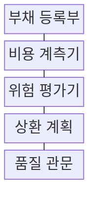
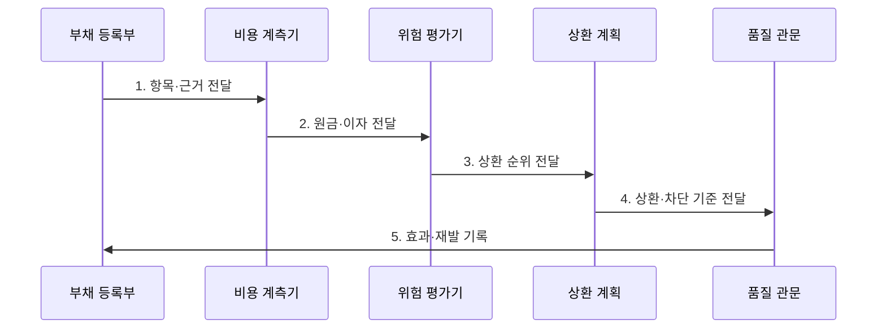

---
sidebar:
  order: 213
  label: "213. 기술부채 측정·관리 (Technical Debt Measurement)"
  badge:
    text: "기출 · 50%"
    variant: note
title: "기술부채 측정·관리 (Technical Debt Measurement)"
date: "2026-07-31T00:57:00+09:00"
tags: ["notes-software"]
weight: 213
extra:
  question_no: "213"
  source_status: "기출"
  source_history: "123회"
  priority: 50
  priority_note: "부채 식별·우선순위·상환 관리가 반복 출제됨"
---

## 미리 알고가기

- **기술부채(Technical Debt)**: 빠른 출시 등을 위해 택한 불완전한 기술 선택이 미래의 변경 비용과 장애 위험을 늘리는 상태다.
- **부채 원금(Principal)**: 기술부채를 제거해 바람직한 구조로 되돌리는 데 필요한 일회성 개선 비용이다.
- **부채 이자(Interest)**: 기술부채를 남겨 둔 동안 반복해서 발생하는 추가 개발 시간이나 운영 손실이다.
- **부채 항목(Debt Item)**: 원인, 영향 범위, 책임자, 원금과 이자를 함께 기록해 추적하는 관리 단위다.
- **순환 의존**: 둘 이상의 모듈이 서로를 참조해 한 부분의 변경이 연쇄적으로 퍼지는 구조다.
- **품질 관문**: 정해진 구조나 품질 조건을 통과한 변경만 저장소나 배포 단계로 보내는 통제 지점이다.
- **지표 게임화(Metric Gaming)**: 지표의 본래 목표보다 수치 달성만 최적화해 실제 품질 판단을 왜곡하는 행동
- **로드맵(Roadmap)**: 제품·기술 변경 목표와 시기를 배치한 중장기 실행 계획

## Ⅰ. 개요

- 정의/개념: 기술 선택의 **원금·이자**를 계량해 상환하는 관리 체계
- 배경/필요성: 비가시적 부채는 비용·위험 비교가 어려워 **상환 순위 산출 불가**

### 쉽게 이해하기 (학습용)

- 당장의 지름길이 앞으로 얼마나 많은 추가 작업을 만들지 기록하고, 손실이 큰 항목부터 고치는 관리 방식이다.

## Ⅱ. 특징

- 개선 비용과 반복 손실의 **원금·이자 분리**
- 사업 영향·기술 위험의 **상환 순위화**
- 지속 계측의 **상환 효과·재발 검증**

### 쉽게 이해하기 (학습용)

- 고치는 비용뿐 아니라 그대로 둘 때 반복될 지연과 장애까지 비교해야 실제로 먼저 갚을 부채가 보인다.

## Ⅲ. 구조 및 구성요소

| 구성요소 | 책임 |
|:---|:---|
| 부채 등록부 | 원인·범위·책임자와 **상태 기록** |
| 비용 계측기 | **원금·반복 손실**의 근거 수집 |
| 위험 평가기 | 사업 영향·**발생 가능성**으로 순위화 |
| 상환 계획 | 예산과 의존성을 반영한 **일정 배치** |
| 품질 관문 | 기준 위반 변경의 **신규 유입 차단** |

### 쉽게 이해하기 (학습용)

- 부채 목록과 비용 증거를 한곳에 모아 우선순위를 정하고, 상환 일정과 새 부채 차단 기준으로 이어 간다.

## Ⅳ. 흐름도

**동작 원리**

1. **항목·근거 전달**: 원인·영향 범위·책임자 명시
2. **원금·이자 전달**: 개선 비용과 반복 손실 산정
3. **상환 순위 전달**: 사업 영향·발생 가능성 비교
4. **상환·차단 기준 전달**: 예산과 의존성에 따라 개선 배치
5. **효과·재발 기록**: 변경 시간·장애 감소와 신규 유입 확인

### 쉽게 이해하기 (학습용)

- 부채마다 고칠 비용과 방치 손실을 추정해 순서를 정하고, 고친 뒤 효과를 확인해 같은 문제가 다시 들어오지 않게 한다.

## Ⅴ. 종류 및 비교

| 기술부채 유형 | 코드 부채 | 아키텍처 부채 | 플랫폼 부채 |
|:---|:---|:---|:---|
| 적용 기준 | 특정 코드 변경의 **반복 지연** | 모듈 변경의 **연쇄 전파** | 지원 종료·**확장 한계** 도달 |
| 핵심 특징 | 중복·**복잡한 함수**에 국한 | 경계·**의존 구조** 전반에 영향 | 기반 제품의 **노후화** |
| 한계 | 결함 증가·**개발 지연** | 장애 전파·**분리 비용** | 보안 노출·**전환 실패** |

> 요약: 영향 범위와 방치 손실로 상환 선택

### 쉽게 이해하기 (학습용)

- 한 코드의 복잡성, 시스템 경계의 얽힘, 기반 제품의 노후화는 영향 범위와 고치는 방식이 달라 따로 관리해야 한다.

## Ⅵ. 실무 고려사항 및 대책

| 고려사항 | 대책 | 효과 |
|:---|:---|:---|
| 주관적인 **부채 점수** | 코드·장애·변경 지표 **결합** | 측정 객관성 **향상** |
| 원금만의 **우선순위 판단** | 이자·발생 빈도 **함께 계산** | 상환 가치 **정확성** |
| 사업 가치 없는 **전면 상환** | 위험·로드맵·**변경 계획 연계** | 투자 낭비 **방지** |
| 지표 목표의 **게임화** | 추세·결과·**표본 검토 병행** | 왜곡 행동 **억제** |

### 쉽게 이해하기 (학습용)

- 주문 모듈들이 서로 참조해 작은 수정도 함께 배포해야 한다면 경계를 나누는 비용과 반복 지연을 비교해 상환한다.

## Ⅶ. 결론

- **변경 이자**가 큰 고위험 **부채 항목**부터 상환 계획에 반영

### 쉽게 이해하기 (학습용)

- 눈에 잘 띄는 코드 수보다 방치할수록 손실이 커지는 항목을 찾아 예산과 일정에 먼저 반영해야 한다.
