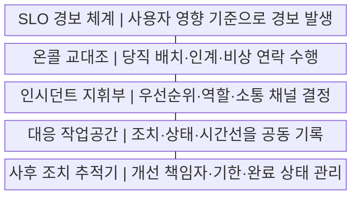
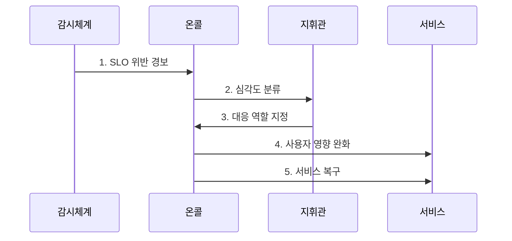

---
sidebar:
  order: 214
  label: "214. SRE 온콜 관리·인시던트 대응 (SRE Oncall Incident Management)"
  badge:
    text: "기출 · 50%"
    variant: note
title: "SRE 온콜 관리·인시던트 대응 (SRE Oncall Incident Management)"
date: "2026-07-29T18:27:00+09:00"
tags: ["notes-software"]
weight: 214
extra:
  question_no: "214"
  source_status: "기출"
  source_history: "137회"
  priority: 50
  priority_note: "온콜·사고 대응 폐루프가 최근 출제됨"
---

## 미리 알고가기

- **사이트 신뢰성 공학(Site Reliability Engineering, SRE·에스알이)**: 영문 각 단어의 머리글자를 딴 표기이며, 소프트웨어 공학과 자동화로 서비스 신뢰성 목표를 달성하는 운영 방식이다.
- **온콜(On-call)**: 정해진 시간에 서비스 경보를 받고 장애의 첫 판단과 대응을 맡는 당직 체계다.
- **서비스 수준 목표(Service Level Objective, SLO·에스엘오)**: 영문 각 단어의 머리글자를 딴 표기이며, 가용성이나 응답시간처럼 일정 기간에 서비스가 달성해야 할 수치 목표다.
- **인시던트 지휘관(Incident Commander, IC·아이씨)**: 영문 각 단어의 머리글자를 딴 표기이며, 중대 장애에서 대응 우선순위와 역할을 정하고 전체 상황을 조정하는 책임자다.
- **완화(Mitigation)**: 근본 원인을 고치기 전에 롤백이나 트래픽 차단으로 사용자 피해부터 줄이는 조치다.
- **런북(Runbook)**: 경보별 확인 항목과 진단·완화 절차를 순서대로 적은 대응 문서다.
- **사후 분석(Postmortem)**: 장애의 원인과 대응 과정을 돌아보고 재발 방지 조치와 책임자를 정하는 활동이다.
- **무비난 원칙**: 개인을 탓하기보다 시스템과 절차가 실패를 허용한 조건을 찾아 개선하는 원칙이다.

## Ⅰ. 개요

- 정의/개념: 온콜의 **장애 완화·복구·학습 체계**
- 배경/필요성: 임시 대응의 **역할 혼선·경보 과다 한계** 해소

### 쉽게 이해하기 (학습용)

- 장애가 나면 당직자가 혼자 버티지 않고 정해진 지휘와 대응 절차로 피해를 줄인 뒤, 배운 내용을 다음 예방 조치로 남긴다.

## Ⅱ. 특징

- 사용자 영향 기반 **실행 가능 경보**
- 교대·인계의 **개인 의존 완화**
- 사후 분석의 **예방 자동화 환류**

### 쉽게 이해하기 (학습용)

- 정말 조치가 필요한 경보만 당직자에게 보내고 교대와 자동화를 운영해야 밤샘 대응이 반복되는 일을 줄일 수 있다.

## Ⅲ. 구조 및 구성요소

| 구성요소 | 책임 |
|:---|:---|
| SLO 경보 체계 | 사용자 영향 기준으로 경보 발생 |
| 온콜 교대조 | 당직 배치·인계·비상 연락 수행 |
| 인시던트 지휘부 | 우선순위·역할·소통 채널 결정 |
| 대응 작업공간 | 조치·상태·시간선을 공동 기록 |
| 사후 조치 추적기 | 개선 책임자·기한·완료 상태 관리 |

### 쉽게 이해하기 (학습용)

- 경보가 당직자를 호출하면 지휘부가 복구 작업과 소통을 나누고, 남은 기록을 다음 경보와 대응 문서 개선에 쓴다.

## Ⅳ. 흐름도

**동작 원리**

1. **SLO 위반 경보**: 사용자 영향과 대응 필요성 전달
2. **심각도 분류**: 영향 범위·긴급도로 대응 수준 결정
3. **대응 역할 지정**: 지휘·복구·소통 책임 분리
4. **사용자 영향 완화**: 롤백·격리로 피해 확산 억제
5. **서비스 복구**: 원인 제거 후 정상 지표 확인

### 쉽게 이해하기 (학습용)

- 장애 규모를 판단해 역할을 나누고 사용자 피해부터 줄인 뒤 원인을 고치며, 끝난 뒤에는 예방 과제를 책임자에게 배정한다.

## Ⅴ. 종류 및 비교

| 인시던트 유형 | 일반 장애 | 중대 장애 | 보안 사고 |
|:---|:---|:---|:---|
| 적용 기준 | 런북으로 온콜 단독 복구 가능 | 전담 지휘와 부서 협업 필요 | 증거 보존·법적 보고 필요 |
| 핵심 특징 | 단일 서비스의 제한된 영향 | 다수 서비스·고객에 큰 영향 | 침해·유출 가능성 수반 |
| 한계 | 반복 장애의 상시화 | 지휘 혼선·피해 확산 | 증거 훼손·신고 지연 |

> 요약: 영향 범위와 침해 여부로 대응 체계 선택

### 쉽게 이해하기 (학습용)

- 당직자가 정해진 절차로 끝낼 장애인지, 전사 지휘가 필요한지, 증거 보존까지 필요한 보안 사고인지 먼저 구분해야 한다.

## Ⅵ. 실무 고려사항 및 대책

| 고려사항 | 대책 | 효과 |
|:---|:---|:---|
| 저가치 경보의 **온콜 피로** | SLO 영향·**행동 가능 경보** | 대응 집중도 **향상** |
| 서비스의 **소유권 불명** | Owner·Escalation **명시** | 인계 지연 **방지** |
| 교대 시 **상황 손실** | 사건 Timeline·**잔여 조치 인계** | 대응 연속성 **확보** |
| 책임 추궁형 **사후 분석** | 비난 배제·**체계 원인 분석** | 재발 방지 **학습** |

### 쉽게 이해하기 (학습용)

- 새 버전 배포 직후 결제 실패가 늘면 원인 분석보다 이전 버전 복귀를 먼저 실행해 사용자 피해를 줄인다.

## Ⅶ. 결론

- **사용자 영향·행동 가능성·인계 준비도**로 온콜 경보 결정

### 쉽게 이해하기 (학습용)

- 경보 건수보다 실제 사용자 피해를 기준으로 대응 수준을 정하고, 장애 기록을 다음 자동화와 예방 조치로 되돌려야 한다.
