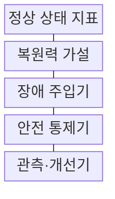
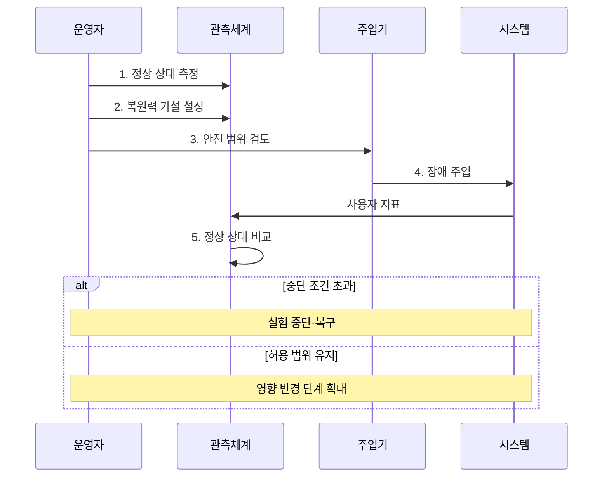

---
sidebar:
  order: 215
  label: "215. 카오스 엔지니어링 (Chaos Engineering)"
  badge:
    text: "미출 · 30%"
    variant: note
title: "카오스 엔지니어링 (Chaos Engineering)"
date: "2026-08-02T12:00:00+09:00"
tags: ["notes-software"]
weight: 215
extra:
  question_no: "215"
  source_status: "미출"
  source_history: ""
  priority: 30
  priority_note: "통제된 장애 주입과 복원력 검증이 독립적임"
---

## Ⅰ. 개요

핵심 용어

- **장애 주입**: 카오스 엔지니어링은 통제된 장애 주입으로 시스템이 정상 상태를 유지한다는 복원력 가설을 검증한다.

- 정의/개념: 통제된 **장애 주입**으로 복원력 가설을 검증하는 실험 기법
- 배경/필요성: 정상 기능 시험만으로 숨은 의존·**연쇄 장애 검증 불가**

### 쉽게 이해하기 (학습용)

- 실제 장애가 오기 전에 작은 실패를 일으켜 자동 복구와 대체 경로 전환이 작동하는지 확인한다.

## Ⅱ. 특징

핵심 용어

- **정상 상태·사용자 지표**: 실험 성공 여부는 내부 구성요소의 생존보다 정상 상태를 대표하는 사용자 지표가 허용 범위에 있는지로 판정한다.

- **실제 장애 주입** 기반 숨은 의존성 탐색
- **정상 상태·사용자 지표** 기반 가설 판정
- **영향 반경·중단 조건** 기반 안전 통제

### 쉽게 이해하기 (학습용)

- 예상 답을 확인하는 기능 시험과 달리 실제 실패를 견디는지 살피며, 안전이 입증될 때만 실험 범위를 넓힌다.

## Ⅲ. 구조 및 구성요소

핵심 용어

- **안전 통제기**: 안전 통제기는 실험 대상과 영향 반경을 제한하고 중단 조건을 넘으면 장애 주입을 즉시 멈춘다.

| 구성요소 | 책임 |
|:---|:---|
| 정상 상태 지표 | 사용자 관점의 **정상 범위** 정의 |
| 복원력 가설 | 장애 후 유지할 **상태 명시** |
| 장애 주입기 | 대상에 **실패 조건**을 통제 적용 |
| 안전 통제기 | **영향 반경·중단 조건** 실행 |
| 관측·개선기 | 가설 판정 후 **복구 약점** 보완 |

### 쉽게 이해하기 (학습용)

- 정상 기준과 예상 결과를 먼저 정하고, 안전장치가 장애 범위를 제한하는 동안 결과를 관찰해 약점을 고친다.

## Ⅳ. 흐름도

핵심 용어

- **4. 장애 주입**: 정상 상태와 복원력 가설, 중단·복구 조건을 확인한 뒤 한 가지 실패 조건을 제한된 대상에 적용한다.

**동작 원리**

1. **정상 상태 측정**: 평시 사용자 지표의 허용 범위 설정
2. **복원력 가설 설정**: 장애 후 유지할 지표를 예상
3. **안전 범위 검토**: 영향 반경·중단·복구 방법 확인
4. **장애 주입**: 한 가지 실패 조건을 대상에 적용
5. **정상 상태 비교**: 실험 지표와 허용 범위 대조

### 쉽게 이해하기 (학습용)

- 평소 상태와 멈출 기준을 먼저 정한 뒤 장애 하나를 일으켜 지표가 한계를 넘으면 즉시 중단하고 약점을 고친다.

## Ⅴ. 종류 및 비교

핵심 용어

- **카오스 엔지니어링**: 카오스 엔지니어링은 숨은 의존성과 연쇄 실패를 찾기 위해 실제 실패 조건으로 복원력 가설을 검증한다.

| 복원력 검증 방식 | 카오스 엔지니어링 | 장애 복구 훈련 | 부하 테스트 |
|:---|:---|:---|:---|
| 적용 기준 | 숨은 의존·**연쇄 실패 탐색** | 담당자 **역할·절차 검증** | **용량·병목 구간** 산정 |
| 핵심 특징 | 실패 조건으로 **복원력 가설** 검증 | 정해진 **복구 절차** 반복 숙달 | 트래픽 증가로 **처리 한계** 측정 |
| 한계 | 영향 반경 초과로 **실제 장애** | 훈련과 **실제 환경 차이** | 과부하의 **서비스 전파** |

> 요약: 숨은 의존은 **카오스 실험**, 대응 숙련은 **장애 복구 훈련** 선택

### 쉽게 이해하기 (학습용)

- 숨은 약점을 찾으려면 카오스 실험, 정해진 대응을 익히려면 복구 훈련, 처리 용량을 재려면 부하 테스트를 선택한다.

## Ⅵ. 실무 고려사항 및 대책

핵심 용어

- **실험 영향 반경**: 실험 영향 반경이 넓으면 예상 밖의 장애가 많은 사용자와 서비스로 확산될 수 있다.

| 문제 | 대책 | 효과 |
|:---|:---|:---|
| 넓은 **실험 영향 반경** | 최소 대상·**단계 확대** | 사용자 피해 **제한** |
| 모호한 **정상 상태 가설** | SLO·업무 지표 **수치화** | 결과 판정 **명확성** |
| 중단 기준 없는 **장애 주입** | 중단 조건·**자동 차단** | 실험 위험 **통제** |
| 운영 실험의 **복구 실패** | 게임데이·롤백 **사전 검증** | 복구 가능성 **확보** |

### 쉽게 이해하기 (학습용)

- 여러 서버가 요청을 나눠 처리할 때 한 대를 끄고도 남은 서버로 요청이 자동 이동하는지 확인한다.

## Ⅶ. 결론

핵심 용어

- **영향 반경**: 정상 상태와 자동 중단 조건이 준비된 실험만 최소 영향 반경에서 시작해 결과에 따라 단계적으로 확대해야 한다.

- 정상 상태와 중단 조건이 준비되면 **영향 반경** 단계 확대

### 쉽게 이해하기 (학습용)

- 복원력은 장애가 없다는 믿음이 아니라 작은 범위에서 실패를 일으키고 사용자 지표로 검증한 증거로 판단해야 한다.
