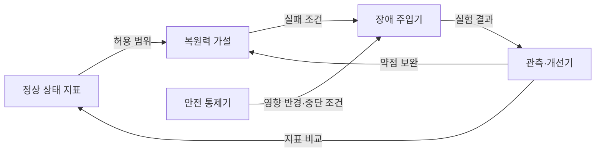
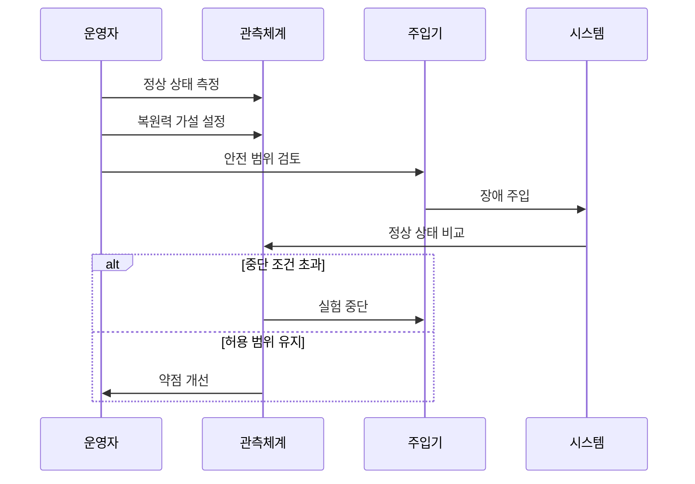

---
sidebar:
  order: 215
  label: "215. 카오스 엔지니어링 (Chaos Engineering)"
  badge:
    text: "미출제 · 30%"
    variant: note
title: "카오스 엔지니어링 (Chaos Engineering)"
date: "2026-07-25T00:30:00+09:00"
tags: ["notes-software"]
weight: 215
extra:
  question_no: "215"
  source_status: "미출제"
  source_history: ""
  priority: 30
  priority_note: "통제된 장애 주입과 복원력 검증이 독립적임"
---

## 미리 알고가기

- **카오스 엔지니어링(Chaos Engineering)**: 운영과 유사한 환경에 통제된 장애를 주입해 시스템의 복원력 가설을 검증하는 실험 방식이다.
- **복원력(Resilience)**: 일부 구성요소가 실패해도 서비스를 허용 범위 안에서 계속 제공하고 정상 상태로 회복하는 능력이다.
- **정상 상태(Steady State)**: 처리량이나 오류율처럼 사용자 관점에서 정상 서비스를 나타내는 측정 가능한 기준이다.
- **복원력 가설**: 특정 장애가 발생해도 정상 상태 지표가 허용 범위에 머물 것이라는 검증 가능한 예상이다.
- **장애 주입(Fault Injection)**: 서버 종료, 통신 지연, 연결 차단 같은 실패 조건을 의도적으로 발생시키는 기법이다.
- **영향 반경(Blast Radius)**: 실험 장애가 영향을 줄 수 있는 사용자, 요청, 서비스의 최대 범위다.
- **중단 조건(Abort Condition)**: 사용자 피해나 지표 악화가 한계를 넘으면 실험을 즉시 멈추도록 정한 기준이다.

## Ⅰ. 개요

- 정의/개념: 장애 주입으로 복원력 가설을 검증
- **배경/필요성**: 숨은 의존성의 연쇄 장애로 사전 검증 필요

### 쉽게 이해하기 (학습용)

- 실제 장애가 오기 전에 작은 실패를 안전하게 일으켜 자동 복구와 우회가 예상대로 작동하는지 확인한다.

## Ⅱ. 특징

- 알려지지 않은 의존성과 복구 약점 발견한다.
- 실제 관측 증거로 복원력 신뢰도 판단한다.
- 영향 반경 확장은 검증 수준에 따라 결정한다.
- 통제 실패 시 실험 자체가 장애를 유발한다.

### 쉽게 이해하기 (학습용)

- 예상 답을 확인하는 기능 시험과 달리 실제 실패를 견디는지 살피며, 안전이 입증될 때만 실험 범위를 넓힌다.

## Ⅲ. 아키텍처 및 구성요소

| 설계 요소 | 설명 |
|:---|:---|
| 정상 상태 지표 | 사용자 관점의 정상 범위 정의 |
| 복원력 가설 | 장애 후 유지할 상태를 명시 |
| 장애 주입기 | 대상에 실패 조건을 통제 적용 |
| 안전 통제기 | 영향 반경 제한·중단 조건 실행 |
| 관측·개선기 | 가설 판정 후 복구 약점 보완 |

> 요약: 정상 상태와 안전 한계로 장애 실험 통제

### 쉽게 이해하기 (학습용)

- 정상 기준과 예상 결과를 먼저 정하고, 안전장치가 장애 범위를 제한하는 동안 결과를 관찰해 약점을 고친다.

## Ⅳ. 원리 및 절차 흐름도

| 절차 | 설명 |
|:---|:---|
| 정상 상태 측정 | 평시 사용자 지표의 허용 범위 설정 |
| 복원력 가설 설정 | 장애 후 유지할 지표를 예상 |
| 안전 범위 검토 | 영향 반경·중단·복구 방법 확인 |
| 장애 주입 | 한 가지 실패 조건을 대상에 적용 |
| 정상 상태 비교 | 실험 지표와 허용 범위 대조 |
| 실험 중단 | 한계 초과 시 주입을 즉시 해제 |
| 약점 개선 | 가설 불일치 원인을 구조에 반영 |

> 요약: 가설·안전 범위를 정하고 장애 결과 비교

### 쉽게 이해하기 (학습용)

- 평소 상태와 멈출 기준을 먼저 정한 뒤 장애 하나를 일으켜 지표가 한계를 넘으면 즉시 중단하고 약점을 고친다.

## Ⅴ. 종류 및 비교

| 판단 기준 | 카오스 엔지니어링 | 장애 복구 훈련 | 부하 테스트 |
|:---|:---|:---|:---|
| 핵심 특징 | 실패 조건으로 복원력 가설 검증 | 정해진 복구 절차를 반복 숙달 | 트래픽 증가로 처리 한계 측정 |
| 적용 기준 | 숨은 의존·연쇄 실패 탐색 | 담당자 역할·절차 검증 | 용량·병목 구간 산정 |
| 주요 위험 | 영향 반경 초과로 실제 장애 | 훈련과 실제 환경의 차이 | 과부하가 다른 서비스로 전파 |

> 요약: 복원력·복구 절차·처리 한계로 구분

### 쉽게 이해하기 (학습용)

- 숨은 약점을 찾으려면 카오스 실험, 정해진 대응을 익히려면 복구 훈련, 처리 용량을 재려면 부하 테스트를 선택한다.

## Ⅵ. 실무 사례

1. 서버 한 대를 종료해 자동 우회 검증

### 쉽게 이해하기 (학습용)

- 여러 서버가 요청을 나눠 처리할 때 한 대를 끄고도 남은 서버로 요청이 자동 이동하는지 확인한다.

## Ⅶ. 결론

- 운영 장애에 대한 복원력을 검증하기 위해 **정상 상태 가설·영향 반경·중단 조건·복구 경로·사용자 영향**을 검토하고, 가역적인 작은 실험부터 카오스 엔지니어링을 확대한다

### 쉽게 이해하기 (학습용)

- 복원력은 장애가 없다는 믿음이 아니라 작은 범위에서 실패를 일으키고 사용자 지표로 검증한 증거로 판단해야 한다.
