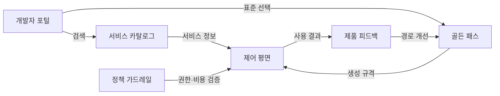
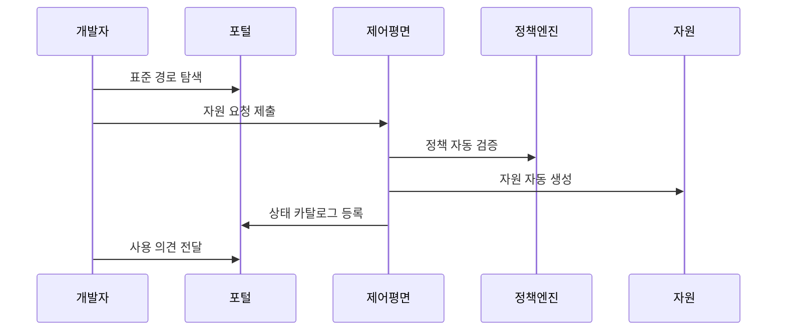

---
sidebar:
  order: 216
  label: "216. 플랫폼 엔지니어링 셀프서비스 (Platform Engineering Self-Service)"
  badge:
    text: "기출 · 85%"
    variant: note
title: "플랫폼 엔지니어링 셀프서비스 (Platform Engineering Self-Service)"
date: "2026-07-27T23:59:59+09:00"
tags: ["notes-software"]
weight: 216
extra:
  question_no: "216"
  source_status: "기출"
  source_history: "134회, 135회"
  priority: 85
  priority_note: "셀프서비스·골든 패스 설계가 반복 출제됨"
---

## 미리 알고가기

- **플랫폼 엔지니어링(Platform Engineering)**: 개발자가 공통 기술을 쉽게 사용하도록 내부 플랫폼을 제품처럼 설계하고 운영하는 활동이다.
- **내부 개발자 플랫폼(Internal Developer Platform, IDP)**: 개발·배포·운영에 필요한 도구와 자원을 하나의 셀프서비스 경험으로 제공하는 플랫폼이다.
- **셀프서비스(Self-Service)**: 중앙 운영팀의 수작업 없이 사용자가 허용 범위 안에서 필요한 자원을 직접 요청하고 생성하는 방식이다.
- **골든 패스(Golden Path)**: 조직이 보안·운영 기준을 미리 반영해 대부분의 개발팀에 권장하는 표준 개발 경로다.
- **서비스 카탈로그**: 서비스의 소유 팀, 저장소, 문서, 운영 상태를 검색할 수 있게 모은 목록이다.
- **제어 평면(Control Plane)**: 사용자의 요청을 받아 정책을 확인하고 실제 자원의 생성·변경·삭제를 조정하는 계층이다.
- **정책 가드레일(Policy Guardrail)**: 금지 사항만 자동 차단하면서 허용된 선택 안에서는 개발팀이 자율적으로 작업하게 하는 규칙이다.
- **인지 부하(Cognitive Load)**: 개발자가 업무 기능 외에 도구와 인프라를 이해하고 조정하느라 써야 하는 정신적 노력이다.

## Ⅰ. 개요

- 정의/개념: 표준 개발 경로의 **내부 플랫폼 셀프서비스**
- **배경/필요성**: 수동 자원 요청의 **대기·운영 병목 한계** 해소

### 쉽게 이해하기 (학습용)

- 개발팀이 반복 신청을 기다리지 않고 검증된 메뉴에서 필요한 환경을 직접 만들게 하는 내부 기술 서비스다.

## Ⅱ. 특징

- 가드레일 내부의 **개발팀 자율성**
- 공통 복잡성 추상화의 **인지 부하 감소**
- 개발자를 고객으로 보는 **제품 중심 운영**

### 쉽게 이해하기 (학습용)

- 플랫폼이 공통 작업을 자동화하되 개발팀의 선택권과 예외 경로도 제공해야 공식 경로를 사용한다.

## Ⅲ. 아키텍처 및 구성요소

| 설계 요소 | 설명 |
|:---|:---|
| 개발자 포털 | 검색·요청·상태 확인의 단일 창구 |
| 서비스 카탈로그 | 서비스 소유권·문서·상태 관리 |
| 골든 패스 | 검증된 개발·배포 구성을 제공 |
| 제어 평면 | 정책에 따라 자원 수명주기 조정 |
| 정책 가드레일 | 권한·보안·비용 한계를 자동 검증 |
| 제품 피드백 | 이용 자료·의견으로 경로 개선 |

> 요약: 표준 경로와 자동 정책으로 자원 제공

### 쉽게 이해하기 (학습용)

- 포털에서 표준 경로를 선택하면 제어 평면이 정책을 확인해 자원을 만들고 사용 결과를 경로 개선에 반영한다.

## Ⅳ. 원리 및 절차 흐름도

| 절차 | 설명 |
|:---|:---|
| 표준 경로 탐색 | 카탈로그에서 목적별 구성을 선택 |
| 자원 요청 제출 | 필요한 값만 입력해 생성을 요청 |
| 정책 자동 검증 | 권한·보안·비용 한도를 판정 |
| 자원 자동 생성 | 승인된 규격대로 환경을 구성 |
| 상태 카탈로그 등록 | 소유권·접속 정보·상태를 기록 |
| 사용 의견 전달 | 실패·예외 요구를 경로에 반영 |

> 요약: 표준 선택부터 정책 검증·생성까지 자동화

### 쉽게 이해하기 (학습용)

- 개발자가 표준 구성을 선택해 요청하면 정책 검사를 통과한 환경이 자동 생성되고 그 결과와 의견이 목록에 남는다.

## Ⅴ. 종류 및 비교

| 플랫폼 제공 방식 | 가드레일 셀프서비스 | 티켓 기반 제공 | 완전 자율 |
|:---|:---|:---|:---|
| 적용 기준 | 반복 수요와 표준화 가능성 높음 | 예외가 많고 승인 판단이 복잡 | 팀별 요구가 크게 다름 |
| 핵심 특징 | 자동 정책 안에서 직접 생성 | 운영팀이 요청마다 수동 처리 | 개발팀이 도구·정책을 독자 선택 |
| 한계 | 플랫폼 병목·표준 경직 | 대기 증가·운영팀 과부하 | 중복 투자·통제 불일치 |

> 요약: 반복성·표준화 가능성으로 제공 방식 선택

### 쉽게 이해하기 (학습용)

- 자주 반복되고 규칙화할 수 있으면 셀프서비스, 사람 판단이 많이 필요하면 티켓, 팀마다 조건이 크게 다르면 자율 방식을 택한다.

## Ⅵ. 실무 사례

1. 신규 서비스의 **표준 저장소·환경 생성**

### 쉽게 이해하기 (학습용)

- 새 서비스를 시작하는 팀은 포털에서 표준 구성을 선택해 저장소와 배포 환경을 한 번에 직접 만든다.

## Ⅶ. 결론

- **반복성·정책화 가능성**으로 셀프서비스 선정

### 쉽게 이해하기 (학습용)

- 모든 요청을 자동화하지 말고 반복되는 공통 작업은 표준 경로로 만들며 복잡한 예외에는 승인 경로를 남겨야 한다.
