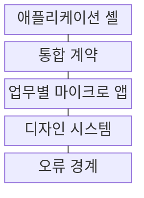
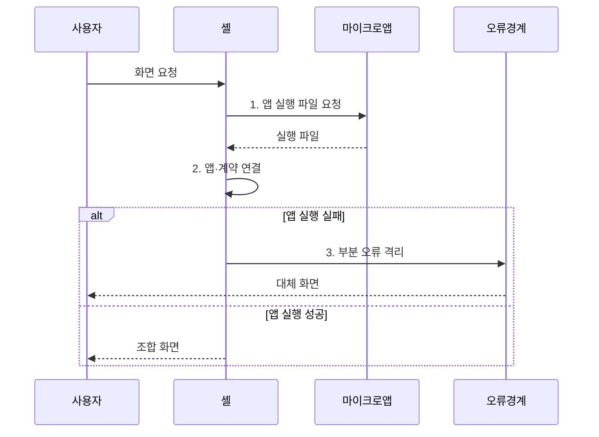

---
sidebar:
  order: 217
  label: "217. 마이크로프론트엔드 아키텍처 (Micro Frontend)"
  badge:
    text: "미출 · 50%"
    variant: note
title: "마이크로프론트엔드 아키텍처 (Micro Frontend)"
date: "2026-08-02T12:00:00+09:00"
tags: ["notes-software"]
weight: 217
extra:
  question_no: "217"
  source_status: "미출"
  source_history: ""
  priority: 50
  priority_note: "업무별 화면 분리와 독립 배포가 독립 설계축임"
---

## Ⅰ. 개요

핵심 용어

- **독립 배포·화면 조합**: 마이크로프론트엔드는 업무별 웹 앱을 팀이 독립 배포하고 애플리케이션 셸에서 하나의 화면으로 조합한다.

- 정의/개념: 업무별 웹 앱을 **독립 배포·화면 조합**하는 프런트엔드 아키텍처
- 배경/필요성: 단일 빌드 구조로 팀별 변경의 **독립 배포 불가**

### 쉽게 이해하기 (학습용)

- 큰 웹 화면을 주문·결제 같은 업무별 작은 앱으로 나눠 각 팀이 따로 배포하되 사용자에게는 한 서비스처럼 보여 준다.

## Ⅱ. 특징

핵심 용어

- **기술 자율성·공통 계약**: 팀은 구현 기술을 자율적으로 선택할 수 있지만 라우팅, 이벤트, 공유 상태의 공통 계약을 지켜야 한다.

- **업무 경계·팀 소유권** 일치
- **부분 독립 배포** 기반 실패 범위 축소
- **기술 자율성·공통 계약** 기반 화면 조합

### 쉽게 이해하기 (학습용)

- 팀별 변경은 분리되지만 과도한 분할은 기능 중복과 화면 상태·양식 동기화 비용을 늘린다.

## Ⅲ. 구조 및 구성요소

핵심 용어

- **애플리케이션 셸**: 애플리케이션 셸은 공통 화면 틀과 라우팅을 제공하고 경로에 맞는 업무별 마이크로 앱을 조합한다.

| 구성요소 | 책임 |
|:---|:---|
| 애플리케이션 셸 | 공통 틀·**라우팅·화면 조합** 담당 |
| 통합 계약 | 이동·이벤트·**공유 상태 규약** 정의 |
| 업무별 마이크로 앱 | 업무 경계별 **독립 개발·배포** 단위 |
| 디자인 시스템 | 화면 구성요소와 **표현 규칙** 공유 |
| 오류 경계 | 부분 오류를 **해당 화면 영역**에 격리 |

### 쉽게 이해하기 (학습용)

- 셸이 공통 화면 틀을 잡고 계약에 맞춰 업무 앱을 끼워 넣으며 디자인 규칙과 오류 경계가 일관성과 격리를 지킨다.

## Ⅳ. 흐름도

핵심 용어

- **3. 부분 오류 격리**: 마이크로 앱 실행이 실패하면 오류 경계가 해당 화면 영역만 폴백으로 바꿔 전체 화면 중단을 막는다.

**동작 원리**

1. **앱 실행 파일 요청**: 경로에 맞는 업무 앱 선택
2. **앱·계약 연결**: 앱 적재 후 이동·이벤트 규약 적용
3. **부분 오류 격리**: 실패 앱 영역만 폴백 화면으로 대체

### 쉽게 이해하기 (학습용)

- 사용자가 메뉴를 열면 셸이 해당 업무 앱을 불러 공통 규칙으로 화면에 붙이고, 실패한 앱의 자리만 오류 화면으로 바꾼다.

## Ⅴ. 종류 및 비교

핵심 용어

- **런타임 조합**: 런타임 조합은 브라우저가 실행 중에 업무별 앱을 적재해 팀별 독립 배포를 가능하게 한다.

| 마이크로프론트엔드 조합 방식 | 빌드 시 조합 | 런타임 조합 | 엣지 조합 |
|:---|:---|:---|:---|
| 적용 기준 | 버전 통제와 **단순 운영** 우선 | 팀별 **독립 배포** 필수 | 서버별 **화면 개인화** 필요 |
| 핵심 특징 | 셸 빌드 때 앱을 **하나로 결합** | 브라우저가 실행 중 **앱 적재** | 중계 서버가 **화면 조각 결합** |
| 한계 | 셸 재배포·**버전 충돌** | 초기 지연·**중복 의존성** | 중계 지연·**조합 실패** |

> 요약: 단일 배포는 **빌드 시**, 독립 배포는 **런타임 조합** 선택

### 쉽게 이해하기 (학습용)

- 한 번에 묶어 배포하면 단순하고, 실행 중 불러오면 팀 독립성이 높으며, 중계 서버에서 합치면 요청별 화면 구성이 쉽다.

## Ⅵ. 실무 고려사항 및 대책

핵심 용어

- **경험 불일치**: 경험 불일치는 팀별 UI가 디자인 토큰과 통합 계약을 다르게 적용해 사용 방식과 표현이 어긋나는 문제다.

| 문제 | 대책 | 효과 |
|:---|:---|:---|
| 중복 런타임의 **용량 증가** | 공유 의존성·**버전 정책 적용** | 초기 적재 **절감** |
| 팀별 UI의 **경험 불일치** | 디자인 토큰·**계약 시험** | 사용자 경험 **일관성** |
| 부분 앱의 **런타임 장애** | 격리·폴백·**오류 경계** | 전체 화면 **보호** |
| 잘못 나눈 **팀 경계** | 업무 도메인·**독립 배포 기준** | 조정 비용 **감소** |

### 쉽게 이해하기 (학습용)

- 상품 팀과 주문 팀이 각자 화면을 배포하면 한쪽의 잦은 변경 때문에 다른 팀의 배포를 기다리지 않아도 된다.

## Ⅶ. 결론

핵심 용어

- **빌드 시 조합**: 업무별 독립 배포가 필요하면 런타임 조합을 사용하고 단순한 운영과 강한 버전 통제가 우선이면 빌드 시 조합을 선택한다.

- 업무별 독립 배포는 **런타임 조합**, 단순 운영은 **빌드 시 조합**

### 쉽게 이해하기 (학습용)

- 화면을 조직도대로 무조건 쪼개지 말고 함께 바뀌는 업무 범위와 필요한 독립 배포 수준을 먼저 정해야 한다.
