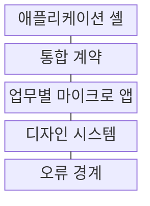
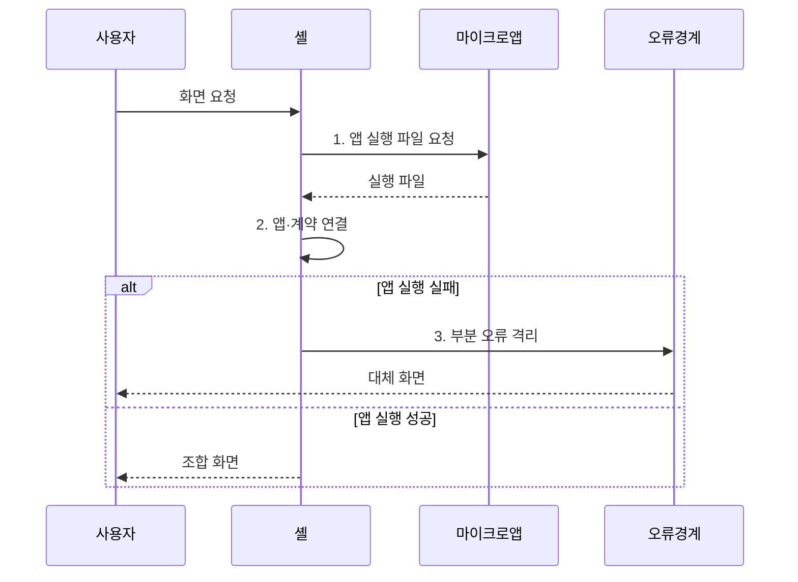

---
sidebar:
  order: 217
  label: "217. 마이크로프론트엔드 아키텍처 (Micro Frontend)"
  badge:
    text: "미출 · 50%"
    variant: note
title: "마이크로프론트엔드 아키텍처 (Micro Frontend)"
date: "2026-07-31T10:53:24+09:00"
tags: ["notes-software"]
weight: 217
extra:
  question_no: "217"
  source_status: "미출"
  source_history: ""
  priority: 50
  priority_note: "업무별 화면 분리와 독립 배포가 독립 설계축임"
---

## 미리 알고가기

- **마이크로프론트엔드(Micro Frontend)**: 하나의 웹 화면을 업무 영역별 작은 애플리케이션으로 나눠 독립 개발·배포하고 사용자에게 하나로 조합하는 구조다.
- **업무 경계**: 주문이나 결제처럼 독립적으로 책임지고 변경할 수 있도록 기능과 데이터를 나누는 기준이다.
- **애플리케이션 셸(Application Shell)**: 공통 화면 틀과 이동 경로를 제공하고 업무별 마이크로 앱을 필요한 위치에 조합하는 상위 앱이다.
- **라우팅(Routing)**: 사용자가 요청한 주소나 메뉴에 따라 표시할 화면 모듈을 결정하는 동작이다.
- **통합 계약(Integration Contract)**: 마이크로 앱 사이의 화면 이동, 이벤트, 공유 상태 교환 방식을 정한 규약이다.
- **디자인 시스템(Design System)**: 색상, 글꼴, 화면 구성요소의 공통 규칙을 제공해 독립 화면의 사용 경험을 맞추는 체계다.
- **오류 경계(Error Boundary)**: 한 마이크로 앱의 화면 오류가 전체 화면 중단으로 번지지 않도록 실패 영역을 격리하는 장치다.
- **빌드(Build)**: 소스 코드와 자원을 실행·배포 가능한 파일 묶음으로 변환하는 과정이다.
- **런타임(Runtime)**: 프로그램이 빌드된 뒤 실제 사용자 환경에서 실행되는 시점이다.
- **엣지 조합(Edge Composition)**: 사용자와 가까운 중계 서버에서 여러 화면 조각을 합쳐 응답하는 방식이다.
- **공유 의존성(Shared Dependency)**: 여러 마이크로 앱이 공통 라이브러리의 한 인스턴스를 재사용하도록 합의한 실행 의존성
- **디자인 토큰(Design Token)**: 색상·간격·글꼴 같은 디자인 값을 공통 이름과 값으로 관리하는 단위
- **계약 시험(Contract Test)**: 마이크로 앱의 이벤트·라우팅·공유 상태 규약이 통합 계약과 맞는지 검증하는 시험
- **폴백(Fallback)**: 부분 앱 적재·실행 실패 시 대체 화면이나 이전 기능으로 전환하는 동작

## Ⅰ. 개요

- 정의/개념: 업무별 웹 앱을 **독립 배포·화면 조합**하는 프런트엔드 아키텍처
- 배경/필요성: 단일 빌드 구조로 팀별 변경의 **독립 배포 불가**

### 쉽게 이해하기 (학습용)

- 큰 웹 화면을 주문·결제 같은 업무별 작은 앱으로 나눠 각 팀이 따로 배포하되 사용자에게는 한 서비스처럼 보여 준다.

## Ⅱ. 특징

- **업무 경계·팀 소유권** 일치
- **부분 독립 배포** 기반 실패 범위 축소
- **기술 자율성·공통 계약** 기반 화면 조합

### 쉽게 이해하기 (학습용)

- 팀별 변경은 분리되지만 과도한 분할은 기능 중복과 화면 상태·양식 동기화 비용을 늘린다.

## Ⅲ. 구조 및 구성요소

| 구성요소 | 책임 |
|:---|:---|
| 애플리케이션 셸 | 공통 틀·**라우팅·화면 조합** 담당 |
| 통합 계약 | 이동·이벤트·**공유 상태 규약** 정의 |
| 업무별 마이크로 앱 | 업무 경계별 **독립 개발·배포** 단위 |
| 디자인 시스템 | 화면 구성요소와 **표현 규칙** 공유 |
| 오류 경계 | 부분 오류를 **해당 화면 영역**에 격리 |

### 쉽게 이해하기 (학습용)

- 셸이 공통 화면 틀을 잡고 계약에 맞춰 업무 앱을 끼워 넣으며 디자인 규칙과 오류 경계가 일관성과 격리를 지킨다.

## Ⅳ. 흐름도

**동작 원리**

1. **앱 실행 파일 요청**: 경로에 맞는 업무 앱 선택
2. **앱·계약 연결**: 앱 적재 후 이동·이벤트 규약 적용
3. **부분 오류 격리**: 실패 앱 영역만 폴백 화면으로 대체

### 쉽게 이해하기 (학습용)

- 사용자가 메뉴를 열면 셸이 해당 업무 앱을 불러 공통 규칙으로 화면에 붙이고, 실패한 앱의 자리만 오류 화면으로 바꾼다.

## Ⅴ. 종류 및 비교

| 마이크로프론트엔드 조합 방식 | 빌드 시 조합 | 런타임 조합 | 엣지 조합 |
|:---|:---|:---|:---|
| 적용 기준 | 버전 통제와 **단순 운영** 우선 | 팀별 **독립 배포** 필수 | 서버별 **화면 개인화** 필요 |
| 핵심 특징 | 셸 빌드 때 앱을 **하나로 결합** | 브라우저가 실행 중 **앱 적재** | 중계 서버가 **화면 조각 결합** |
| 한계 | 셸 재배포·**버전 충돌** | 초기 지연·**중복 의존성** | 중계 지연·**조합 실패** |

> 요약: 단일 배포는 **빌드 시**, 독립 배포는 **런타임 조합** 선택

### 쉽게 이해하기 (학습용)

- 한 번에 묶어 배포하면 단순하고, 실행 중 불러오면 팀 독립성이 높으며, 중계 서버에서 합치면 요청별 화면 구성이 쉽다.

## Ⅵ. 실무 고려사항 및 대책

| 고려사항 | 대책 | 효과 |
|:---|:---|:---|
| 중복 런타임의 **용량 증가** | 공유 의존성·**버전 정책 적용** | 초기 적재 **절감** |
| 팀별 UI의 **경험 불일치** | 디자인 토큰·**계약 시험** | 사용자 경험 **일관성** |
| 부분 앱의 **런타임 장애** | 격리·폴백·**오류 경계** | 전체 화면 **보호** |
| 잘못 나눈 **팀 경계** | 업무 도메인·**독립 배포 기준** | 조정 비용 **감소** |

### 쉽게 이해하기 (학습용)

- 상품 팀과 주문 팀이 각자 화면을 배포하면 한쪽의 잦은 변경 때문에 다른 팀의 배포를 기다리지 않아도 된다.

## Ⅶ. 결론

- 업무별 독립 배포는 **런타임 조합**, 단순 운영은 **빌드 시 조합**

### 쉽게 이해하기 (학습용)

- 화면을 조직도대로 무조건 쪼개지 말고 함께 바뀌는 업무 범위와 필요한 독립 배포 수준을 먼저 정해야 한다.
